<!-- README.md is generated from README.Rmd. Please edit that file -->

# Análise - Doutorado - Edvaldo Aldo Litos Paulo Nhanombe

## Pré-tratamento dos dados

``` r
dados_batata <- readxl::read_xlsx("data-raw/Exp. Verão-2024_25.xlsx") |> 
  janitor::clean_names()
readr::write_rds(dados_batata,"data/batata-doce-ednaldo.rds")

dados_multi <- readxl::read_xlsx("data-raw/HTP_Verão.xlsx") |> 
  janitor::clean_names()
readr::write_rds(dados_multi,"data/batata-doce-multiespectral.rds")
```

## Análise exploratória - Batata Doce

### Carregando pacotes e banco de dados

``` r
library(tidyverse)
data_set <- read_rds("data/batata-doce-ednaldo.rds")
glimpse(data_set)
```

``` r
lista_variaveis <- data_set |> select(pt:tmspa_percent) |> names()
# map(lista_variaveis, ~{
#   data_set |> 
#     ggplot(aes(x=!!sym(.x), y = ..density..)) +
#     geom_histogram(color="black",fill="gray", bins = 15) +
#     labs(title = .x) +
#     theme_bw()
# })
```

<!--
### Análise de resíduos - Pré-supostos da ANOVA
&#10;
``` r
map(lista_variaveis, ~{
  print("========================")
  print(.x)
  print("========================")
  y <- data_set |> pull(!!sym(.x))
  trat <- data_set |> pull(designacao) |> as_factor()
  bloco <- data_set |> pull(bloco) |> as_factor()
  mod <- aov(y ~ trat + bloco)
  print(anova(mod))
  rs <- rstudent(mod)
  yp <- predict(mod)
  sw_test <- shapiro.test(rs)
  sw_test <- round(sw_test$p.value,5)
  print(
    as_tibble(rs) |> 
      ggplot(aes(rs)) +
      geom_histogram(bins=14,color="black",fill="aquamarine4") +
      labs(title = .x,
           subtitle = paste("Shapiro-Wilk - p-valor: ",sw_test)) +
      theme_bw()
  )
  df_aux <- data_set |> 
    select(designacao, bloco,!!sym(.x)) |> 
    add_column(rs,yp)  |> 
    filter(rs > 3 | rs < -3)
    # arrange(rs)
  if(nrow(df_aux) != 0) print(df_aux)
  levene_teste <- lawstat::levene.test(y,trat)
  levene_teste <- round(levene_teste$p.value,5)
  box_plot <- data_set |> 
      group_by(designacao) |> 
      mutate(
        y_mean = median(!!sym(.x),na.rm=TRUE),
        designacao = as_factor(designacao))  |>
      ungroup() |> 
      mutate(designacao = designacao |>  fct_reorder(y_mean)) |> 
      ggplot(aes(x=as_factor(designacao),y=!!sym(.x),
             fill=as_factor(designacao))) +
      geom_boxplot() +
      scale_fill_viridis_d(option = "magma") +
      theme_bw()+
      labs(x="Designacao",
           title =  paste("Levene test - p-valor: ",levene_teste))
  &#10;  print(
    box_plot
  )
  print(cat("\n"))
})
```
&#10;-->

## Análise exploratória - Multiespectral

### Carregando pacotes e banco de dados

``` r
library(tidyverse)
data_set <- read_rds("data/batata-doce-multiespectral.rds")
glimpse(data_set)
#> Rows: 216
#> Columns: 12
#> $ epoca      <dbl> 1, 1, 1, 1, 1, 1, 1, 1, 1, 1, 1, 1, 1, 1, 1, 1, 1, 1, 1, 1,…
#> $ designacao <dbl> 1, 1, 1, 2, 2, 2, 3, 3, 3, 4, 4, 4, 5, 5, 5, 6, 6, 6, 7, 7,…
#> $ rep        <dbl> 1, 2, 3, 1, 2, 3, 1, 2, 3, 1, 2, 3, 1, 2, 3, 1, 2, 3, 1, 2,…
#> $ r          <dbl> 19942.12, 20806.48, 20806.35, 21161.64, 20891.04, 21097.11,…
#> $ g          <dbl> 27621.00, 29823.40, 29960.27, 23863.78, 27079.20, 28653.24,…
#> $ b          <dbl> 137.7584, 138.5132, 135.6616, 131.0940, 138.0996, 135.0067,…
#> $ nir        <dbl> 47355.00, 51920.10, 57472.20, 51559.14, 55239.00, 59944.10,…
#> $ red_edge   <dbl> 21762.94, 31705.17, 22526.24, 22978.82, 31500.33, 23481.31,…
#> $ ndvi       <dbl> 0.34100000, 0.40684066, 0.46332079, 0.40566244, 0.44574740,…
#> $ gndvi      <dbl> 0.23100000, 0.26932817, 0.32691776, 0.36257996, 0.34713362,…
#> $ savi       <dbl> 0.49800000, 0.61025680, 0.69497663, 0.60848943, 0.66861658,…
#> $ vari       <dbl> 0.121000000, 0.155613755, 0.151821825, 0.049606302, 0.11185…
```

``` r
lista_variaveis <- data_set |> select(r:vari) |> names()
epocas <- data_set |> pull(epoca) |> unique()
# map(lista_variaveis, ~{
#   data_set |> 
#     ggplot(aes(x=!!sym(.x), y = ..density..)) +
#     geom_histogram(color="black",fill="gray", bins = 15) +
#     labs(title = .x) +
#     theme_bw()
# })
```

<!--
&#10;### Análise de resíduos - Pré-supostos da ANOVA
&#10;
``` r
for(i in seq_along(lista_variaveis)){
  for(j in seq_along(epocas)){
    print("========================")
    print(paste(lista_variaveis[i]," Época: ",epocas[j]))
    print("========================")
    y <- data_set |> filter(epoca == epocas[j]) |> pull(lista_variaveis[i])
    trat <- data_set |> filter(epoca ==epocas[j])|> pull(designacao) |> as_factor()
    bloco <- data_set |> filter(epoca == epocas[j]) |> pull(rep) |> as_factor()
    mod <- aov(y ~ trat + bloco)
    print(anova(mod))
    rs <- rstudent(mod)
    yp <- predict(mod)
    sw_test <- shapiro.test(rs)
    sw_test <- round(sw_test$p.value,5)
    print(
      as_tibble(rs) |> 
        ggplot(aes(rs)) +
        geom_histogram(bins=14,color="black",fill="aquamarine4") +
        labs(title = paste(lista_variaveis[i]," Época: ",epocas[j]),
             subtitle = paste("Shapiro-Wilk - p-valor: ",sw_test)) +
        theme_bw()
    )
    df_aux <- data_set |> 
      filter(epoca == epocas[j]) |> 
      select(designacao, rep,lista_variaveis[i]) |> 
      add_column(rs,yp)  |> 
      filter(rs > 3 | rs < -3)
    # arrange(rs)
    if(nrow(df_aux) != 0) print(df_aux)
    levene_teste <- lawstat::levene.test(y,trat)
    levene_teste <- round(levene_teste$p.value,5)
    box_plot <- data_set |> 
      filter(epoca == epocas[j]) |> 
      group_by(designacao) |> 
      mutate(
        y_mean = median(!!sym(lista_variaveis[i]),na.rm=TRUE),
        designacao = as_factor(designacao))  |>
      ungroup() |> 
      mutate(designacao = designacao |>  fct_reorder(y_mean)) |> 
      ggplot(aes(x=as_factor(designacao),y=!!sym(lista_variaveis[i]),
                 fill=as_factor(designacao))) +
      geom_boxplot() +
      scale_fill_viridis_d(option = "magma") +
      theme_bw()+
      labs(x="Designacao",
           title =  paste("Levene test - p-valor: ",levene_teste))
    &#10;    print(
      box_plot
    )
    print(cat("\n"))
  }
}
#> [1] "========================"
#> [1] "r  Época:  1"
#> [1] "========================"
#> Analysis of Variance Table
#> 
#> Response: y
#>           Df  Sum Sq Mean Sq F value  Pr(>F)   
#> trat      17 2057358  121021  0.9087 0.57039   
#> bloco      2 1509206  754603  5.6660 0.00752 **
#> Residuals 34 4528110  133180                   
#> ---
#> Signif. codes:  0 '***' 0.001 '**' 0.01 '*' 0.05 '.' 0.1 ' ' 1
```
&#10;<!-- -->

<!-- -->

    #> 
    #> NULL
    #> [1] "========================"
    #> [1] "r  Época:  3"
    #> [1] "========================"
    #> Analysis of Variance Table
    #> 
    #> Response: y
    #>           Df   Sum Sq Mean Sq F value Pr(>F)
    #> trat      17 25991312 1528901  0.9059 0.5732
    #> bloco      2   424308  212154  0.1257 0.8823
    #> Residuals 34 57383904 1687762

<!-- --><!-- -->

    #> 
    #> NULL
    #> [1] "========================"
    #> [1] "r  Época:  4"
    #> [1] "========================"
    #> Analysis of Variance Table
    #> 
    #> Response: y
    #>           Df   Sum Sq Mean Sq F value  Pr(>F)  
    #> trat      17 16715382  983258  0.6756 0.80376  
    #> bloco      2 12998996 6499498  4.4655 0.01897 *
    #> Residuals 34 49486177 1455476                  
    #> ---
    #> Signif. codes:  0 '***' 0.001 '**' 0.01 '*' 0.05 '.' 0.1 ' ' 1

<!-- -->

    #> # A tibble: 2 × 5
    #>   designacao   rep      r    rs     yp
    #>        <dbl> <dbl>  <dbl> <dbl>  <dbl>
    #> 1         11     3 17365. -3.49 20264.
    #> 2         17     1 15763. -3.40 18608.

<!-- -->

    #> 
    #> NULL
    #> [1] "========================"
    #> [1] "r  Época:  5"
    #> [1] "========================"
    #> Analysis of Variance Table
    #> 
    #> Response: y
    #>           Df  Sum Sq Mean Sq F value  Pr(>F)  
    #> trat      17 8805500  517971  2.2145 0.02377 *
    #> bloco      2  680080  340040  1.4538 0.24784  
    #> Residuals 34 7952509  233897                  
    #> ---
    #> Signif. codes:  0 '***' 0.001 '**' 0.01 '*' 0.05 '.' 0.1 ' ' 1

<!-- -->

    #> # A tibble: 1 × 5
    #>   designacao   rep     r    rs     yp
    #>        <dbl> <dbl> <dbl> <dbl>  <dbl>
    #> 1         14     3 18611 -3.87 19862.

<!-- -->

    #> 
    #> NULL
    #> [1] "========================"
    #> [1] "g  Época:  1"
    #> [1] "========================"
    #> Analysis of Variance Table
    #> 
    #> Response: y
    #>           Df    Sum Sq  Mean Sq F value    Pr(>F)    
    #> trat      17 419963521 24703737  4.6480 6.915e-05 ***
    #> bloco      2  44315094 22157547  4.1689   0.02403 *  
    #> Residuals 34 180706732  5314904                      
    #> ---
    #> Signif. codes:  0 '***' 0.001 '**' 0.01 '*' 0.05 '.' 0.1 ' ' 1

<!-- --><!-- -->

    #> 
    #> NULL
    #> [1] "========================"
    #> [1] "g  Época:  3"
    #> [1] "========================"
    #> Analysis of Variance Table
    #> 
    #> Response: y
    #>           Df    Sum Sq  Mean Sq F value Pr(>F)
    #> trat      17 230547651 13561627  0.7708 0.7112
    #> bloco      2  74577442 37288721  2.1194 0.1357
    #> Residuals 34 598189176 17593799

<!-- --><!-- -->

    #> 
    #> NULL
    #> [1] "========================"
    #> [1] "g  Época:  4"
    #> [1] "========================"
    #> Analysis of Variance Table
    #> 
    #> Response: y
    #>           Df    Sum Sq   Mean Sq F value    Pr(>F)    
    #> trat      17 214544068  12620239  2.2931   0.01933 *  
    #> bloco      2 634036677 317018338 57.6010 1.205e-11 ***
    #> Residuals 34 187125473   5503690                      
    #> ---
    #> Signif. codes:  0 '***' 0.001 '**' 0.01 '*' 0.05 '.' 0.1 ' ' 1

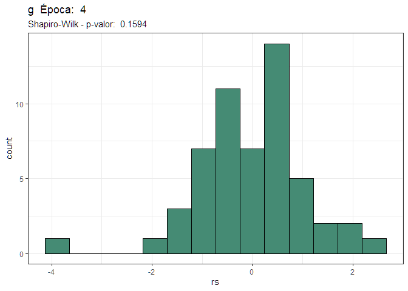<!-- -->

    #> # A tibble: 1 × 5
    #>   designacao   rep      g    rs     yp
    #>        <dbl> <dbl>  <dbl> <dbl>  <dbl>
    #> 1         12     1 20955. -3.74 26877.

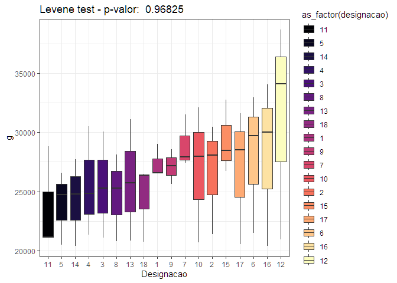<!-- -->

    #> 
    #> NULL
    #> [1] "========================"
    #> [1] "g  Época:  5"
    #> [1] "========================"
    #> Analysis of Variance Table
    #> 
    #> Response: y
    #>           Df    Sum Sq  Mean Sq F value    Pr(>F)    
    #> trat      17 120513568  7089033  7.1277 6.757e-07 ***
    #> bloco      2  54704500 27352250 27.5013 7.858e-08 ***
    #> Residuals 34  33815675   994579                      
    #> ---
    #> Signif. codes:  0 '***' 0.001 '**' 0.01 '*' 0.05 '.' 0.1 ' ' 1

<!-- --><!-- -->

    #> 
    #> NULL
    #> [1] "========================"
    #> [1] "b  Época:  1"
    #> [1] "========================"
    #> Analysis of Variance Table
    #> 
    #> Response: y
    #>           Df  Sum Sq Mean Sq F value   Pr(>F)   
    #> trat      17 2240.05  131.77  1.8717 0.058792 . 
    #> bloco      2  841.87  420.94  5.9793 0.005955 **
    #> Residuals 34 2393.56   70.40                    
    #> ---
    #> Signif. codes:  0 '***' 0.001 '**' 0.01 '*' 0.05 '.' 0.1 ' ' 1

<!-- --><!-- -->

    #> 
    #> NULL
    #> [1] "========================"
    #> [1] "b  Época:  3"
    #> [1] "========================"
    #> Analysis of Variance Table
    #> 
    #> Response: y
    #>           Df  Sum Sq Mean Sq F value   Pr(>F)   
    #> trat      17 1410.71  82.983  2.4141 0.014061 * 
    #> bloco      2  477.33 238.663  6.9431 0.002962 **
    #> Residuals 34 1168.71  34.374                    
    #> ---
    #> Signif. codes:  0 '***' 0.001 '**' 0.01 '*' 0.05 '.' 0.1 ' ' 1

<!-- -->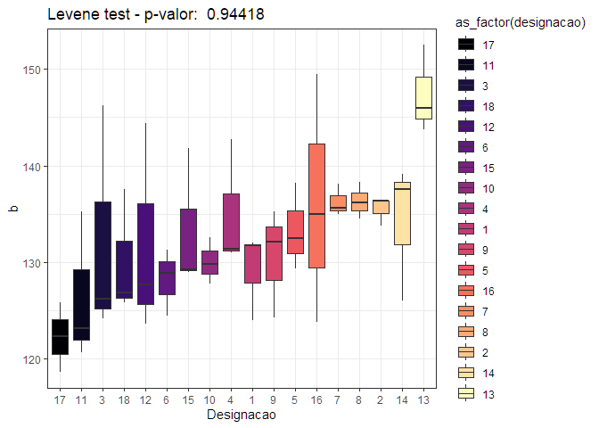<!-- -->

    #> 
    #> NULL
    #> [1] "========================"
    #> [1] "b  Época:  4"
    #> [1] "========================"
    #> Analysis of Variance Table
    #> 
    #> Response: y
    #>           Df  Sum Sq Mean Sq F value Pr(>F)
    #> trat      17  437.07  25.710  0.8548 0.6253
    #> bloco      2   32.39  16.192  0.5383 0.5886
    #> Residuals 34 1022.66  30.078

<!-- --><!-- -->

    #> 
    #> NULL
    #> [1] "========================"
    #> [1] "b  Época:  5"
    #> [1] "========================"
    #> Analysis of Variance Table
    #> 
    #> Response: y
    #>           Df  Sum Sq Mean Sq F value  Pr(>F)  
    #> trat      17 164.538  9.6787  1.6897 0.09462 .
    #> bloco      2  37.261 18.6304  3.2525 0.05099 .
    #> Residuals 34 194.755  5.7281                  
    #> ---
    #> Signif. codes:  0 '***' 0.001 '**' 0.01 '*' 0.05 '.' 0.1 ' ' 1

<!-- --><!-- -->

    #> 
    #> NULL
    #> [1] "========================"
    #> [1] "nir  Época:  1"
    #> [1] "========================"
    #> Analysis of Variance Table
    #> 
    #> Response: y
    #>           Df     Sum Sq   Mean Sq F value  Pr(>F)  
    #> trat      17 2002243348 117779020  1.7418 0.08264 .
    #> bloco      2  697728463 348864231  5.1592 0.01105 *
    #> Residuals 34 2299071503  67619750                  
    #> ---
    #> Signif. codes:  0 '***' 0.001 '**' 0.01 '*' 0.05 '.' 0.1 ' ' 1

<!-- --><!-- -->

    #> 
    #> NULL
    #> [1] "========================"
    #> [1] "nir  Época:  3"
    #> [1] "========================"
    #> Analysis of Variance Table
    #> 
    #> Response: y
    #>           Df     Sum Sq   Mean Sq F value Pr(>F)
    #> trat      17 4.2379e+09 249290192  0.7803 0.7016
    #> bloco      2 1.1116e+09 555778907  1.7397 0.1908
    #> Residuals 34 1.0862e+10 319471672

<!-- --><!-- -->

    #> 
    #> NULL
    #> [1] "========================"
    #> [1] "nir  Época:  4"
    #> [1] "========================"
    #> Analysis of Variance Table
    #> 
    #> Response: y
    #>           Df     Sum Sq    Mean Sq F value    Pr(>F)    
    #> trat      17 1615335174   95019716  0.8012    0.6803    
    #> bloco      2 7208514536 3604257268 30.3893 2.698e-08 ***
    #> Residuals 34 4032498947  118602910                      
    #> ---
    #> Signif. codes:  0 '***' 0.001 '**' 0.01 '*' 0.05 '.' 0.1 ' ' 1

<!-- -->

    #> # A tibble: 1 × 5
    #>   designacao   rep    nir    rs     yp
    #>        <dbl> <dbl>  <dbl> <dbl>  <dbl>
    #> 1         14     2 22381. -3.34 47697.

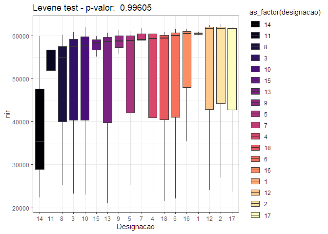<!-- -->

    #> 
    #> NULL
    #> [1] "========================"
    #> [1] "nir  Época:  5"
    #> [1] "========================"
    #> Analysis of Variance Table
    #> 
    #> Response: y
    #>           Df    Sum Sq  Mean Sq F value    Pr(>F)    
    #> trat      17 192219117 11307007  3.5008 0.0009145 ***
    #> bloco      2 137588642 68794321 21.2994 1.008e-06 ***
    #> Residuals 34 109815848  3229878                      
    #> ---
    #> Signif. codes:  0 '***' 0.001 '**' 0.01 '*' 0.05 '.' 0.1 ' ' 1

<!-- -->

    #> # A tibble: 1 × 5
    #>   designacao   rep    nir    rs     yp
    #>        <dbl> <dbl>  <dbl> <dbl>  <dbl>
    #> 1         14     1 50314.  4.91 44912.

<!-- -->

    #> 
    #> NULL
    #> [1] "========================"
    #> [1] "red_edge  Época:  1"
    #> [1] "========================"
    #> Analysis of Variance Table
    #> 
    #> Response: y
    #>           Df    Sum Sq  Mean Sq F value    Pr(>F)    
    #> trat      17 192002996 11294294  1.7199 0.0874683 .  
    #> bloco      2 154738631 77369316 11.7822 0.0001296 ***
    #> Residuals 34 223265913  6566644                      
    #> ---
    #> Signif. codes:  0 '***' 0.001 '**' 0.01 '*' 0.05 '.' 0.1 ' ' 1

<!-- --><!-- -->

    #> 
    #> NULL
    #> [1] "========================"
    #> [1] "red_edge  Época:  3"
    #> [1] "========================"
    #> Analysis of Variance Table
    #> 
    #> Response: y
    #>           Df    Sum Sq  Mean Sq F value   Pr(>F)   
    #> trat      17  78862732  4638984  1.0838 0.406185   
    #> bloco      2  71292735 35646367  8.3280 0.001139 **
    #> Residuals 34 145530400  4280306                    
    #> ---
    #> Signif. codes:  0 '***' 0.001 '**' 0.01 '*' 0.05 '.' 0.1 ' ' 1

<!-- --><!-- -->

    #> 
    #> NULL
    #> [1] "========================"
    #> [1] "red_edge  Época:  4"
    #> [1] "========================"
    #> Analysis of Variance Table
    #> 
    #> Response: y
    #>           Df   Sum Sq  Mean Sq F value   Pr(>F)   
    #> trat      17 47431346  2790079  1.0619 0.425073   
    #> bloco      2 35541201 17770601  6.7635 0.003366 **
    #> Residuals 34 89332457  2627425                    
    #> ---
    #> Signif. codes:  0 '***' 0.001 '**' 0.01 '*' 0.05 '.' 0.1 ' ' 1

<!-- -->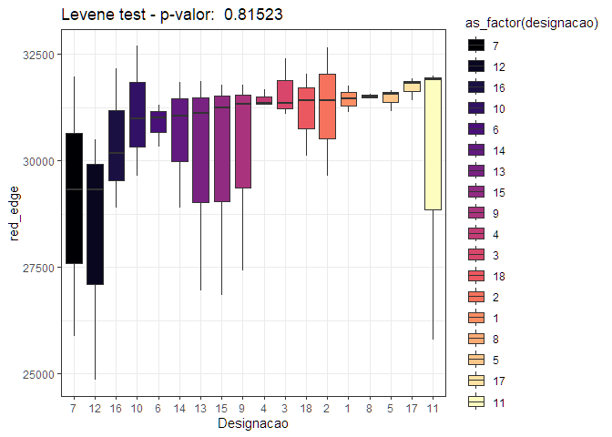<!-- -->

    #> 
    #> NULL
    #> [1] "========================"
    #> [1] "red_edge  Época:  5"
    #> [1] "========================"
    #> Analysis of Variance Table
    #> 
    #> Response: y
    #>           Df    Sum Sq  Mean Sq F value  Pr(>F)  
    #> trat      17  63827976  3754587  1.0038 0.47767  
    #> bloco      2  24359402 12179701  3.2564 0.05082 .
    #> Residuals 34 127166875  3740202                  
    #> ---
    #> Signif. codes:  0 '***' 0.001 '**' 0.01 '*' 0.05 '.' 0.1 ' ' 1

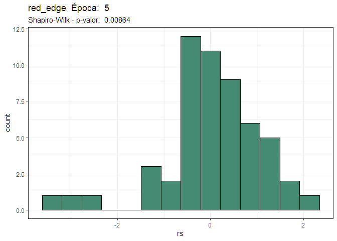<!-- -->

    #> # A tibble: 2 × 5
    #>   designacao   rep red_edge    rs     yp
    #>        <dbl> <dbl>    <dbl> <dbl>  <dbl>
    #> 1         13     1   23867. -3.11 28128.
    #> 2         14     3   24213. -3.22 28593.

<!-- -->

    #> 
    #> NULL
    #> [1] "========================"
    #> [1] "ndvi  Época:  1"
    #> [1] "========================"
    #> Analysis of Variance Table
    #> 
    #> Response: y
    #>           Df   Sum Sq  Mean Sq F value  Pr(>F)  
    #> trat      17 0.244324 0.014372  1.8589 0.06081 .
    #> bloco      2 0.079565 0.039783  5.1455 0.01116 *
    #> Residuals 34 0.262872 0.007732                  
    #> ---
    #> Signif. codes:  0 '***' 0.001 '**' 0.01 '*' 0.05 '.' 0.1 ' ' 1

<!-- -->

    #> # A tibble: 1 × 5
    #>   designacao   rep   ndvi    rs    yp
    #>        <dbl> <dbl>  <dbl> <dbl> <dbl>
    #> 1          7     2 0.0137 -3.66 0.232

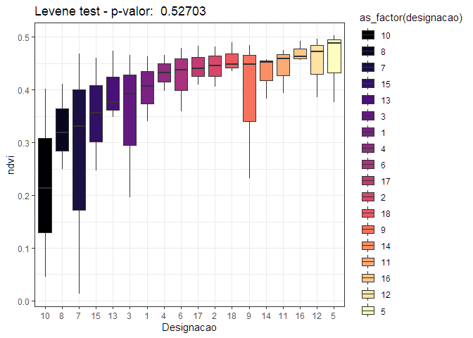<!-- -->

    #> 
    #> NULL
    #> [1] "========================"
    #> [1] "ndvi  Época:  3"
    #> [1] "========================"
    #> Analysis of Variance Table
    #> 
    #> Response: y
    #>           Df  Sum Sq  Mean Sq F value Pr(>F)
    #> trat      17 0.60348 0.035499  0.9504 0.5290
    #> bloco      2 0.09947 0.049734  1.3314 0.2775
    #> Residuals 34 1.27002 0.037354

<!-- --><!-- -->

    #> 
    #> NULL
    #> [1] "========================"
    #> [1] "ndvi  Época:  4"
    #> [1] "========================"
    #> Analysis of Variance Table
    #> 
    #> Response: y
    #>           Df  Sum Sq Mean Sq F value    Pr(>F)    
    #> trat      17 0.12135 0.00714  0.7509    0.7312    
    #> bloco      2 0.70167 0.35084 36.9073 3.017e-09 ***
    #> Residuals 34 0.32320 0.00951                      
    #> ---
    #> Signif. codes:  0 '***' 0.001 '**' 0.01 '*' 0.05 '.' 0.1 ' ' 1

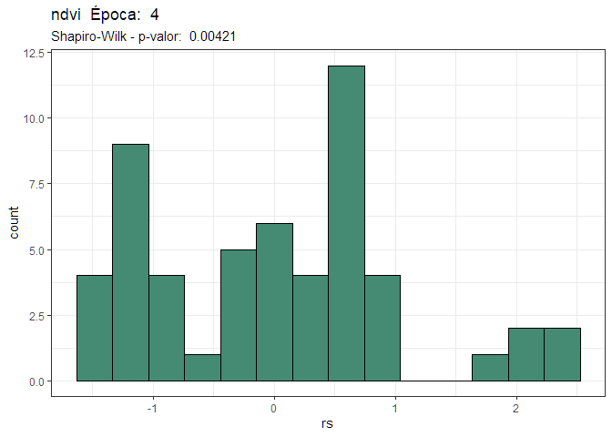<!-- -->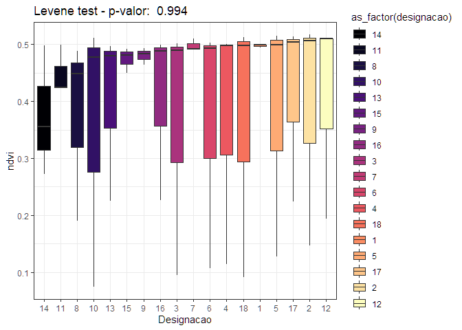<!-- -->

    #> 
    #> NULL
    #> [1] "========================"
    #> [1] "ndvi  Época:  5"
    #> [1] "========================"
    #> Analysis of Variance Table
    #> 
    #> Response: y
    #>           Df    Sum Sq    Mean Sq F value    Pr(>F)    
    #> trat      17 0.0119208 0.00070122  2.2269 0.0230085 *  
    #> bloco      2 0.0062025 0.00310124  9.8489 0.0004226 ***
    #> Residuals 34 0.0107060 0.00031488                      
    #> ---
    #> Signif. codes:  0 '***' 0.001 '**' 0.01 '*' 0.05 '.' 0.1 ' ' 1

<!-- -->

    #> # A tibble: 1 × 5
    #>   designacao   rep  ndvi    rs    yp
    #>        <dbl> <dbl> <dbl> <dbl> <dbl>
    #> 1         14     3  0.33 -4.62 0.381

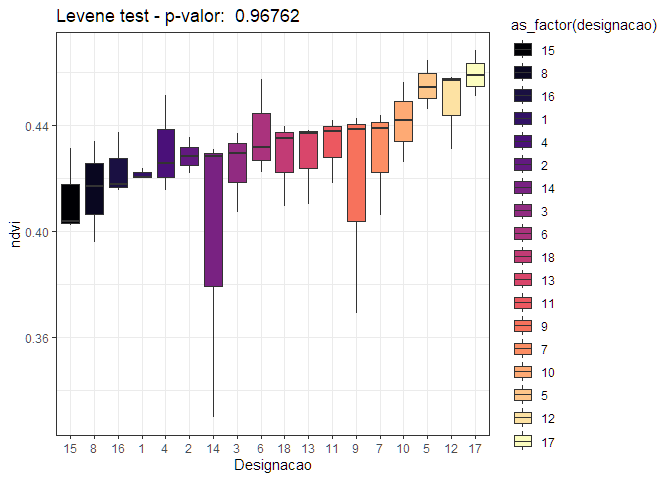<!-- -->

    #> 
    #> NULL
    #> [1] "========================"
    #> [1] "gndvi  Época:  1"
    #> [1] "========================"
    #> Analysis of Variance Table
    #> 
    #> Response: y
    #>           Df   Sum Sq   Mean Sq F value   Pr(>F)   
    #> trat      17 0.127282 0.0074872  2.2241 0.023184 * 
    #> bloco      2 0.039665 0.0198325  5.8912 0.006357 **
    #> Residuals 34 0.114460 0.0033665                    
    #> ---
    #> Signif. codes:  0 '***' 0.001 '**' 0.01 '*' 0.05 '.' 0.1 ' ' 1

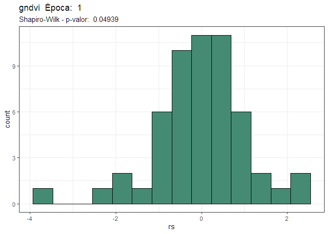<!-- -->

    #> # A tibble: 1 × 5
    #>   designacao   rep  gndvi    rs    yp
    #>        <dbl> <dbl>  <dbl> <dbl> <dbl>
    #> 1          7     2 0.0116 -3.74 0.158

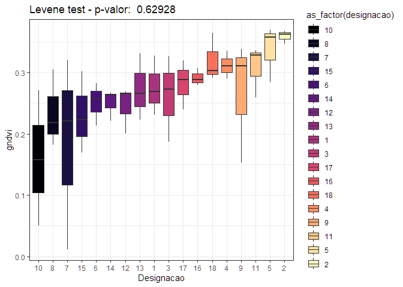<!-- -->

    #> 
    #> NULL
    #> [1] "========================"
    #> [1] "gndvi  Época:  3"
    #> [1] "========================"
    #> Analysis of Variance Table
    #> 
    #> Response: y
    #>           Df  Sum Sq  Mean Sq F value Pr(>F)
    #> trat      17 0.40734 0.023961  0.9694 0.5104
    #> bloco      2 0.06240 0.031198  1.2622 0.2959
    #> Residuals 34 0.84037 0.024717

<!-- --><!-- -->

    #> 
    #> NULL
    #> [1] "========================"
    #> [1] "gndvi  Época:  4"
    #> [1] "========================"
    #> Analysis of Variance Table
    #> 
    #> Response: y
    #>           Df  Sum Sq  Mean Sq F value    Pr(>F)    
    #> trat      17 0.20303 0.011943  1.1162    0.3792    
    #> bloco      2 0.36018 0.180091 16.8316 8.301e-06 ***
    #> Residuals 34 0.36378 0.010700                      
    #> ---
    #> Signif. codes:  0 '***' 0.001 '**' 0.01 '*' 0.05 '.' 0.1 ' ' 1

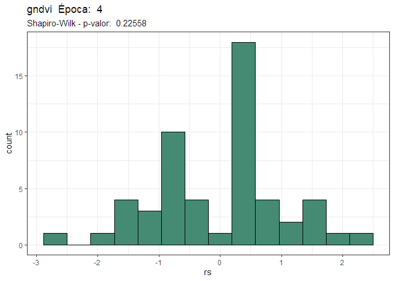<!-- --><!-- -->

    #> 
    #> NULL
    #> [1] "========================"
    #> [1] "gndvi  Época:  5"
    #> [1] "========================"
    #> Analysis of Variance Table
    #> 
    #> Response: y
    #>           Df   Sum Sq   Mean Sq F value    Pr(>F)    
    #> trat      17 0.061134 0.0035961  7.4827 3.797e-07 ***
    #> bloco      2 0.000905 0.0004524  0.9413    0.4001    
    #> Residuals 34 0.016340 0.0004806                      
    #> ---
    #> Signif. codes:  0 '***' 0.001 '**' 0.01 '*' 0.05 '.' 0.1 ' ' 1

<!-- -->

    #> # A tibble: 1 × 5
    #>   designacao   rep gndvi    rs    yp
    #>        <dbl> <dbl> <dbl> <dbl> <dbl>
    #> 1         14     1 0.332  4.13 0.273

<!-- -->

    #> 
    #> NULL
    #> [1] "========================"
    #> [1] "savi  Época:  1"
    #> [1] "========================"
    #> Analysis of Variance Table
    #> 
    #> Response: y
    #>           Df  Sum Sq  Mean Sq F value  Pr(>F)  
    #> trat      17 0.60489 0.035582  1.7927 0.07235 .
    #> bloco      2 0.12407 0.062033  3.1253 0.05675 .
    #> Residuals 34 0.67484 0.019848                  
    #> ---
    #> Signif. codes:  0 '***' 0.001 '**' 0.01 '*' 0.05 '.' 0.1 ' ' 1

<!-- -->

    #> # A tibble: 2 × 5
    #>   designacao   rep   savi    rs    yp
    #>        <dbl> <dbl>  <dbl> <dbl> <dbl>
    #> 1          7     2 0.0206 -3.44 0.356
    #> 2          9     2 0.727   3.25 0.406

<!-- -->

    #> 
    #> NULL
    #> [1] "========================"
    #> [1] "savi  Época:  3"
    #> [1] "========================"
    #> Analysis of Variance Table
    #> 
    #> Response: y
    #>           Df  Sum Sq  Mean Sq F value Pr(>F)
    #> trat      17 1.32159 0.077740  0.8982 0.5810
    #> bloco      2 0.21803 0.109017  1.2595 0.2967
    #> Residuals 34 2.94282 0.086553

<!-- --><!-- -->

    #> 
    #> NULL
    #> [1] "========================"
    #> [1] "savi  Época:  4"
    #> [1] "========================"
    #> Analysis of Variance Table
    #> 
    #> Response: y
    #>           Df  Sum Sq Mean Sq F value    Pr(>F)    
    #> trat      17 0.56635 0.03331  0.9672    0.5126    
    #> bloco      2 1.34900 0.67450 19.5821 2.198e-06 ***
    #> Residuals 34 1.17112 0.03444                      
    #> ---
    #> Signif. codes:  0 '***' 0.001 '**' 0.01 '*' 0.05 '.' 0.1 ' ' 1

<!-- -->

    #> # A tibble: 1 × 5
    #>   designacao   rep   savi    rs    yp
    #>        <dbl> <dbl>  <dbl> <dbl> <dbl>
    #> 1         14     2 0.0903 -3.14 0.502

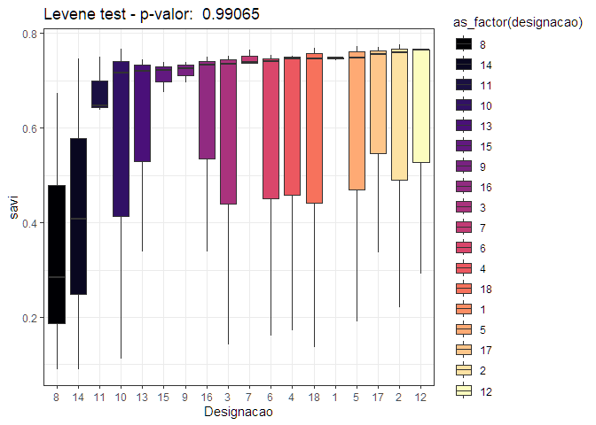<!-- -->

    #> 
    #> NULL
    #> [1] "========================"
    #> [1] "savi  Época:  5"
    #> [1] "========================"
    #> Analysis of Variance Table
    #> 
    #> Response: y
    #>           Df   Sum Sq   Mean Sq F value    Pr(>F)    
    #> trat      17 0.026821 0.0015777  2.2270 0.0230071 *  
    #> bloco      2 0.013955 0.0069777  9.8491 0.0004225 ***
    #> Residuals 34 0.024088 0.0007085                      
    #> ---
    #> Signif. codes:  0 '***' 0.001 '**' 0.01 '*' 0.05 '.' 0.1 ' ' 1

<!-- -->

    #> # A tibble: 1 × 5
    #>   designacao   rep  savi    rs    yp
    #>        <dbl> <dbl> <dbl> <dbl> <dbl>
    #> 1         14     3 0.495 -4.62 0.572

<!-- -->

    #> 
    #> NULL
    #> [1] "========================"
    #> [1] "vari  Época:  1"
    #> [1] "========================"
    #> Analysis of Variance Table
    #> 
    #> Response: y
    #>           Df   Sum Sq   Mean Sq F value    Pr(>F)    
    #> trat      17 0.088754 0.0052208  3.4681 0.0009889 ***
    #> bloco      2 0.008653 0.0043264  2.8739 0.0702758 .  
    #> Residuals 34 0.051184 0.0015054                      
    #> ---
    #> Signif. codes:  0 '***' 0.001 '**' 0.01 '*' 0.05 '.' 0.1 ' ' 1

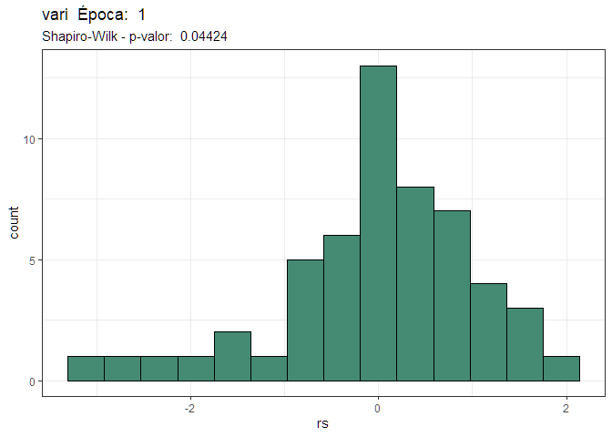<!-- -->

    #> # A tibble: 1 × 5
    #>   designacao   rep    vari    rs     yp
    #>        <dbl> <dbl>   <dbl> <dbl>  <dbl>
    #> 1          7     2 0.00147 -3.02 0.0850

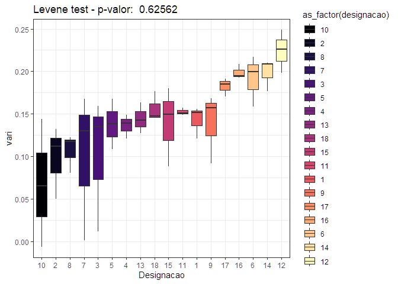<!-- -->

    #> 
    #> NULL
    #> [1] "========================"
    #> [1] "vari  Época:  3"
    #> [1] "========================"
    #> Analysis of Variance Table
    #> 
    #> Response: y
    #>           Df   Sum Sq   Mean Sq F value Pr(>F)
    #> trat      17 0.101124 0.0059485  1.0934 0.3981
    #> bloco      2 0.016702 0.0083508  1.5350 0.2300
    #> Residuals 34 0.184975 0.0054404

<!-- --><!-- -->

    #> 
    #> NULL
    #> [1] "========================"
    #> [1] "vari  Época:  4"
    #> [1] "========================"
    #> Analysis of Variance Table
    #> 
    #> Response: y
    #>           Df   Sum Sq   Mean Sq F value    Pr(>F)    
    #> trat      17 0.086638 0.0050964  3.7624 0.0004934 ***
    #> bloco      2 0.061210 0.0306052 22.5946 5.726e-07 ***
    #> Residuals 34 0.046054 0.0013545                      
    #> ---
    #> Signif. codes:  0 '***' 0.001 '**' 0.01 '*' 0.05 '.' 0.1 ' ' 1

<!-- -->

    #> # A tibble: 1 × 5
    #>   designacao   rep  vari    rs    yp
    #>        <dbl> <dbl> <dbl> <dbl> <dbl>
    #> 1         13     1 0.190  3.25 0.106

<!-- -->

    #> 
    #> NULL
    #> [1] "========================"
    #> [1] "vari  Época:  5"
    #> [1] "========================"
    #> Analysis of Variance Table
    #> 
    #> Response: y
    #>           Df   Sum Sq   Mean Sq F value    Pr(>F)    
    #> trat      17 0.042047 0.0024733  9.3999 2.253e-08 ***
    #> bloco      2 0.007475 0.0037376 14.2048 3.280e-05 ***
    #> Residuals 34 0.008946 0.0002631                      
    #> ---
    #> Signif. codes:  0 '***' 0.001 '**' 0.01 '*' 0.05 '.' 0.1 ' ' 1

<!-- -->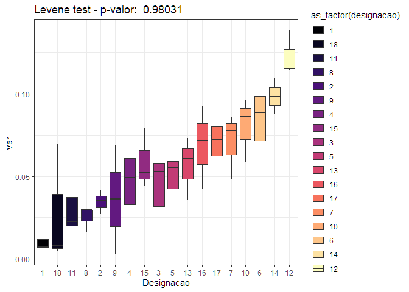<!-- -->

    #> 
    #> NULL

–\>
