<!-- README.md is generated from README.Rmd. Please edit that file -->

# Análise - Doutorado - Edvaldo Aldo Litos Paulo Nhanombe

## Pré-tratamento dos dados

``` r
dados_batata <- readxl::read_xlsx("data-raw/Exp. Verão-2024_25.xlsx") |> 
  janitor::clean_names()
readr::write_rds(dados_batata,"data/batata-doce-ednaldo.rds")

dados_multi <- readxl::read_xlsx("data-raw/HTP_Verão.xlsx") |> 
  janitor::clean_names()
readr::write_rds(dados_multi,"data/batata-doce-multiespectral.rds")
```

## Análise exploratória - Batata Doce

### Carregando pacotes e banco de dados

``` r
library(tidyverse)
data_set <- read_rds("data/batata-doce-ednaldo.rds")
glimpse(data_set)
```

``` r
lista_variaveis <- data_set |> select(pt:tmspa_percent) |> names()
# map(lista_variaveis, ~{
#   data_set |> 
#     ggplot(aes(x=!!sym(.x), y = ..density..)) +
#     geom_histogram(color="black",fill="gray", bins = 15) +
#     labs(title = .x) +
#     theme_bw()
# })
```

### Análise de resíduos - Pré-supostos da ANOVA

``` r
map(lista_variaveis, ~{
  print("========================")
  print(.x)
  print("========================")
  y <- data_set |> pull(!!sym(.x))
  trat <- data_set |> pull(designacao) |> as_factor()
  bloco <- data_set |> pull(bloco) |> as_factor()
  mod <- aov(y ~ trat + bloco)
  print(anova(mod))
  rs <- rstudent(mod)
  yp <- predict(mod)
  sw_test <- shapiro.test(rs)
  sw_test <- round(sw_test$p.value,5)
  print(
    as_tibble(rs) |> 
      ggplot(aes(rs)) +
      geom_histogram(bins=14,color="black",fill="aquamarine4") +
      labs(title = .x,
           subtitle = paste("Shapiro-Wilk - p-valor: ",sw_test)) +
      theme_bw()
  )
  df_aux <- data_set |> 
    select(designacao, bloco,!!sym(.x)) |> 
    add_column(rs,yp)  |> 
    filter(rs > 3 | rs < -3)
    # arrange(rs)
  if(nrow(df_aux) != 0) print(df_aux)
  levene_teste <- lawstat::levene.test(y,trat)
  levene_teste <- round(levene_teste$p.value,5)
  box_plot <- data_set |> 
      group_by(designacao) |> 
      mutate(
        y_mean = median(!!sym(.x),na.rm=TRUE),
        designacao = as_factor(designacao))  |>
      ungroup() |> 
      mutate(designacao = designacao |>  fct_reorder(y_mean)) |> 
      ggplot(aes(x=as_factor(designacao),y=!!sym(.x),
             fill=as_factor(designacao))) +
      geom_boxplot() +
      scale_fill_viridis_d(option = "magma") +
      theme_bw()+
      labs(x="Designacao",
           title =  paste("Levene test - p-valor: ",levene_teste))
  
  print(
    box_plot
  )
  print(cat("\n"))
})
```

## Análise exploratória - Multiespectral

### Carregando pacotes e banco de dados

``` r
library(tidyverse)
data_set <- read_rds("data/batata-doce-multiespectral.rds")
glimpse(data_set)
#> Rows: 216
#> Columns: 12
#> $ epoca      <dbl> 1, 1, 1, 1, 1, 1, 1, 1, 1, 1, 1, 1, 1, 1, 1, 1, 1, 1, 1, 1,…
#> $ designacao <dbl> 1, 1, 1, 2, 2, 2, 3, 3, 3, 4, 4, 4, 5, 5, 5, 6, 6, 6, 7, 7,…
#> $ rep        <dbl> 1, 2, 3, 1, 2, 3, 1, 2, 3, 1, 2, 3, 1, 2, 3, 1, 2, 3, 1, 2,…
#> $ r          <dbl> 19942.12, 20806.48, 20806.35, 21161.64, 20891.04, 21097.11,…
#> $ g          <dbl> 20796.02, 29823.40, 29960.27, 23863.78, 27079.20, 28653.24,…
#> $ b          <dbl> 137.7584, 138.5132, 135.6616, 131.0940, 138.0996, 135.0067,…
#> $ nir        <dbl> 20947.02, 51920.10, 57472.20, 51559.14, 55239.00, 59944.10,…
#> $ red_edge   <dbl> 21762.94, 31705.17, 22526.24, 22978.82, 31500.33, 23481.31,…
#> $ ndvi       <dbl> 0.03089974, 0.40684066, 0.46332079, 0.40566244, 0.44574740,…
#> $ gndvi      <dbl> 0.00943209, 0.26932817, 0.32691776, 0.36257996, 0.34713362,…
#> $ savi       <dbl> 0.04634915, 0.61025680, 0.69497663, 0.60848943, 0.66861658,…
#> $ vari       <dbl> 0.019049202, 0.155613755, 0.151821825, 0.049606302, 0.11185…
```

``` r
lista_variaveis <- data_set |> select(r:vari) |> names()
epocas <- data_set |> pull(epoca) |> unique()
# map(lista_variaveis, ~{
#   data_set |> 
#     ggplot(aes(x=!!sym(.x), y = ..density..)) +
#     geom_histogram(color="black",fill="gray", bins = 15) +
#     labs(title = .x) +
#     theme_bw()
# })
```

### Análise de resíduos - Pré-supostos da ANOVA

``` r
for(i in seq_along(lista_variaveis)){
  for(j in seq_along(epocas)){
    print("========================")
    print(paste(lista_variaveis[i]," Época: ",epocas[j]))
    print("========================")
    y <- data_set |> filter(epoca == epocas[j]) |> pull(lista_variaveis[i])
    trat <- data_set |> filter(epoca ==epocas[j])|> pull(designacao) |> as_factor()
    bloco <- data_set |> filter(epoca == epocas[j]) |> pull(rep) |> as_factor()
    mod <- aov(y ~ trat + bloco)
    print(anova(mod))
    rs <- rstudent(mod)
    yp <- predict(mod)
    sw_test <- shapiro.test(rs)
    sw_test <- round(sw_test$p.value,5)
    print(
      as_tibble(rs) |> 
        ggplot(aes(rs)) +
        geom_histogram(bins=14,color="black",fill="aquamarine4") +
        labs(title = paste(lista_variaveis[i]," Época: ",epocas[j]),
             subtitle = paste("Shapiro-Wilk - p-valor: ",sw_test)) +
        theme_bw()
    )
    df_aux <- data_set |> 
      filter(epoca == epocas[j]) |> 
      select(designacao, rep,lista_variaveis[i]) |> 
      add_column(rs,yp)  |> 
      filter(rs > 3 | rs < -3)
    # arrange(rs)
    if(nrow(df_aux) != 0) print(df_aux)
    levene_teste <- lawstat::levene.test(y,trat)
    levene_teste <- round(levene_teste$p.value,5)
    box_plot <- data_set |> 
      filter(epoca == epocas[j]) |> 
      group_by(designacao) |> 
      mutate(
        y_mean = median(!!sym(lista_variaveis[i]),na.rm=TRUE),
        designacao = as_factor(designacao))  |>
      ungroup() |> 
      mutate(designacao = designacao |>  fct_reorder(y_mean)) |> 
      ggplot(aes(x=as_factor(designacao),y=!!sym(lista_variaveis[i]),
                 fill=as_factor(designacao))) +
      geom_boxplot() +
      scale_fill_viridis_d(option = "magma") +
      theme_bw()+
      labs(x="Designacao",
           title =  paste("Levene test - p-valor: ",levene_teste))
    
    print(
      box_plot
    )
    print(cat("\n"))
  }
}
#> [1] "========================"
#> [1] "r  Época:  1"
#> [1] "========================"
#> Analysis of Variance Table
#> 
#> Response: y
#>           Df  Sum Sq Mean Sq F value  Pr(>F)   
#> trat      17 2057358  121021  0.9087 0.57039   
#> bloco      2 1509206  754603  5.6660 0.00752 **
#> Residuals 34 4528110  133180                   
#> ---
#> Signif. codes:  0 '***' 0.001 '**' 0.01 '*' 0.05 '.' 0.1 ' ' 1
```

<!-- --><!-- -->

    #> 
    #> NULL
    #> [1] "========================"
    #> [1] "r  Época:  3"
    #> [1] "========================"
    #> Analysis of Variance Table
    #> 
    #> Response: y
    #>           Df   Sum Sq Mean Sq F value Pr(>F)
    #> trat      17 25991312 1528901  0.9059 0.5732
    #> bloco      2   424308  212154  0.1257 0.8823
    #> Residuals 34 57383904 1687762

<!-- --><!-- -->

    #> 
    #> NULL
    #> [1] "========================"
    #> [1] "r  Época:  4"
    #> [1] "========================"
    #> Analysis of Variance Table
    #> 
    #> Response: y
    #>           Df   Sum Sq Mean Sq F value  Pr(>F)  
    #> trat      17 25661204 1509483  0.7077 0.77358  
    #> bloco      2 19210003 9605001  4.5031 0.01841 *
    #> Residuals 34 72520392 2132953                  
    #> ---
    #> Signif. codes:  0 '***' 0.001 '**' 0.01 '*' 0.05 '.' 0.1 ' ' 1

<!-- -->

    #> # A tibble: 1 × 5
    #>   designacao   rep      r    rs     yp
    #>        <dbl> <dbl>  <dbl> <dbl>  <dbl>
    #> 1         13     1 13744. -4.38 17844.

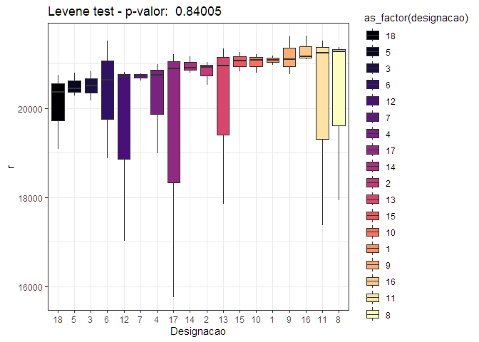<!-- -->

    #> 
    #> NULL
    #> [1] "========================"
    #> [1] "r  Época:  5"
    #> [1] "========================"
    #> Analysis of Variance Table
    #> 
    #> Response: y
    #>           Df   Sum Sq Mean Sq F value Pr(>F)
    #> trat      17 16119024  948178  1.3662 0.2137
    #> bloco      2  2139677 1069839  1.5415 0.2286
    #> Residuals 34 23596894  694026

<!-- -->

    #> # A tibble: 1 × 5
    #>   designacao   rep      r    rs     yp
    #>        <dbl> <dbl>  <dbl> <dbl>  <dbl>
    #> 1         14     3 15232. -10.5 18611.

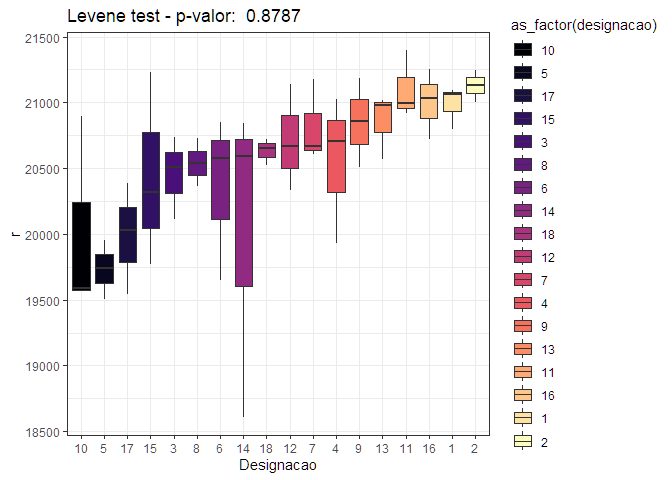<!-- -->

    #> 
    #> NULL
    #> [1] "========================"
    #> [1] "g  Época:  1"
    #> [1] "========================"
    #> Analysis of Variance Table
    #> 
    #> Response: y
    #>           Df    Sum Sq  Mean Sq F value    Pr(>F)    
    #> trat      17 441314712 25959689  3.6093 0.0007065 ***
    #> bloco      2  32196082 16098041  2.2382 0.1221360    
    #> Residuals 34 244543852  7192466                      
    #> ---
    #> Signif. codes:  0 '***' 0.001 '**' 0.01 '*' 0.05 '.' 0.1 ' ' 1

<!-- -->

    #> # A tibble: 1 × 5
    #>   designacao   rep      g    rs     yp
    #>        <dbl> <dbl>  <dbl> <dbl>  <dbl>
    #> 1          1     1 20796. -3.78 27621.

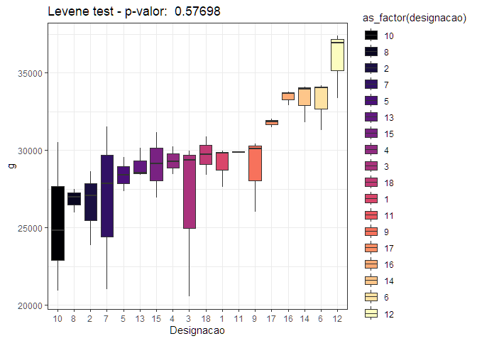<!-- -->

    #> 
    #> NULL
    #> [1] "========================"
    #> [1] "g  Época:  3"
    #> [1] "========================"
    #> Analysis of Variance Table
    #> 
    #> Response: y
    #>           Df    Sum Sq  Mean Sq F value Pr(>F)
    #> trat      17 230547651 13561627  0.7708 0.7112
    #> bloco      2  74577442 37288721  2.1194 0.1357
    #> Residuals 34 598189176 17593799

<!-- --><!-- -->

    #> 
    #> NULL
    #> [1] "========================"
    #> [1] "g  Época:  4"
    #> [1] "========================"
    #> Analysis of Variance Table
    #> 
    #> Response: y
    #>           Df    Sum Sq   Mean Sq F value    Pr(>F)    
    #> trat      17 217756626  12809213  1.5712    0.1283    
    #> bloco      2 588270494 294135247 36.0794 3.925e-09 ***
    #> Residuals 34 277182904   8152438                      
    #> ---
    #> Signif. codes:  0 '***' 0.001 '**' 0.01 '*' 0.05 '.' 0.1 ' ' 1

<!-- -->

    #> # A tibble: 2 × 5
    #>   designacao   rep      g    rs     yp
    #>        <dbl> <dbl>  <dbl> <dbl>  <dbl>
    #> 1         14     2 20875. -3.49 27728.
    #> 2         14     3 30986.  3.04 24803.

<!-- -->

    #> 
    #> NULL
    #> [1] "========================"
    #> [1] "g  Época:  5"
    #> [1] "========================"
    #> Analysis of Variance Table
    #> 
    #> Response: y
    #>           Df    Sum Sq  Mean Sq F value    Pr(>F)    
    #> trat      17 120513568  7089033  7.1277 6.757e-07 ***
    #> bloco      2  54704500 27352250 27.5013 7.858e-08 ***
    #> Residuals 34  33815675   994579                      
    #> ---
    #> Signif. codes:  0 '***' 0.001 '**' 0.01 '*' 0.05 '.' 0.1 ' ' 1

<!-- --><!-- -->

    #> 
    #> NULL
    #> [1] "========================"
    #> [1] "b  Época:  1"
    #> [1] "========================"
    #> Analysis of Variance Table
    #> 
    #> Response: y
    #>           Df  Sum Sq Mean Sq F value   Pr(>F)   
    #> trat      17 2240.05  131.77  1.8717 0.058792 . 
    #> bloco      2  841.87  420.94  5.9793 0.005955 **
    #> Residuals 34 2393.56   70.40                    
    #> ---
    #> Signif. codes:  0 '***' 0.001 '**' 0.01 '*' 0.05 '.' 0.1 ' ' 1

<!-- --><!-- -->

    #> 
    #> NULL
    #> [1] "========================"
    #> [1] "b  Época:  3"
    #> [1] "========================"
    #> Analysis of Variance Table
    #> 
    #> Response: y
    #>           Df  Sum Sq Mean Sq F value  Pr(>F)  
    #> trat      17 1057.39  62.199  1.4574 0.17088  
    #> bloco      2  368.05 184.024  4.3118 0.02143 *
    #> Residuals 34 1451.10  42.679                  
    #> ---
    #> Signif. codes:  0 '***' 0.001 '**' 0.01 '*' 0.05 '.' 0.1 ' ' 1

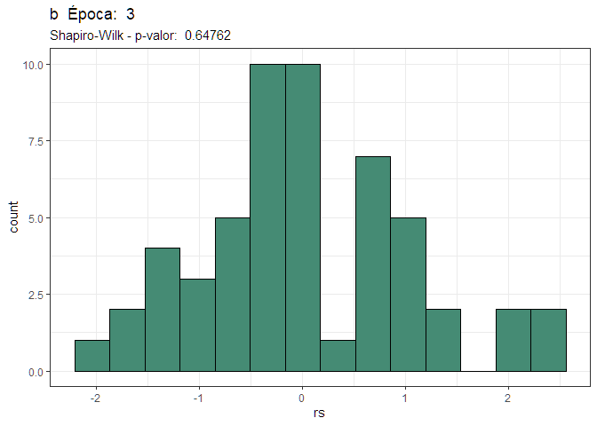<!-- -->

    #> # A tibble: 1 × 5
    #>   designacao   rep     b    rs    yp
    #>        <dbl> <dbl> <dbl> <dbl> <dbl>
    #> 1         13     1  132. -3.12  146.

<!-- -->

    #> 
    #> NULL
    #> [1] "========================"
    #> [1] "b  Época:  4"
    #> [1] "========================"
    #> Analysis of Variance Table
    #> 
    #> Response: y
    #>           Df  Sum Sq Mean Sq F value Pr(>F)
    #> trat      17  437.07  25.710  0.8548 0.6253
    #> bloco      2   32.39  16.192  0.5383 0.5886
    #> Residuals 34 1022.66  30.078

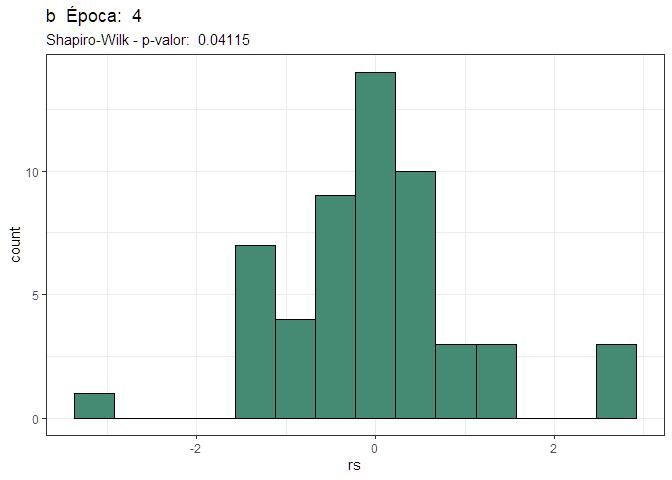<!-- --><!-- -->

    #> 
    #> NULL
    #> [1] "========================"
    #> [1] "b  Época:  5"
    #> [1] "========================"
    #> Analysis of Variance Table
    #> 
    #> Response: y
    #>           Df  Sum Sq Mean Sq F value  Pr(>F)  
    #> trat      17 164.538  9.6787  1.6897 0.09462 .
    #> bloco      2  37.261 18.6304  3.2525 0.05099 .
    #> Residuals 34 194.755  5.7281                  
    #> ---
    #> Signif. codes:  0 '***' 0.001 '**' 0.01 '*' 0.05 '.' 0.1 ' ' 1

<!-- --><!-- -->

    #> 
    #> NULL
    #> [1] "========================"
    #> [1] "nir  Época:  1"
    #> [1] "========================"
    #> Analysis of Variance Table
    #> 
    #> Response: y
    #>           Df     Sum Sq   Mean Sq F value Pr(>F)
    #> trat      17 2193753421 129044319  1.3480 0.2233
    #> bloco      2  465476552 232738276  2.4313 0.1031
    #> Residuals 34 3254730699  95727374

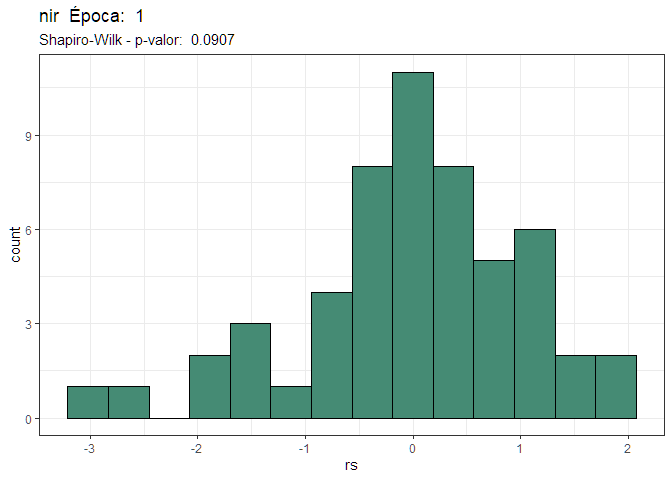<!-- -->

    #> # A tibble: 1 × 5
    #>   designacao   rep    nir    rs     yp
    #>        <dbl> <dbl>  <dbl> <dbl>  <dbl>
    #> 1          1     1 20947. -4.13 47355.

<!-- -->

    #> 
    #> NULL
    #> [1] "========================"
    #> [1] "nir  Época:  3"
    #> [1] "========================"
    #> Analysis of Variance Table
    #> 
    #> Response: y
    #>           Df     Sum Sq   Mean Sq F value Pr(>F)
    #> trat      17 4.2379e+09 249290192  0.7803 0.7016
    #> bloco      2 1.1116e+09 555778907  1.7397 0.1908
    #> Residuals 34 1.0862e+10 319471672

<!-- --><!-- -->

    #> 
    #> NULL
    #> [1] "========================"
    #> [1] "nir  Época:  4"
    #> [1] "========================"
    #> Analysis of Variance Table
    #> 
    #> Response: y
    #>           Df     Sum Sq    Mean Sq F value    Pr(>F)    
    #> trat      17 1634782991   96163705   0.619    0.8531    
    #> bloco      2 6768280690 3384140345  21.783 8.142e-07 ***
    #> Residuals 34 5282113291  155356273                      
    #> ---
    #> Signif. codes:  0 '***' 0.001 '**' 0.01 '*' 0.05 '.' 0.1 ' ' 1

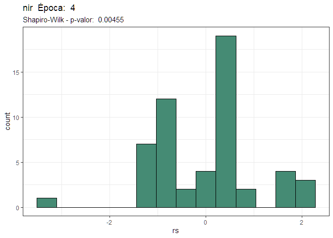<!-- -->

    #> # A tibble: 1 × 5
    #>   designacao   rep    nir    rs     yp
    #>        <dbl> <dbl>  <dbl> <dbl>  <dbl>
    #> 1         11     3 21539. -3.53 51737.

<!-- -->

    #> 
    #> NULL
    #> [1] "========================"
    #> [1] "nir  Época:  5"
    #> [1] "========================"
    #> Analysis of Variance Table
    #> 
    #> Response: y
    #>           Df    Sum Sq   Mean Sq F value   Pr(>F)   
    #> trat      17 309133355  18184315  1.2287 0.295474   
    #> bloco      2 240880730 120440365  8.1383 0.001294 **
    #> Residuals 34 503172356  14799187                    
    #> ---
    #> Signif. codes:  0 '***' 0.001 '**' 0.01 '*' 0.05 '.' 0.1 ' ' 1

<!-- -->

    #> # A tibble: 2 × 5
    #>   designacao   rep    nir     rs     yp
    #>        <dbl> <dbl>  <dbl>  <dbl>  <dbl>
    #> 1         14     2 50802.   3.25 42035.
    #> 2         14     3 21115. -15.2  37765.

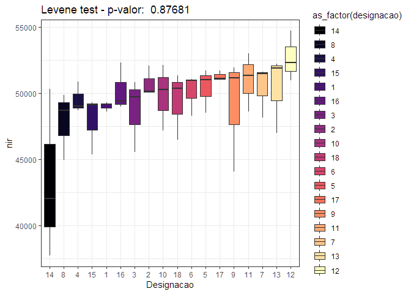<!-- -->

    #> 
    #> NULL
    #> [1] "========================"
    #> [1] "red_edge  Época:  1"
    #> [1] "========================"
    #> Analysis of Variance Table
    #> 
    #> Response: y
    #>           Df    Sum Sq  Mean Sq F value    Pr(>F)    
    #> trat      17 192002996 11294294  1.7199 0.0874683 .  
    #> bloco      2 154738631 77369316 11.7822 0.0001296 ***
    #> Residuals 34 223265913  6566644                      
    #> ---
    #> Signif. codes:  0 '***' 0.001 '**' 0.01 '*' 0.05 '.' 0.1 ' ' 1

<!-- --><!-- -->

    #> 
    #> NULL
    #> [1] "========================"
    #> [1] "red_edge  Época:  3"
    #> [1] "========================"
    #> Analysis of Variance Table
    #> 
    #> Response: y
    #>           Df    Sum Sq  Mean Sq F value   Pr(>F)   
    #> trat      17  78862732  4638984  1.0838 0.406185   
    #> bloco      2  71292735 35646367  8.3280 0.001139 **
    #> Residuals 34 145530400  4280306                    
    #> ---
    #> Signif. codes:  0 '***' 0.001 '**' 0.01 '*' 0.05 '.' 0.1 ' ' 1

<!-- --><!-- -->

    #> 
    #> NULL
    #> [1] "========================"
    #> [1] "red_edge  Época:  4"
    #> [1] "========================"
    #> Analysis of Variance Table
    #> 
    #> Response: y
    #>           Df    Sum Sq  Mean Sq F value   Pr(>F)   
    #> trat      17  74326236  4372132  0.9675 0.512243   
    #> bloco      2  60370238 30185119  6.6797 0.003575 **
    #> Residuals 34 153642772  4518905                    
    #> ---
    #> Signif. codes:  0 '***' 0.001 '**' 0.01 '*' 0.05 '.' 0.1 ' ' 1

<!-- -->

    #> # A tibble: 2 × 5
    #>   designacao   rep red_edge    rs     yp
    #>        <dbl> <dbl>    <dbl> <dbl>  <dbl>
    #> 1         13     1   22312. -3.07 26948.
    #> 2         15     1   21921. -3.32 26840.

<!-- -->

    #> 
    #> NULL
    #> [1] "========================"
    #> [1] "red_edge  Época:  5"
    #> [1] "========================"
    #> Analysis of Variance Table
    #> 
    #> Response: y
    #>           Df    Sum Sq  Mean Sq F value  Pr(>F)  
    #> trat      17  72629111  4272301  0.9170 0.56210  
    #> bloco      2  34216383 17108192  3.6719 0.03599 *
    #> Residuals 34 158412751  4659199                  
    #> ---
    #> Signif. codes:  0 '***' 0.001 '**' 0.01 '*' 0.05 '.' 0.1 ' ' 1

<!-- -->

    #> # A tibble: 1 × 5
    #>   designacao   rep red_edge    rs     yp
    #>        <dbl> <dbl>    <dbl> <dbl>  <dbl>
    #> 1         15     1   22782. -3.13 27557.

<!-- -->

    #> 
    #> NULL
    #> [1] "========================"
    #> [1] "ndvi  Época:  1"
    #> [1] "========================"
    #> Analysis of Variance Table
    #> 
    #> Response: y
    #>           Df  Sum Sq  Mean Sq F value Pr(>F)
    #> trat      17 0.27138 0.015963  1.3753 0.2090
    #> bloco      2 0.05080 0.025403  2.1885 0.1276
    #> Residuals 34 0.39464 0.011607

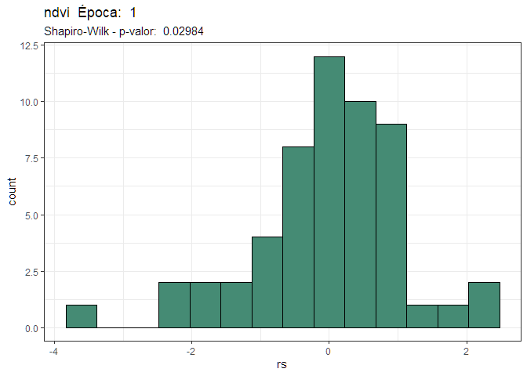<!-- -->

    #> # A tibble: 1 × 5
    #>   designacao   rep   ndvi    rs    yp
    #>        <dbl> <dbl>  <dbl> <dbl> <dbl>
    #> 1          1     1 0.0309 -4.56 0.341

<!-- -->

    #> 
    #> NULL
    #> [1] "========================"
    #> [1] "ndvi  Época:  3"
    #> [1] "========================"
    #> Analysis of Variance Table
    #> 
    #> Response: y
    #>           Df  Sum Sq  Mean Sq F value Pr(>F)
    #> trat      17 0.60348 0.035499  0.9504 0.5290
    #> bloco      2 0.09947 0.049734  1.3314 0.2775
    #> Residuals 34 1.27002 0.037354

<!-- --><!-- -->

    #> 
    #> NULL
    #> [1] "========================"
    #> [1] "ndvi  Época:  4"
    #> [1] "========================"
    #> Analysis of Variance Table
    #> 
    #> Response: y
    #>           Df  Sum Sq  Mean Sq F value    Pr(>F)    
    #> trat      17 0.16887 0.009934  0.6085    0.8616    
    #> bloco      2 0.61044 0.305220 18.6961 3.335e-06 ***
    #> Residuals 34 0.55506 0.016325                      
    #> ---
    #> Signif. codes:  0 '***' 0.001 '**' 0.01 '*' 0.05 '.' 0.1 ' ' 1

<!-- -->

    #> # A tibble: 2 × 5
    #>   designacao   rep   ndvi    rs    yp
    #>        <dbl> <dbl>  <dbl> <dbl> <dbl>
    #> 1         11     3 0.134  -3.23 0.424
    #> 2         14     2 0.0602 -3.32 0.356

<!-- -->

    #> 
    #> NULL
    #> [1] "========================"
    #> [1] "ndvi  Época:  5"
    #> [1] "========================"
    #> Analysis of Variance Table
    #> 
    #> Response: y
    #>           Df   Sum Sq   Mean Sq F value  Pr(>F)  
    #> trat      17 0.027224 0.0016014  1.4623 0.16880  
    #> bloco      2 0.011061 0.0055304  5.0499 0.01201 *
    #> Residuals 34 0.037235 0.0010952                  
    #> ---
    #> Signif. codes:  0 '***' 0.001 '**' 0.01 '*' 0.05 '.' 0.1 ' ' 1

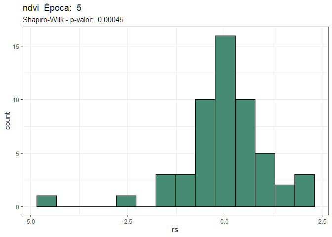<!-- -->

    #> # A tibble: 1 × 5
    #>   designacao   rep  ndvi    rs    yp
    #>        <dbl> <dbl> <dbl> <dbl> <dbl>
    #> 1         14     3 0.191 -12.5 0.330

<!-- -->

    #> 
    #> NULL
    #> [1] "========================"
    #> [1] "gndvi  Época:  1"
    #> [1] "========================"
    #> Analysis of Variance Table
    #> 
    #> Response: y
    #>           Df   Sum Sq  Mean Sq F value Pr(>F)
    #> trat      17 0.139807 0.008224  1.5386 0.1394
    #> bloco      2 0.024953 0.012477  2.3343 0.1122
    #> Residuals 34 0.181729 0.005345

<!-- -->

    #> # A tibble: 1 × 5
    #>   designacao   rep   gndvi    rs    yp
    #>        <dbl> <dbl>   <dbl> <dbl> <dbl>
    #> 1          1     1 0.00943 -4.98 0.231

<!-- -->

    #> 
    #> NULL
    #> [1] "========================"
    #> [1] "gndvi  Época:  3"
    #> [1] "========================"
    #> Analysis of Variance Table
    #> 
    #> Response: y
    #>           Df  Sum Sq  Mean Sq F value Pr(>F)
    #> trat      17 0.40734 0.023961  0.9694 0.5104
    #> bloco      2 0.06240 0.031198  1.2622 0.2959
    #> Residuals 34 0.84037 0.024717

<!-- --><!-- -->

    #> 
    #> NULL
    #> [1] "========================"
    #> [1] "gndvi  Época:  4"
    #> [1] "========================"
    #> Analysis of Variance Table
    #> 
    #> Response: y
    #>           Df  Sum Sq  Mean Sq F value    Pr(>F)    
    #> trat      17 0.18536 0.010903  0.7531 0.7290568    
    #> bloco      2 0.31947 0.159737 11.0327 0.0002029 ***
    #> Residuals 34 0.49227 0.014479                      
    #> ---
    #> Signif. codes:  0 '***' 0.001 '**' 0.01 '*' 0.05 '.' 0.1 ' ' 1

<!-- -->

    #> # A tibble: 1 × 5
    #>   designacao   rep  gndvi    rs    yp
    #>        <dbl> <dbl>  <dbl> <dbl> <dbl>
    #> 1         11     3 0.0405 -3.78 0.347

<!-- -->

    #> 
    #> NULL
    #> [1] "========================"
    #> [1] "gndvi  Época:  5"
    #> [1] "========================"
    #> Analysis of Variance Table
    #> 
    #> Response: y
    #>           Df   Sum Sq   Mean Sq F value  Pr(>F)  
    #> trat      17 0.081977 0.0048222  2.3684 0.01585 *
    #> bloco      2 0.000995 0.0004977  0.2445 0.78449  
    #> Residuals 34 0.069227 0.0020361                  
    #> ---
    #> Signif. codes:  0 '***' 0.001 '**' 0.01 '*' 0.05 '.' 0.1 ' ' 1

<!-- -->

    #> # A tibble: 2 × 5
    #>   designacao   rep  gndvi     rs    yp
    #>        <dbl> <dbl>  <dbl>  <dbl> <dbl>
    #> 1         14     2 0.349    3.36 0.243
    #> 2         14     3 0.0439 -13.3  0.236

<!-- -->

    #> 
    #> NULL
    #> [1] "========================"
    #> [1] "savi  Época:  1"
    #> [1] "========================"
    #> Analysis of Variance Table
    #> 
    #> Response: y
    #>           Df  Sum Sq  Mean Sq F value Pr(>F)
    #> trat      17 0.65966 0.038803  1.3829 0.2052
    #> bloco      2 0.07395 0.036977  1.3178 0.2811
    #> Residuals 34 0.95406 0.028061

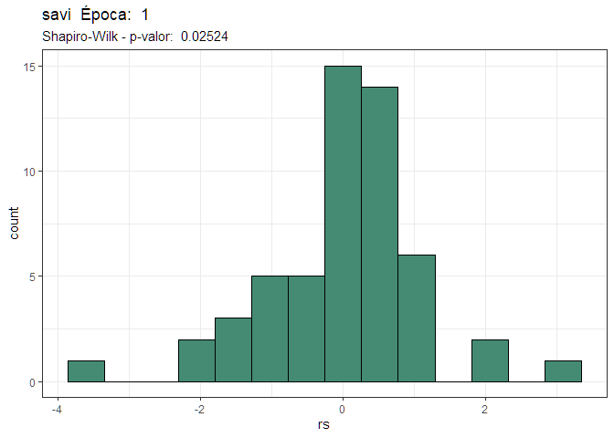<!-- -->

    #> # A tibble: 1 × 5
    #>   designacao   rep   savi    rs    yp
    #>        <dbl> <dbl>  <dbl> <dbl> <dbl>
    #> 1          1     1 0.0463 -4.11 0.498

<!-- -->

    #> 
    #> NULL
    #> [1] "========================"
    #> [1] "savi  Época:  3"
    #> [1] "========================"
    #> Analysis of Variance Table
    #> 
    #> Response: y
    #>           Df  Sum Sq  Mean Sq F value Pr(>F)
    #> trat      17 1.32159 0.077740  0.8982 0.5810
    #> bloco      2 0.21803 0.109017  1.2595 0.2967
    #> Residuals 34 2.94282 0.086553

<!-- --><!-- -->

    #> 
    #> NULL
    #> [1] "========================"
    #> [1] "savi  Época:  4"
    #> [1] "========================"
    #> Analysis of Variance Table
    #> 
    #> Response: y
    #>           Df  Sum Sq Mean Sq F value    Pr(>F)    
    #> trat      17 0.55394 0.03258  0.7671     0.715    
    #> bloco      2 1.23597 0.61798 14.5484 2.723e-05 ***
    #> Residuals 34 1.44424 0.04248                      
    #> ---
    #> Signif. codes:  0 '***' 0.001 '**' 0.01 '*' 0.05 '.' 0.1 ' ' 1

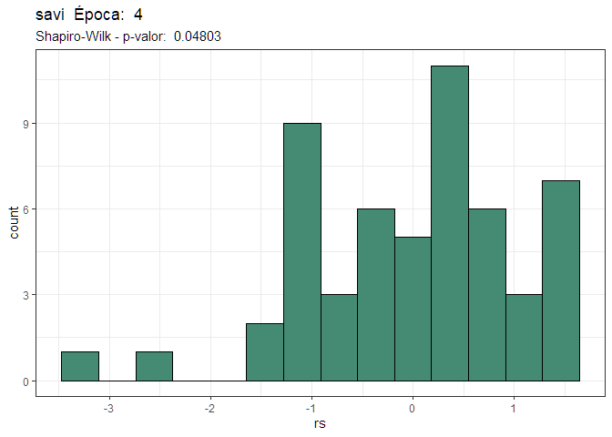<!-- -->

    #> # A tibble: 1 × 5
    #>   designacao   rep  savi    rs    yp
    #>        <dbl> <dbl> <dbl> <dbl> <dbl>
    #> 1         11     3 0.201 -3.04 0.648

<!-- -->

    #> 
    #> NULL
    #> [1] "========================"
    #> [1] "savi  Época:  5"
    #> [1] "========================"
    #> Analysis of Variance Table
    #> 
    #> Response: y
    #>           Df   Sum Sq   Mean Sq F value  Pr(>F)  
    #> trat      17 0.061254 0.0036032  1.4623 0.16880  
    #> bloco      2 0.024887 0.0124435  5.0499 0.01201 *
    #> Residuals 34 0.083779 0.0024641                  
    #> ---
    #> Signif. codes:  0 '***' 0.001 '**' 0.01 '*' 0.05 '.' 0.1 ' ' 1

<!-- -->

    #> # A tibble: 1 × 5
    #>   designacao   rep  savi    rs    yp
    #>        <dbl> <dbl> <dbl> <dbl> <dbl>
    #> 1         14     3 0.286 -12.5 0.495

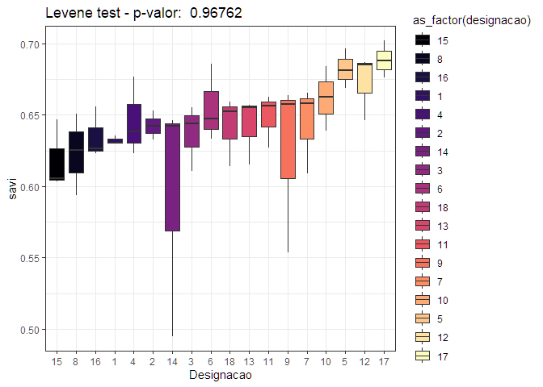<!-- -->

    #> 
    #> NULL
    #> [1] "========================"
    #> [1] "vari  Época:  1"
    #> [1] "========================"
    #> Analysis of Variance Table
    #> 
    #> Response: y
    #>           Df   Sum Sq   Mean Sq F value   Pr(>F)   
    #> trat      17 0.092545 0.0054438  2.8261 0.004844 **
    #> bloco      2 0.005721 0.0028603  1.4849 0.240845   
    #> Residuals 34 0.065493 0.0019263                    
    #> ---
    #> Signif. codes:  0 '***' 0.001 '**' 0.01 '*' 0.05 '.' 0.1 ' ' 1

<!-- -->

    #> # A tibble: 1 × 5
    #>   designacao   rep   vari    rs    yp
    #>        <dbl> <dbl>  <dbl> <dbl> <dbl>
    #> 1          1     1 0.0190 -3.35 0.121

<!-- -->

    #> 
    #> NULL
    #> [1] "========================"
    #> [1] "vari  Época:  3"
    #> [1] "========================"
    #> Analysis of Variance Table
    #> 
    #> Response: y
    #>           Df   Sum Sq   Mean Sq F value Pr(>F)
    #> trat      17 0.101124 0.0059485  1.0934 0.3981
    #> bloco      2 0.016702 0.0083508  1.5350 0.2300
    #> Residuals 34 0.184975 0.0054404

<!-- --><!-- -->

    #> 
    #> NULL
    #> [1] "========================"
    #> [1] "vari  Época:  4"
    #> [1] "========================"
    #> Analysis of Variance Table
    #> 
    #> Response: y
    #>           Df   Sum Sq   Mean Sq F value    Pr(>F)    
    #> trat      17 0.069580 0.0040929  2.1938   0.02511 *  
    #> bloco      2 0.061837 0.0309186 16.5720 9.463e-06 ***
    #> Residuals 34 0.063434 0.0018657                      
    #> ---
    #> Signif. codes:  0 '***' 0.001 '**' 0.01 '*' 0.05 '.' 0.1 ' ' 1

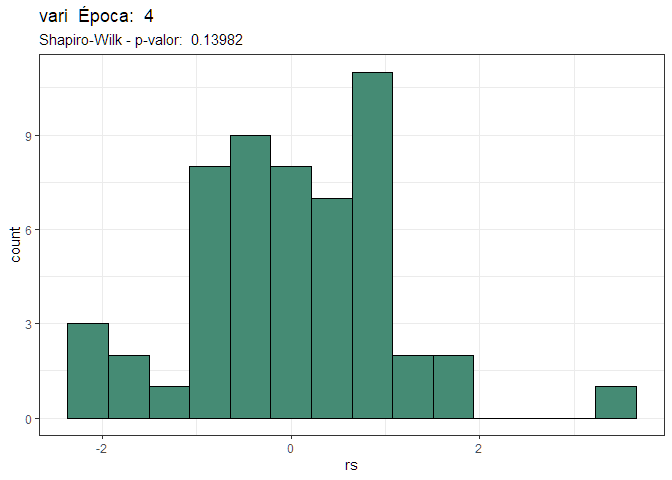<!-- -->

    #> # A tibble: 1 × 5
    #>   designacao   rep  vari    rs     yp
    #>        <dbl> <dbl> <dbl> <dbl>  <dbl>
    #> 1         14     3 0.172  3.92 0.0598

<!-- -->

    #> 
    #> NULL
    #> [1] "========================"
    #> [1] "vari  Época:  5"
    #> [1] "========================"
    #> Analysis of Variance Table
    #> 
    #> Response: y
    #>           Df   Sum Sq   Mean Sq F value    Pr(>F)    
    #> trat      17 0.047328 0.0027840  6.4409 2.177e-06 ***
    #> bloco      2 0.006475 0.0032374  7.4898  0.002018 ** 
    #> Residuals 34 0.014696 0.0004322                      
    #> ---
    #> Signif. codes:  0 '***' 0.001 '**' 0.01 '*' 0.05 '.' 0.1 ' ' 1

<!-- -->

    #> # A tibble: 2 × 5
    #>   designacao   rep  vari    rs     yp
    #>        <dbl> <dbl> <dbl> <dbl>  <dbl>
    #> 1         14     3 0.143  3.02 0.0986
    #> 2         15     2 0.126  3.25 0.0789

<!-- -->

    #> 
    #> NULL
