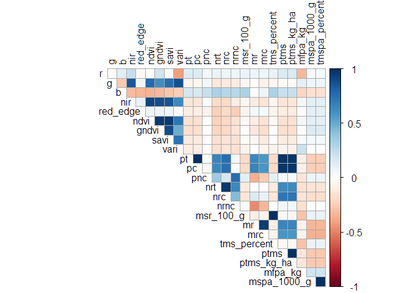
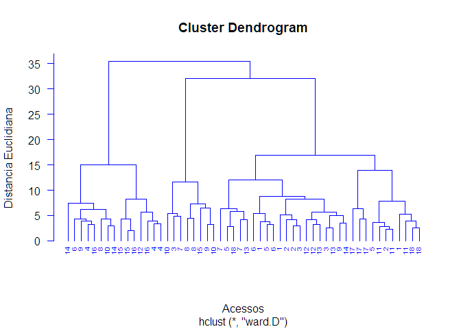
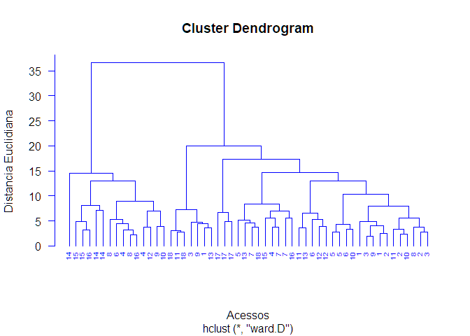
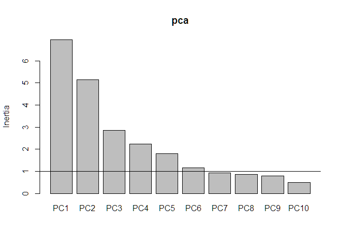
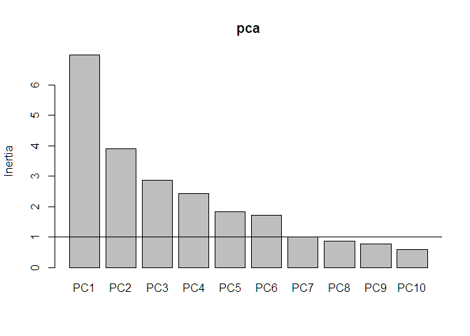

<!-- README.md is generated from README.Rmd. Please edit that file -->

# Análise - Doutorado - Edvaldo Aldo Litos Paulo Nhanombe

## Análise de variância - Batata Doce

### Carregando pacotes e banco de dados

``` r
library(tidyverse)
library(vegan)
library(ExpDes.pt)
data_set_bt <- read_rds("data/batata-doce-ednaldo.rds")
glimpse(data_set_bt)
#> Rows: 54
#> Columns: 17
#> $ designacao    <dbl> 1, 1, 1, 2, 2, 2, 3, 3, 3, 4, 4, 4, 5, 5, 5, 6, 6, 6, 7,…
#> $ bloco         <dbl> 1, 2, 3, 1, 2, 3, 1, 2, 3, 1, 2, 3, 1, 2, 3, 1, 2, 3, 1,…
#> $ pt            <dbl> 4.4450, 1.8800, 1.2250, 4.5500, 1.3550, 3.2200, 3.6600, …
#> $ pc            <dbl> 4.305, 1.880, 1.160, 4.435, 1.315, 3.085, 3.615, 1.760, …
#> $ pnc           <dbl> 0.1400, 0.0000, 0.0650, 0.1150, 0.0400, 0.1350, 0.0450, …
#> $ nrt           <dbl> 16, 6, 13, 16, 8, 13, 13, 16, 12, 25, 10, 22, 8, 4, 10, …
#> $ nrc           <dbl> 13, 6, 11, 13, 7, 10, 12, 12, 11, 21, 9, 16, 7, 4, 5, 12…
#> $ nrnc          <dbl> 3, 0, 2, 3, 1, 3, 1, 4, 1, 4, 1, 6, 1, 0, 5, 0, 3, 3, 8,…
#> $ msr_100_g     <dbl> 0.030, 0.025, 0.035, 0.030, 0.025, 0.025, 0.030, 0.030, …
#> $ mr            <dbl> 0.27781250, 0.31333333, 0.09423077, 0.28437500, 0.169375…
#> $ mrc           <dbl> 0.3311538, 0.3133333, 0.1054545, 0.3411538, 0.1878571, 0…
#> $ tms_percent   <dbl> 30, 25, 35, 30, 25, 25, 30, 30, 30, 25, 25, 25, 30, 30, …
#> $ ptms          <dbl> 1.333500, 0.470000, 0.428750, 1.365000, 0.338750, 0.8050…
#> $ ptms_kg_ha    <dbl> 8418.386, 2967.110, 2706.699, 8617.245, 2138.529, 5081.9…
#> $ mfpa_kg       <dbl> 8.670, 8.420, 12.745, 4.365, 2.975, 5.655, 4.395, 4.950,…
#> $ mspa_1000_g   <dbl> 0.125, 0.100, 0.165, 0.115, 0.140, 0.150, 0.130, 0.150, …
#> $ tmspa_percent <dbl> 12.5, 10.0, 16.5, 11.5, 14.0, 15.0, 13.0, 15.0, 14.5, 12…
```

``` r
lista_variaveis <- data_set_bt |> select(pt:tmspa_percent) |> names()
```

### Análise de resíduos - Pré-supostos da ANOVA

``` r
map(lista_variaveis, ~{
  print("========================")
  print(.x)
  print("========================")
  y <- data_set_bt |> pull(!!sym(.x))
  trat <- data_set_bt |> pull(designacao) |> as_factor()
  bloco <- data_set_bt |> pull(bloco) |> as_factor()
  dbc(trat,bloco,y,mcomp = "sk")
    print(cat("\n"))
})
```

## Análise exploratória - Multiespectral

### Carregando pacotes e banco de dados

``` r
library(tidyverse)
data_set_mult <- read_rds("data/batata-doce-multiespectral.rds")
glimpse(data_set_mult)
#> Rows: 216
#> Columns: 12
#> $ epoca      <dbl> 1, 1, 1, 1, 1, 1, 1, 1, 1, 1, 1, 1, 1, 1, 1, 1, 1, 1, 1, 1,…
#> $ designacao <dbl> 1, 1, 1, 2, 2, 2, 3, 3, 3, 4, 4, 4, 5, 5, 5, 6, 6, 6, 7, 7,…
#> $ rep        <dbl> 1, 2, 3, 1, 2, 3, 1, 2, 3, 1, 2, 3, 1, 2, 3, 1, 2, 3, 1, 2,…
#> $ r          <dbl> 19942.12, 20806.48, 20806.35, 21161.64, 20891.04, 21097.11,…
#> $ g          <dbl> 27621.00, 29823.40, 29960.27, 23863.78, 27079.20, 28653.24,…
#> $ b          <dbl> 137.7584, 138.5132, 135.6616, 131.0940, 138.0996, 135.0067,…
#> $ nir        <dbl> 47355.00, 51920.10, 57472.20, 51559.14, 55239.00, 59944.10,…
#> $ red_edge   <dbl> 21762.94, 31705.17, 22526.24, 22978.82, 31500.33, 23481.31,…
#> $ ndvi       <dbl> 0.34100000, 0.40684066, 0.46332079, 0.40566244, 0.44574740,…
#> $ gndvi      <dbl> 0.23100000, 0.26932817, 0.32691776, 0.36257996, 0.34713362,…
#> $ savi       <dbl> 0.49800000, 0.61025680, 0.69497663, 0.60848943, 0.66861658,…
#> $ vari       <dbl> 0.121000000, 0.155613755, 0.151821825, 0.049606302, 0.11185…
```

``` r
lista_variaveis <- data_set_mult |> select(r:vari) |> names()
```

### Análise considerando parcelas subdivididas

``` r
for(i in seq_along(lista_variaveis)){
  print("========================")
  print(lista_variaveis[i])
  print("========================")
  y <- data_set_mult |> pull(lista_variaveis[i])
  trat <- data_set_mult |> pull(designacao) |> as_factor()
  epoca <- data_set_mult |> pull(epoca) |> as_factor()
  bloco <- data_set_mult |> pull(rep) |> as_factor()
  psub2.dbc(trat,epoca,bloco,y,mcomp = "sk",
            fac.names=c("trat","epoca"),sigT = 0.2)
  print(cat("\n"))
}
#> [1] "========================"
#> [1] "r"
#> [1] "========================"
#> ------------------------------------------------------------------------
#> Legenda:
#> FATOR 1 (parcela):  trat 
#> FATOR 2 (subparcela):  epoca 
#> ------------------------------------------------------------------------
#> 
#> ------------------------------------------------------------------------
#> Quadro da analise de variancia
#> ------------------------------------------------------------------------
#>             GL        SQ      QM     Fc  Pr(>Fc)    
#> trat        17  21035789 1237399 1.3321 0.231995    
#> Bloco        2   3613178 1806589 1.9448 0.158601    
#> Erro a      34  31583892  928938                    
#> epoca        3  18635294 6211765 6.7244 0.000334 ***
#> trat*epoca  51  32533763  637917 0.6906 0.929260    
#> Erro b     108  99766218  923761                    
#> Total      215 207168134                            
#> ---
#> Signif. codes:  0 '***' 0.001 '**' 0.01 '*' 0.05 '.' 0.1 ' ' 1
#> ------------------------------------------------------------------------
#> CV 1 = 4.690116 %
#> CV 2 = 4.67703 %
#> 
#> Interacao nao significativa: analisando os efeitos simples
#> ------------------------------------------------------------------------
#> trat
#> De acordo com o teste F, as medias desse fator sao estatisticamente iguais.
#> ------------------------------------------------------------------------
#>    Niveis   Medias
#> 1       1 20805.25
#> 2      10 20606.96
#> 3      11 20680.45
#> 4      12 20396.56
#> 5      13 20567.10
#> 6      14 20518.17
#> 7      15 20531.12
#> 8      16 21085.86
#> 9      17 19660.71
#> 10     18 20562.39
#> 11      2 21064.52
#> 12      3 20355.16
#> 13      4 20361.70
#> 14      5 20176.99
#> 15      6 20661.00
#> 16      7 20818.81
#> 17      8 20501.75
#> 18      9 20543.73
#> ------------------------------------------------------------------------
#> epoca
#> Teste de Scott-Knott
#> ------------------------------------------------------------------------
#>   Grupos Tratamentos   Medias
#> 1      a           1 20984.55
#> 2      b           5 20565.87
#> 3      b           4 20489.50
#> 4      c           3 20159.68
#> ------------------------------------------------------------------------
#> 
#> 
#> NULL
#> [1] "========================"
#> [1] "g"
#> [1] "========================"
#> ------------------------------------------------------------------------
#> Legenda:
#> FATOR 1 (parcela):  trat 
#> FATOR 2 (subparcela):  epoca 
#> ------------------------------------------------------------------------
#> 
#> ------------------------------------------------------------------------
#> Quadro da analise de variancia
#> ------------------------------------------------------------------------
#>             GL         SQ        QM     Fc   Pr(>Fc)    
#> trat        17  515379053  30316415  3.494  0.000929 ***
#> Bloco        2  204175172 102087586 11.766  0.000131 ***
#> Erro a      34  295009864   8676761                     
#> epoca        3 1362190809 454063603 37.483 < 2.2e-16 ***
#> trat*epoca  51  470189755   9219407  0.761  0.860851    
#> Erro b     108 1308285733  12113757                     
#> Total      215 4155230386                               
#> ---
#> Signif. codes:  0 '***' 0.001 '**' 0.01 '*' 0.05 '.' 0.1 ' ' 1
#> ------------------------------------------------------------------------
#> CV 1 = 11.3978 %
#> CV 2 = 13.46734 %
#> 
#> Interacao nao significativa: analisando os efeitos simples
#> ------------------------------------------------------------------------
#> trat
#> Teste de Scott-Knott
#> ------------------------------------------------------------------------
#>    Grupos Tratamentos   Medias
#> 1       a          12 30144.71
#> 2       b          14 27555.53
#> 3       b          16 27541.63
#> 4       b          17 27267.54
#> 5       b           6 27265.71
#> 6       b           7 26754.83
#> 7       c          15 25875.14
#> 8       c          13 25565.37
#> 9       c           9 25380.83
#> 10      c           1 25195.12
#> 11      c          11 24869.63
#> 12      c           5 24793.43
#> 13      c           4 24690.05
#> 14      c          18 24584.68
#> 15      c           3 24565.46
#> 16      c           8 24431.27
#> 17      c          10 24427.04
#> 18      c           2 24281.78
#> ------------------------------------------------------------------------
#> 
#> epoca
#> Teste de Scott-Knott
#> ------------------------------------------------------------------------
#>   Grupos Tratamentos   Medias
#> 1      a           1 29624.78
#> 2      b           4 26603.53
#> 3      c           3 23723.67
#> 4      c           5 23423.51
#> ------------------------------------------------------------------------
#> 
#> 
#> NULL
#> [1] "========================"
#> [1] "b"
#> [1] "========================"
#> ------------------------------------------------------------------------
#> Legenda:
#> FATOR 1 (parcela):  trat 
#> FATOR 2 (subparcela):  epoca 
#> ------------------------------------------------------------------------
#> 
#> ------------------------------------------------------------------------
#> Quadro da analise de variancia
#> ------------------------------------------------------------------------
#>             GL      SQ      QM     Fc Pr(>Fc)    
#> trat        17  2151.5  126.56  2.497 0.01132 *  
#> Bloco        2     2.6    1.32  0.026 0.97432    
#> Erro a      34  1723.2   50.68                   
#> epoca        3  5386.6 1795.54 43.649 < 2e-16 ***
#> trat*epoca  51  2100.8   41.19  1.001 0.48627    
#> Erro b     108  4442.7   41.14                   
#> Total      215 15807.5                           
#> ---
#> Signif. codes:  0 '***' 0.001 '**' 0.01 '*' 0.05 '.' 0.1 ' ' 1
#> ------------------------------------------------------------------------
#> CV 1 = 5.439989 %
#> CV 2 = 4.901041 %
#> 
#> Interacao nao significativa: analisando os efeitos simples
#> ------------------------------------------------------------------------
#> trat
#> Teste de Scott-Knott
#> ------------------------------------------------------------------------
#>    Grupos Tratamentos   Medias
#> 1       a          13 137.1923
#> 2       a           8 136.2021
#> 3       a          15 133.5895
#> 4       a           7 132.8511
#> 5       a          16 132.2818
#> 6       a          10 132.1871
#> 7       a          14 132.0029
#> 8       a           9 131.5938
#> 9       a           2 131.2540
#> 10      a           4 130.8053
#> 11      a          18 130.4663
#> 12      a           5 130.2510
#> 13      a          11 129.9713
#> 14      b           1 129.0203
#> 15      b           3 128.4058
#> 16      b           6 127.2194
#> 17      b          12 126.5703
#> 18      b          17 123.7129
#> ------------------------------------------------------------------------
#> 
#> epoca
#> Teste de Scott-Knott
#> ------------------------------------------------------------------------
#>   Grupos Tratamentos   Medias
#> 1      a           1 137.5763
#> 2      b           3 132.6886
#> 3      c           4 129.3348
#> 4      d           5 123.8619
#> ------------------------------------------------------------------------
#> 
#> 
#> NULL
#> [1] "========================"
#> [1] "nir"
#> [1] "========================"
#> ------------------------------------------------------------------------
#> Legenda:
#> FATOR 1 (parcela):  trat 
#> FATOR 2 (subparcela):  epoca 
#> ------------------------------------------------------------------------
#> 
#> ------------------------------------------------------------------------
#> Quadro da analise de variancia
#> ------------------------------------------------------------------------
#>             GL         SQ         QM      Fc  Pr(>Fc)    
#> trat        17 2.2675e+09  133382340  0.8611 0.618784    
#> Bloco        2 1.7353e+09  867652607  5.6016 0.007893 ** 
#> Erro a      34 5.2664e+09  154893961                     
#> epoca        3 6.5356e+09 2178538595 12.0923    1e-06 ***
#> trat*epoca  51 5.7802e+09  113337865  0.6291 0.966765    
#> Erro b     108 1.9457e+10  180158451                     
#> Total      215 4.1042e+10                                
#> ---
#> Signif. codes:  0 '***' 0.001 '**' 0.01 '*' 0.05 '.' 0.1 ' ' 1
#> ------------------------------------------------------------------------
#> CV 1 = 26.2067 %
#> CV 2 = 28.26327 %
#> 
#> Interacao nao significativa: analisando os efeitos simples
#> ------------------------------------------------------------------------
#> trat
#> De acordo com o teste F, as medias desse fator sao estatisticamente iguais.
#> ------------------------------------------------------------------------
#>    Niveis   Medias
#> 1       1 50385.55
#> 2      10 39521.03
#> 3      11 52418.79
#> 4      12 48621.46
#> 5      13 46181.37
#> 6      14 46363.99
#> 7      15 43539.86
#> 8      16 50136.37
#> 9      17 50806.35
#> 10     18 49649.78
#> 11      2 45928.81
#> 12      3 44288.09
#> 13      4 43559.83
#> 14      5 50904.86
#> 15      6 47008.19
#> 16      7 50196.96
#> 17      8 46466.71
#> 18      9 48847.37
#> ------------------------------------------------------------------------
#> epoca
#> Teste de Scott-Knott
#> ------------------------------------------------------------------------
#>   Grupos Tratamentos   Medias
#> 1      a           1 51718.28
#> 2      a           4 50641.12
#> 3      a           5 49545.59
#> 4      b           3 38056.20
#> ------------------------------------------------------------------------
#> 
#> 
#> NULL
#> [1] "========================"
#> [1] "red_edge"
#> [1] "========================"
#> ------------------------------------------------------------------------
#> Legenda:
#> FATOR 1 (parcela):  trat 
#> FATOR 2 (subparcela):  epoca 
#> ------------------------------------------------------------------------
#> 
#> ------------------------------------------------------------------------
#> Quadro da analise de variancia
#> ------------------------------------------------------------------------
#>             GL         SQ        QM      Fc   Pr(>Fc)    
#> trat        17   78939770   4643516  1.0456  0.439506    
#> Bloco        2  206359664 103179832 23.2330 < 2.2e-16 ***
#> Erro a      34  150997176   4441093                      
#> epoca        3   90589932  30196644  6.3464  0.000528 ***
#> trat*epoca  51  303185280   5944809  1.2494  0.167526    
#> Erro b     108  513870773   4758063                      
#> Total      215 1343942596                                
#> ---
#> Signif. codes:  0 '***' 0.001 '**' 0.01 '*' 0.05 '.' 0.1 ' ' 1
#> ------------------------------------------------------------------------
#> CV 1 = 6.979684 %
#> CV 2 = 7.224468 %
#> 
#> Interacao nao significativa: analisando os efeitos simples
#> ------------------------------------------------------------------------
#> trat
#> De acordo com o teste F, as medias desse fator sao estatisticamente iguais.
#> ------------------------------------------------------------------------
#>    Niveis   Medias
#> 1       1 29928.96
#> 2      10 30591.58
#> 3      11 30038.16
#> 4      12 28729.28
#> 5      13 29725.35
#> 6      14 29150.97
#> 7      15 29680.45
#> 8      16 30035.22
#> 9      17 30209.46
#> 10     18 31133.35
#> 11      2 30149.89
#> 12      3 30614.86
#> 13      4 30930.97
#> 14      5 30805.28
#> 15      6 30781.67
#> 16      7 29969.70
#> 17      8 30603.38
#> 18      9 30399.13
#> ------------------------------------------------------------------------
#> epoca
#> Teste de Scott-Knott
#> ------------------------------------------------------------------------
#>   Grupos Tratamentos   Medias
#> 1      a           4 30661.48
#> 2      a           3 30591.44
#> 3      a           5 30439.76
#> 4      b           1 29080.13
#> ------------------------------------------------------------------------
#> 
#> 
#> NULL
#> [1] "========================"
#> [1] "ndvi"
#> [1] "========================"
#> ------------------------------------------------------------------------
#> Legenda:
#> FATOR 1 (parcela):  trat 
#> FATOR 2 (subparcela):  epoca 
#> ------------------------------------------------------------------------
#> 
#> ------------------------------------------------------------------------
#> Quadro da analise de variancia
#> ------------------------------------------------------------------------
#>             GL     SQ       QM      Fc Pr(>Fc)    
#> trat        17 0.2904 0.017084  0.9752 0.50484    
#> Bloco        2 0.1679 0.083948  4.7921 0.01467 *  
#> Erro a      34 0.5956 0.017518                    
#> epoca        3 0.7029 0.234316 12.7155 < 2e-16 ***
#> trat*epoca  51 0.6907 0.013542  0.7349 0.88950    
#> Erro b     108 1.9902 0.018428                    
#> Total      215 4.4377                             
#> ---
#> Signif. codes:  0 '***' 0.001 '**' 0.01 '*' 0.05 '.' 0.1 ' ' 1
#> ------------------------------------------------------------------------
#> CV 1 = 34.82319 %
#> CV 2 = 35.71566 %
#> 
#> Interacao nao significativa: analisando os efeitos simples
#> ------------------------------------------------------------------------
#> trat
#> De acordo com o teste F, as medias desse fator sao estatisticamente iguais.
#> ------------------------------------------------------------------------
#>    Niveis    Medias
#> 1       1 0.4033830
#> 2      10 0.2815210
#> 3      11 0.4238135
#> 4      12 0.3821632
#> 5      13 0.3684321
#> 6      14 0.3950491
#> 7      15 0.3437409
#> 8      16 0.3930098
#> 9      17 0.4319938
#> 10     18 0.3975051
#> 11      2 0.3481623
#> 12      3 0.3718794
#> 13      4 0.3305334
#> 14      5 0.4183305
#> 15      6 0.3652239
#> 16      7 0.3932397
#> 17      8 0.3719505
#> 18      9 0.4215299
#> ------------------------------------------------------------------------
#> epoca
#> Teste de Scott-Knott
#> ------------------------------------------------------------------------
#>   Grupos Tratamentos    Medias
#> 1      a           5 0.4293348
#> 2      a           4 0.4093195
#> 3      a           1 0.3985251
#> 4      b           3 0.2831452
#> ------------------------------------------------------------------------
#> 
#> 
#> NULL
#> [1] "========================"
#> [1] "gndvi"
#> [1] "========================"
#> ------------------------------------------------------------------------
#> Legenda:
#> FATOR 1 (parcela):  trat 
#> FATOR 2 (subparcela):  epoca 
#> ------------------------------------------------------------------------
#> 
#> ------------------------------------------------------------------------
#> Quadro da analise de variancia
#> ------------------------------------------------------------------------
#>             GL     SQ       QM      Fc Pr(>Fc)    
#> trat        17 0.3243 0.019077  1.5395 0.13905    
#> Bloco        2 0.1076 0.053790  4.3408 0.02094 *  
#> Erro a      34 0.4213 0.012392                    
#> epoca        3 0.7603 0.253432 21.5651 < 2e-16 ***
#> trat*epoca  51 0.4745 0.009304  0.7917 0.82279    
#> Erro b     108 1.2692 0.011752                    
#> Total      215 3.3572                             
#> ---
#> Signif. codes:  0 '***' 0.001 '**' 0.01 '*' 0.05 '.' 0.1 ' ' 1
#> ------------------------------------------------------------------------
#> CV 1 = 37.98195 %
#> CV 2 = 36.98846 %
#> 
#> Interacao nao significativa: analisando os efeitos simples
#> ------------------------------------------------------------------------
#> trat
#> De acordo com o teste F, as medias desse fator sao estatisticamente iguais.
#> ------------------------------------------------------------------------
#>    Niveis    Medias
#> 1       1 0.3366799
#> 2      10 0.2192938
#> 3      11 0.3550788
#> 4      12 0.2371858
#> 5      13 0.2738915
#> 6      14 0.2500863
#> 7      15 0.2694316
#> 8      16 0.2825102
#> 9      17 0.3069775
#> 10     18 0.3326011
#> 11      2 0.2975743
#> 12      3 0.3020449
#> 13      4 0.2518595
#> 14      5 0.3432018
#> 15      6 0.2594034
#> 16      7 0.2997925
#> 17      8 0.3267865
#> 18      9 0.3310653
#> ------------------------------------------------------------------------
#> epoca
#> Teste de Scott-Knott
#> ------------------------------------------------------------------------
#>   Grupos Tratamentos    Medias
#> 1      a           5 0.3772415
#> 2      b           4 0.3109852
#> 3      c           1 0.2691374
#> 4      d           3 0.2149613
#> ------------------------------------------------------------------------
#> 
#> 
#> NULL
#> [1] "========================"
#> [1] "savi"
#> [1] "========================"
#> ------------------------------------------------------------------------
#> Legenda:
#> FATOR 1 (parcela):  trat 
#> FATOR 2 (subparcela):  epoca 
#> ------------------------------------------------------------------------
#> 
#> ------------------------------------------------------------------------
#> Quadro da analise de variancia
#> ------------------------------------------------------------------------
#>             GL      SQ      QM      Fc Pr(>Fc)    
#> trat        17  0.5935 0.03491  0.8665 0.61323    
#> Bloco        2  0.3191 0.15954  3.9601 0.02844 *  
#> Erro a      34  1.3698 0.04029                    
#> epoca        3  1.6681 0.55605 12.4357 < 2e-16 ***
#> trat*epoca  51  1.9262 0.03777  0.8447 0.74670    
#> Erro b     108  4.8291 0.04471                    
#> Total      215 10.7057                            
#> ---
#> Signif. codes:  0 '***' 0.001 '**' 0.01 '*' 0.05 '.' 0.1 ' ' 1
#> ------------------------------------------------------------------------
#> CV 1 = 35.82174 %
#> CV 2 = 37.7384 %
#> 
#> Interacao nao significativa: analisando os efeitos simples
#> ------------------------------------------------------------------------
#> trat
#> De acordo com o teste F, as medias desse fator sao estatisticamente iguais.
#> ------------------------------------------------------------------------
#>    Niveis    Medias
#> 1       1 0.6039454
#> 2      10 0.4222780
#> 3      11 0.5820586
#> 4      12 0.5732406
#> 5      13 0.5526439
#> 6      14 0.5555959
#> 7      15 0.5156074
#> 8      16 0.5895103
#> 9      17 0.6479858
#> 10     18 0.5962532
#> 11      2 0.5222394
#> 12      3 0.5578149
#> 13      4 0.4957961
#> 14      5 0.6274912
#> 15      6 0.5478317
#> 16      7 0.5898554
#> 17      8 0.5044575
#> 18      9 0.6011676
#> ------------------------------------------------------------------------
#> epoca
#> Teste de Scott-Knott
#> ------------------------------------------------------------------------
#>   Grupos Tratamentos    Medias
#> 1      a           5 0.6439972
#> 2      a           4 0.5940999
#> 3      a           1 0.5906176
#> 4      b           3 0.4125682
#> ------------------------------------------------------------------------
#> 
#> 
#> NULL
#> [1] "========================"
#> [1] "vari"
#> [1] "========================"
#> ------------------------------------------------------------------------
#> Legenda:
#> FATOR 1 (parcela):  trat 
#> FATOR 2 (subparcela):  epoca 
#> ------------------------------------------------------------------------
#> 
#> ------------------------------------------------------------------------
#> Quadro da analise de variancia
#> ------------------------------------------------------------------------
#>             GL      SQ       QM     Fc   Pr(>Fc)    
#> trat        17 0.14283 0.008402  3.421  0.001107 ** 
#> Bloco        2 0.02029 0.010146  4.131  0.024768 *  
#> Erro a      34 0.08350 0.002456                     
#> epoca        3 0.25154 0.083847 32.180 < 2.2e-16 ***
#> trat*epoca  51 0.17573 0.003446  1.322  0.113935    
#> Erro b     108 0.28140 0.002606                     
#> Total      215 0.95530                              
#> ---
#> Signif. codes:  0 '***' 0.001 '**' 0.01 '*' 0.05 '.' 0.1 ' ' 1
#> ------------------------------------------------------------------------
#> CV 1 = 51.11635 %
#> CV 2 = 52.64972 %
#> 
#> Interacao nao significativa: analisando os efeitos simples
#> ------------------------------------------------------------------------
#> trat
#> Teste de Scott-Knott
#> ------------------------------------------------------------------------
#>    Grupos Tratamentos     Medias
#> 1       a          12 0.15764429
#> 2       a          17 0.14262577
#> 3       b          16 0.12185047
#> 4       b           6 0.11640278
#> 5       b          14 0.11523442
#> 6       b          13 0.10561157
#> 7       b           7 0.10504350
#> 8       b           9 0.10334848
#> 9       c          15 0.09504100
#> 10      c           5 0.08745236
#> 11      c           4 0.08400298
#> 12      c           3 0.07954623
#> 13      c          11 0.07908734
#> 14      c           1 0.07580187
#> 15      c           8 0.07575239
#> 16      c          18 0.07384013
#> 17      c          10 0.06873162
#> 18      c           2 0.05811386
#> ------------------------------------------------------------------------
#> 
#> epoca
#> Teste de Scott-Knott
#> ------------------------------------------------------------------------
#>   Grupos Tratamentos    Medias
#> 1      a           1 0.1453534
#> 2      b           4 0.1108539
#> 3      c           3 0.0753210
#> 4      d           5 0.0562786
#> ------------------------------------------------------------------------
#> 
#> 
#> NULL
```

## Análise de Correlação Linear entre as variáveis

### Juntando as bases

``` r
data_set <- data_set_mult |> 
  left_join( data_set_bt |> 
               rename(rep = bloco),
             by = c("designacao","rep"))
```

``` r
walk(c(1,3:5), ~{
  dfau <- data_set |> 
    filter(epoca == .x) |> 
    select(r:tmspa_percent) 
  
  dfau_cor <- cor(dfau) 
  
  corrplot::corrplot(dfau_cor, method = "color",
         outline = TRUE,
         addgrid.col = "darkgray", cl.pos = "r", tl.col = "black",
         tl.cex = 1, cl.cex = 1, type = "upper", bg="azure2",
         diag = FALSE,
         cl.ratio = 0.2,
         cl.length = 5,
         number.cex = 0.8)
})
```

<!-- --><!-- --><!-- --><!-- -->
\## Análise de agrupamento hierárquico - Por época

``` r
map(c(1,3:5), ~{
  print("========================")
  print(paste0("Época: ",.x))
  print("========================")
  da_pad<-decostand(  data_set |> 
    filter(epoca == .x) |> 
    select(r:tmspa_percent) , 
                  method = "standardize",
                  na.rm=TRUE)
  labs <- data_set |> filter(epoca == .x) |> pull(designacao)
  da_pad_euc<-vegdist(da_pad,"euclidean") 
  da_pad_euc_ward<-hclust(da_pad_euc, method="ward.D")
  plot(da_pad_euc_ward,labels = labs,
     ylab="Distancia Euclidiana",
     xlab="Acessos", hang=-1,
     col="blue", las=1,
     cex=.6,lwd=1.5)
}) 
#> [1] "========================"
#> [1] "Época: 1"
#> [1] "========================"
```

<!-- -->

    #> [1] "========================"
    #> [1] "Época: 3"
    #> [1] "========================"

<!-- -->

    #> [1] "========================"
    #> [1] "Época: 4"
    #> [1] "========================"

<!-- -->

    #> [1] "========================"
    #> [1] "Época: 5"
    #> [1] "========================"

<!-- -->

    #> [[1]]
    #> NULL
    #> 
    #> [[2]]
    #> NULL
    #> 
    #> [[3]]
    #> NULL
    #> 
    #> [[4]]
    #> NULL

## Componentes principais - Por época

``` r
for(.x in c(1,3,4,5)){
  print("========================")
  print(paste0("Época: ",.x))
  print("========================")
  print("======== Análise de Componentes Principais ========== ")
  da_pad<-decostand(  data_set |> 
    filter(epoca == .x) |> 
    select(r:tmspa_percent) , 
                  method = "standardize",
                  na.rm=TRUE)
  pca <-  prcomp(da_pad,scale.=TRUE)
  # Autovalores
  eig<-pca$sdev^2
  print("==== Autovalores ====")
  print(round(eig,3))
  print("==== % da variância explicada ====")
  ve<-eig/sum(eig)
  print(round(ve,4))
  print("==== % da variância explicada acumulada ====")
  print(round(cumsum(ve),4)*100)
  print("==== Poder Discriminante ====")
  mcor<-cor(da_pad,pca$x)
  corrplot::corrplot(mcor)
  print("==== screeplot ====")
  screeplot(pca)
  abline(h=1)
  labs <- data_set |> filter(epoca == .x) |> pull(designacao)
  pc1V<-cor(da_pad,pca$x)[,1]/sd(cor(da_pad,pca$x)[,1])
  pc2V<-cor(da_pad,pca$x)[,2]/sd(cor(da_pad,pca$x)[,2])
  pc1c<-pca$x[,1]/sd(pca$x[,1])
  pc2c<-pca$x[,2]/sd(pca$x[,2])
  nv<-ncol(da_pad) # número de variáveis utilizadas na análise
  bip<-data.frame(pc1c,pc2c,labs)
  texto <- data.frame(
    x = pc1V,
    y = pc2V,
    # z = pc3V,
    label = names(da_pad)
  )
  
  print("==== Tabela da correlação dos atributos com cada PC ====")
  ck<-sum(pca$sdev^2>=0.98)
  tabelapca<-vector()
  for( l in 1:ck) tabelapca<-cbind(tabelapca,mcor[,l])
  colnames(tabelapca)<-paste(rep(c("PC"),ck),1:ck,sep="")
  pcat<-round(tabelapca,3)
  tabelapca<-tabelapca[order(abs(tabelapca[,1])),]
  
  
  bi_plot <- bip |>
    ggplot(aes(x=pc1c,y=pc2c))+
    # geom_point() +
    theme_minimal() +
    geom_text(aes(label = labs), vjust = -0.5, size = 3) +  # nomes dos tratamentos
    # # scale_shape_manual(values=16:18)+
    # # scale_color_manual(values=c("#009E73", "#999999","#D55E00")) +
    annotate(geom="text", x=pc1V, y=pc2V, label=names(pc1V),
              color="black",font=3) +
    geom_vline(aes(xintercept=0),
                color="black", size=1)+
    geom_hline(aes(yintercept=0),
                color="black", size=1) +
    annotate(geom="segment",
              x=rep(0,length(da_pad)),
              xend=texto$x,
              y=rep(0,length(da_pad)),
              yend=texto$y,color="black",lwd=.5) +
    geom_label(data=texto,aes(x=x,y=y,label=label),
               color="black",angle=0,fontface="bold",size=4,fill="white") +
    labs(x=paste("CP1 (",round(100*ve[1],2),"%)",sep=""),
         y=paste("CP2 (",round(100*ve[2],2),"%)",sep=""))+
    theme(legend.position = "top")
  
    print(bi_plot)
    print(tabelapca[,1:3])
} 
#> [1] "========================"
#> [1] "Época: 1"
#> [1] "========================"
#> [1] "======== Análise de Componentes Principais ========== "
#> [1] "==== Autovalores ===="
#>  [1] 6.954 5.148 2.853 2.247 1.793 1.163 0.938 0.867 0.782 0.485 0.320 0.231
#> [13] 0.095 0.071 0.026 0.013 0.011 0.003 0.000 0.000 0.000 0.000 0.000 0.000
#> [1] "==== % da variância explicada ===="
#>  [1] 0.2897 0.2145 0.1189 0.0936 0.0747 0.0485 0.0391 0.0361 0.0326 0.0202
#> [11] 0.0133 0.0096 0.0040 0.0029 0.0011 0.0006 0.0005 0.0001 0.0000 0.0000
#> [21] 0.0000 0.0000 0.0000 0.0000
#> [1] "==== % da variância explicada acumulada ===="
#>  [1]  28.97  50.42  62.31  71.67  79.15  83.99  87.90  91.51  94.77  96.79
#> [11]  98.12  99.09  99.48  99.78  99.88  99.94  99.99 100.00 100.00 100.00
#> [21] 100.00 100.00 100.00 100.00
#> [1] "==== Poder Discriminante ===="
```

<!-- -->

    #> [1] "==== screeplot ===="

<!-- -->

    #> [1] "==== Tabela da correlação dos atributos com cada PC ===="

<!-- -->

    #>                       PC1         PC2          PC3
    #> mfpa_kg        0.02006673  0.29560667  0.095028414
    #> nrnc          -0.08758402 -0.35100302 -0.798588081
    #> pnc           -0.09481034 -0.19101695 -0.711518615
    #> msr_100_g     -0.18984280  0.04341703 -0.187697743
    #> tms_percent   -0.18984280  0.04341703 -0.187697743
    #> r              0.22932048 -0.08635273  0.151485358
    #> red_edge      -0.24526814 -0.19044163 -0.264372669
    #> nrt            0.40140000 -0.66983900 -0.543898602
    #> tmspa_percent -0.40358821  0.13043578 -0.209925207
    #> mspa_1000_g   -0.40358821  0.13043578 -0.209925207
    #> b             -0.42804860 -0.58797870 -0.039181907
    #> gndvi          0.46993801  0.67205184 -0.215834266
    #> nrc            0.49598005 -0.67595053 -0.381506140
    #> savi           0.61177963  0.68025210 -0.276746503
    #> ndvi           0.63470220  0.70360603 -0.251088829
    #> mrc            0.64207793 -0.15330261  0.556128206
    #> nir            0.64442779  0.70714843 -0.208582484
    #> vari           0.66783025  0.53207509 -0.232877084
    #> mr             0.67441048 -0.18497185  0.614762435
    #> g              0.68521592  0.47400328 -0.180736012
    #> ptms           0.81166580 -0.51508755 -0.024418956
    #> ptms_kg_ha     0.81166580 -0.51508755 -0.024418956
    #> pt             0.81212434 -0.53342691 -0.002542686
    #> pc             0.81405450 -0.52739931  0.030803082
    #> [1] "========================"
    #> [1] "Época: 3"
    #> [1] "========================"
    #> [1] "======== Análise de Componentes Principais ========== "
    #> [1] "==== Autovalores ===="
    #>  [1] 6.835 4.638 3.060 2.335 1.843 1.405 0.994 0.792 0.602 0.536 0.446 0.248
    #> [13] 0.095 0.073 0.046 0.023 0.016 0.010 0.001 0.000 0.000 0.000 0.000 0.000
    #> [1] "==== % da variância explicada ===="
    #>  [1] 0.2848 0.1933 0.1275 0.0973 0.0768 0.0585 0.0414 0.0330 0.0251 0.0223
    #> [11] 0.0186 0.0103 0.0040 0.0031 0.0019 0.0009 0.0007 0.0004 0.0000 0.0000
    #> [21] 0.0000 0.0000 0.0000 0.0000
    #> [1] "==== % da variância explicada acumulada ===="
    #>  [1]  28.48  47.81  60.56  70.29  77.97  83.82  87.96  91.26  93.77  96.01
    #> [11]  97.87  98.90  99.30  99.60  99.79  99.89  99.95 100.00 100.00 100.00
    #> [21] 100.00 100.00 100.00 100.00
    #> [1] "==== Poder Discriminante ===="

<!-- -->

    #> [1] "==== screeplot ===="

<!-- -->

    #> [1] "==== Tabela da correlação dos atributos com cada PC ===="

<!-- -->

    #>                       PC1         PC2         PC3
    #> pnc           -0.04659399  0.11970212 -0.72250800
    #> msr_100_g      0.07699913  0.23131202 -0.20641898
    #> tms_percent    0.07699913  0.23131202 -0.20641898
    #> r             -0.13028129 -0.06479124 -0.17635702
    #> red_edge       0.18501301 -0.05725243  0.28554222
    #> nrnc          -0.19703700  0.22920580 -0.82257042
    #> mfpa_kg        0.20334229 -0.04382030  0.22148996
    #> mspa_1000_g    0.39083604  0.16626782 -0.21599169
    #> tmspa_percent  0.39083604  0.16626782 -0.21599169
    #> b             -0.40883091  0.25723603 -0.30116658
    #> vari           0.45250901 -0.66312712 -0.05513324
    #> g              0.45816591 -0.73941692 -0.17977140
    #> savi           0.53762917 -0.75822799 -0.17181244
    #> mrc           -0.55228211 -0.34958089  0.54649689
    #> mr            -0.55961544 -0.44601654  0.58028130
    #> nir            0.56681467 -0.72423939 -0.21766241
    #> gndvi          0.57959986 -0.65304552 -0.19454380
    #> ndvi           0.60605929 -0.74218233 -0.16934013
    #> nrt           -0.68165298 -0.13144164 -0.62286678
    #> nrc           -0.73590130 -0.22558142 -0.46711660
    #> ptms          -0.84387269 -0.46396586 -0.06429751
    #> ptms_kg_ha    -0.84387269 -0.46396586 -0.06429751
    #> pc            -0.84645090 -0.47881934 -0.01315014
    #> pt            -0.85069040 -0.47028912 -0.04459211
    #> [1] "========================"
    #> [1] "Época: 4"
    #> [1] "========================"
    #> [1] "======== Análise de Componentes Principais ========== "
    #> [1] "==== Autovalores ===="
    #>  [1] 6.781 5.076 2.702 2.245 1.799 1.274 0.950 0.765 0.732 0.663 0.366 0.256
    #> [13] 0.154 0.078 0.065 0.047 0.019 0.017 0.010 0.000 0.000 0.000 0.000 0.000
    #> [1] "==== % da variância explicada ===="
    #>  [1] 0.2826 0.2115 0.1126 0.0935 0.0750 0.0531 0.0396 0.0319 0.0305 0.0276
    #> [11] 0.0153 0.0107 0.0064 0.0033 0.0027 0.0019 0.0008 0.0007 0.0004 0.0000
    #> [21] 0.0000 0.0000 0.0000 0.0000
    #> [1] "==== % da variância explicada acumulada ===="
    #>  [1]  28.26  49.41  60.67  70.02  77.51  82.82  86.78  89.97  93.02  95.78
    #> [11]  97.31  98.38  99.02  99.34  99.61  99.81  99.89  99.96 100.00 100.00
    #> [21] 100.00 100.00 100.00 100.00
    #> [1] "==== Poder Discriminante ===="

<!-- -->

    #> [1] "==== screeplot ===="

<!-- -->

    #> [1] "==== Tabela da correlação dos atributos com cada PC ===="

<!-- -->

    #>                       PC1          PC2         PC3
    #> nrnc          -0.07898161 -0.392703176  0.80360325
    #> r             -0.10799079 -0.603964126 -0.14250487
    #> red_edge      -0.12437958 -0.004193286 -0.30055095
    #> mfpa_kg       -0.12781415  0.146417604 -0.24400863
    #> tms_percent   -0.13458882  0.083452775  0.27743614
    #> msr_100_g     -0.13458882  0.083452775  0.27743614
    #> pnc           -0.14425616 -0.313534568  0.67794462
    #> b              0.16214121  0.193143061  0.22464974
    #> g             -0.45025869 -0.664085020 -0.16767739
    #> nrt            0.46223862 -0.628690076  0.52182487
    #> vari          -0.48342334 -0.447575045 -0.04973452
    #> gndvi         -0.52283081 -0.660144405 -0.20887840
    #> mspa_1000_g   -0.55692111 -0.146595667 -0.04957809
    #> tmspa_percent -0.55692111 -0.146595667 -0.04957809
    #> nrc            0.56630012 -0.611537626  0.35562452
    #> savi          -0.62550070 -0.631953075 -0.20195279
    #> nir           -0.62832430 -0.711245677 -0.22385576
    #> ndvi          -0.63157767 -0.692089688 -0.19949570
    #> mrc            0.66383010 -0.052055140 -0.50511073
    #> mr             0.71202715 -0.073576289 -0.57830012
    #> ptms           0.81106484 -0.524592260 -0.04933647
    #> ptms_kg_ha     0.81106484 -0.524592260 -0.04933647
    #> pt             0.81479219 -0.532343177 -0.08010141
    #> pc             0.81957255 -0.520582125 -0.11177736
    #> [1] "========================"
    #> [1] "Época: 5"
    #> [1] "========================"
    #> [1] "======== Análise de Componentes Principais ========== "
    #> [1] "==== Autovalores ===="
    #>  [1] 6.982 3.910 2.874 2.440 1.822 1.720 1.002 0.867 0.765 0.578 0.487 0.262
    #> [13] 0.137 0.088 0.026 0.022 0.013 0.005 0.000 0.000 0.000 0.000 0.000 0.000
    #> [1] "==== % da variância explicada ===="
    #>  [1] 0.2909 0.1629 0.1198 0.1017 0.0759 0.0717 0.0417 0.0361 0.0319 0.0241
    #> [11] 0.0203 0.0109 0.0057 0.0037 0.0011 0.0009 0.0005 0.0002 0.0000 0.0000
    #> [21] 0.0000 0.0000 0.0000 0.0000
    #> [1] "==== % da variância explicada acumulada ===="
    #>  [1]  29.09  45.38  57.36  67.53  75.12  82.29  86.46  90.08  93.26  95.67
    #> [11]  97.70  98.79  99.36  99.72  99.83  99.92  99.98 100.00 100.00 100.00
    #> [21] 100.00 100.00 100.00 100.00
    #> [1] "==== Poder Discriminante ===="

<!-- -->

    #> [1] "==== screeplot ===="

<!-- -->

    #> [1] "==== Tabela da correlação dos atributos com cada PC ===="

<!-- -->

    #>                       PC1           PC2         PC3
    #> pnc            0.02616951 -0.3208677702  0.66549890
    #> r             -0.07236747 -0.1982379392  0.25681726
    #> msr_100_g     -0.10867728 -0.2102058728  0.18344542
    #> tms_percent   -0.10867728 -0.2102058728  0.18344542
    #> nrnc           0.11776594 -0.3416803596  0.80565052
    #> mfpa_kg       -0.18313376  0.0396086884 -0.24388618
    #> b              0.23967592 -0.1945981228  0.17947688
    #> red_edge      -0.26273523 -0.0629779657 -0.10304532
    #> nir           -0.31805791  0.6609107223  0.36953226
    #> g              0.31861842  0.5894854778  0.47882280
    #> mspa_1000_g   -0.37049490 -0.6034421671 -0.06786483
    #> tmspa_percent -0.37049490 -0.6034421671 -0.06786483
    #> savi          -0.37859293  0.7975778032  0.26779398
    #> ndvi          -0.37859546  0.7975733806  0.26779577
    #> vari           0.39140229  0.6308535821  0.27205905
    #> mrc            0.62322947  0.3181604916 -0.47506218
    #> gndvi         -0.63769668  0.0004379303 -0.10906017
    #> mr             0.66674833  0.3111963108 -0.55603340
    #> nrt            0.68322650 -0.2888933720  0.52049738
    #> nrc            0.76280420 -0.2313472006  0.35226549
    #> pc             0.94368001 -0.0154431929 -0.08926705
    #> pt             0.94494792 -0.0281450276 -0.05855650
    #> ptms           0.94601272 -0.0170655675 -0.02384452
    #> ptms_kg_ha     0.94601272 -0.0170655675 -0.02384452
