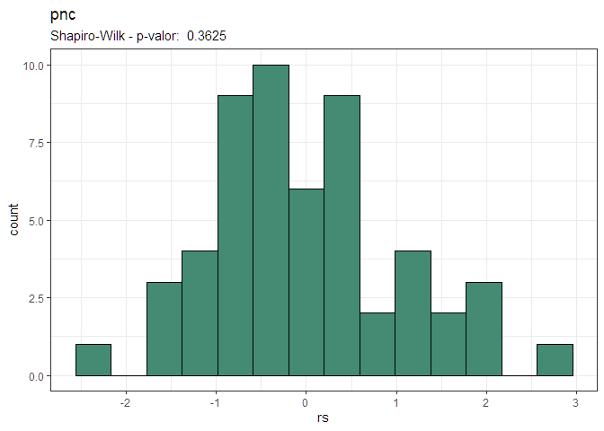
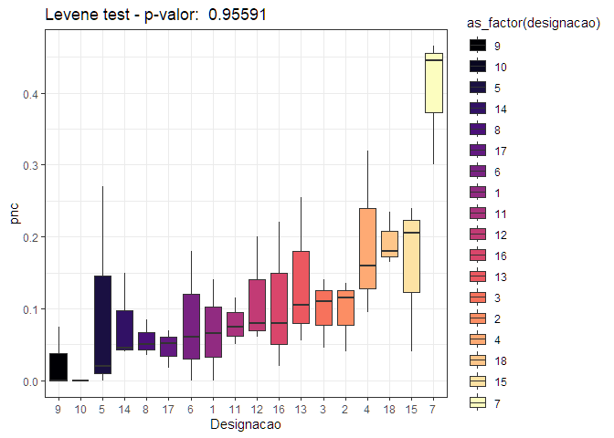
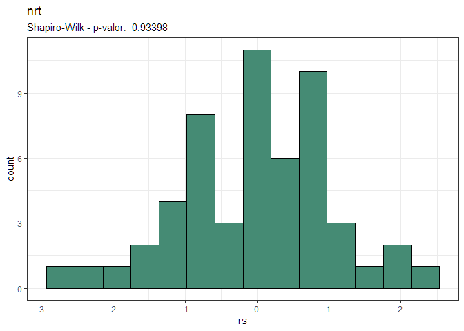
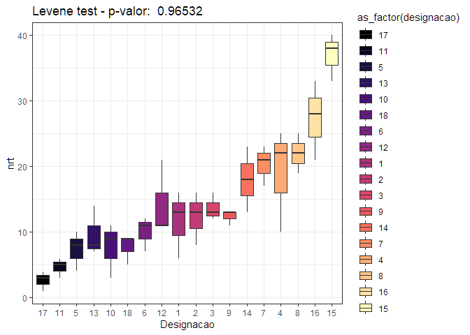
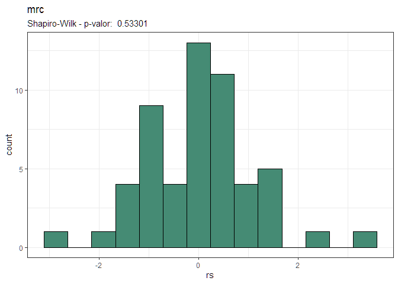
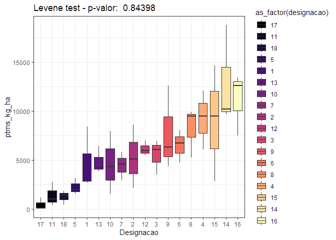

<!-- README.md is generated from README.Rmd. Please edit that file -->

# Análise - Doutorado - Edvaldo Aldo Litos Paulo Nhanombe

## Pré-tratamento dos dados

``` r
dados <- readxl::read_xlsx("data-raw/Exp. Verão-2024_25.xlsx") |> 
  janitor::clean_names()
readr::write_rds(dados,"data/batata-doce-ednaldo.rds")
```

## Análise exploratória

### Carregando pacotes e banco de dados

``` r
library(tidyverse)
data_set <- read_rds("data/batata-doce-ednaldo.rds")
glimpse(data_set)
#> Rows: 54
#> Columns: 17
#> $ designacao    <dbl> 1, 1, 1, 2, 2, 2, 3, 3, 3, 4, 4, 4, 5, 5, 5, 6, 6, 6, 7,…
#> $ bloco         <dbl> 1, 2, 3, 1, 2, 3, 1, 2, 3, 1, 2, 3, 1, 2, 3, 1, 2, 3, 1,…
#> $ pt            <dbl> 4.4450, 1.8800, 1.2250, 4.5500, 1.3550, 3.2200, 3.6600, …
#> $ pc            <dbl> 4.305, 1.880, 1.160, 4.435, 1.315, 3.085, 3.615, 1.760, …
#> $ pnc           <dbl> 0.1400, 0.0000, 0.0650, 0.1150, 0.0400, 0.1350, 0.0450, …
#> $ nrt           <dbl> 16, 6, 13, 16, 8, 13, 13, 16, 12, 25, 10, 27, 8, 4, 10, …
#> $ nrc           <dbl> 13, 6, 11, 13, 7, 10, 12, 12, 11, 21, 9, 16, 7, 4, 5, 12…
#> $ nrnc          <dbl> 3, 0, 2, 3, 1, 3, 1, 4, 1, 4, 1, 11, 1, 0, 5, 0, 3, 3, 8…
#> $ msr_100_g     <dbl> 0.030, 0.025, 0.035, 0.030, 0.025, 0.025, 0.030, 0.030, …
#> $ mr            <dbl> 0.27781250, 0.31333333, 0.09423077, 0.28437500, 0.169375…
#> $ mrc           <dbl> 0.3311538, 0.3133333, 0.1054545, 0.3411538, 0.1878571, 0…
#> $ tms_percent   <dbl> 30, 25, 35, 30, 25, 25, 30, 30, 30, 25, 25, 25, 30, 30, …
#> $ ptms          <dbl> 1.333500, 0.470000, 0.428750, 1.365000, 0.338750, 0.8050…
#> $ ptms_kg_ha    <dbl> 8418.386, 2967.110, 2706.699, 8617.245, 2138.529, 5081.9…
#> $ mfpa_kg       <dbl> 8.670, 8.420, 12.745, 4.365, 2.975, 5.655, 4.395, 4.950,…
#> $ mspa_1000_g   <dbl> 0.125, 0.100, 0.165, 0.115, 0.140, 0.150, 0.130, 0.150, …
#> $ tmspa_percent <dbl> 12.5, 10.0, 16.5, 11.5, 14.0, 15.0, 13.0, 15.0, 14.5, 12…
```

``` r
lista_variaveis <- data_set |> select(pt:tmspa_percent) |> names()
# map(lista_variaveis, ~{
#   data_set |> 
#     ggplot(aes(x=!!sym(.x), y = ..density..)) +
#     geom_histogram(color="black",fill="gray", bins = 15) +
#     labs(title = .x) +
#     theme_bw()
# })
```

### Análise de resíduos - Pré-supostos da ANOVA

``` r
map(lista_variaveis, ~{
  print("========================")
  print(.x)
  print("========================")
  y <- data_set |> pull(!!sym(.x))
  trat <- data_set |> pull(designacao) |> as_factor()
  bloco <- data_set |> pull(bloco) |> as_factor()
  mod <- aov(y ~ trat + bloco)
  print(anova(mod))
  rs <- rstudent(mod)
  yp <- predict(mod)
  sw_test <- shapiro.test(rs)
  sw_test <- round(sw_test$p.value,5)
  print(
    as_tibble(rs) |> 
      ggplot(aes(rs)) +
      geom_histogram(bins=14,color="black",fill="aquamarine4") +
      labs(title = .x,
           subtitle = paste("Shapiro-Wilk - p-valor: ",sw_test)) +
      theme_bw()
  )
  df_aux <- data_set |> 
    select(designacao, bloco,!!sym(.x)) |> 
    add_column(rs,yp)  |> 
    filter(rs > 3 | rs < -3)
    # arrange(rs)
  if(nrow(df_aux) != 0) print(df_aux)
  levene_teste <- lawstat::levene.test(y,trat)
  levene_teste <- round(levene_teste$p.value,5)
  box_plot <- data_set |> 
      group_by(designacao) |> 
      mutate(
        y_mean = median(!!sym(.x),na.rm=TRUE),
        designacao = as_factor(designacao))  |>
      ungroup() |> 
      mutate(designacao = designacao |>  fct_reorder(y_mean)) |> 
      ggplot(aes(x=as_factor(designacao),y=!!sym(.x),
             fill=as_factor(designacao))) +
      geom_boxplot() +
      scale_fill_viridis_d(option = "magma") +
      theme_bw()+
      labs(x="Designacao",
           title =  paste("Levene test - p-valor: ",levene_teste))
  
  print(
    box_plot
  )
  print(cat("\n"))
})
#> [1] "========================"
#> [1] "pt"
#> [1] "========================"
#> Analysis of Variance Table
#> 
#> Response: y
#>           Df Sum Sq Mean Sq F value    Pr(>F)    
#> trat      17 257.99 15.1759  5.0518 2.998e-05 ***
#> bloco      2  17.24  8.6199  2.8694   0.07055 .  
#> Residuals 34 102.14  3.0041                      
#> ---
#> Signif. codes:  0 '***' 0.001 '**' 0.01 '*' 0.05 '.' 0.1 ' ' 1
```

<!-- --><!-- -->

    #> 
    #> NULL
    #> [1] "========================"
    #> [1] "pc"
    #> [1] "========================"
    #> Analysis of Variance Table
    #> 
    #> Response: y
    #>           Df  Sum Sq Mean Sq F value    Pr(>F)    
    #> trat      17 258.068 15.1805  5.0409 3.064e-05 ***
    #> bloco      2  17.522  8.7610  2.9092   0.06819 .  
    #> Residuals 34 102.389  3.0114                      
    #> ---
    #> Signif. codes:  0 '***' 0.001 '**' 0.01 '*' 0.05 '.' 0.1 ' ' 1

<!-- --><!-- -->

    #> 
    #> NULL
    #> [1] "========================"
    #> [1] "pnc"
    #> [1] "========================"
    #> Analysis of Variance Table
    #> 
    #> Response: y
    #>           Df  Sum Sq  Mean Sq F value  Pr(>F)  
    #> trat      17 0.50188 0.029523  2.2788 0.02007 *
    #> bloco      2 0.02138 0.010692  0.8253 0.44668  
    #> Residuals 34 0.44047 0.012955                  
    #> ---
    #> Signif. codes:  0 '***' 0.001 '**' 0.01 '*' 0.05 '.' 0.1 ' ' 1

<!-- -->

    #> # A tibble: 2 × 5
    #>   designacao bloco   pnc    rs    yp
    #>        <dbl> <dbl> <dbl> <dbl> <dbl>
    #> 1          4     3 0.625  4.07 0.320
    #> 2         12     1 0.48   3.61 0.200

<!-- -->

    #> 
    #> NULL
    #> [1] "========================"
    #> [1] "nrt"
    #> [1] "========================"
    #> Analysis of Variance Table
    #> 
    #> Response: y
    #>           Df Sum Sq Mean Sq F value    Pr(>F)    
    #> trat      17 3467.4 203.967  8.0300 1.618e-07 ***
    #> bloco      2   75.4  37.711  1.4847    0.2409    
    #> Residuals 34  863.6  25.401                      
    #> ---
    #> Signif. codes:  0 '***' 0.001 '**' 0.01 '*' 0.05 '.' 0.1 ' ' 1

<!-- -->

    #> # A tibble: 1 × 5
    #>   designacao bloco   nrt    rs    yp
    #>        <dbl> <dbl> <dbl> <dbl> <dbl>
    #> 1         15     3    21 -3.61  33.4

<!-- -->

    #> 
    #> NULL
    #> [1] "========================"
    #> [1] "nrc"
    #> [1] "========================"
    #> Analysis of Variance Table
    #> 
    #> Response: y
    #>           Df  Sum Sq Mean Sq F value    Pr(>F)    
    #> trat      17 2498.72 146.983  6.6813 1.433e-06 ***
    #> bloco      2   56.06  28.032  1.2742    0.2927    
    #> Residuals 34  747.97  21.999                      
    #> ---
    #> Signif. codes:  0 '***' 0.001 '**' 0.01 '*' 0.05 '.' 0.1 ' ' 1

<!-- -->

    #> # A tibble: 2 × 5
    #>   designacao bloco   nrc    rs    yp
    #>        <dbl> <dbl> <dbl> <dbl> <dbl>
    #> 1          8     3    34  3.00  24.0
    #> 2         15     3    12 -4.45  25.3

<!-- -->

    #> 
    #> NULL
    #> [1] "========================"
    #> [1] "nrnc"
    #> [1] "========================"
    #> Analysis of Variance Table
    #> 
    #> Response: y
    #>           Df  Sum Sq Mean Sq F value    Pr(>F)    
    #> trat      17 260.681 15.3342   3.655 0.0006343 ***
    #> bloco      2   6.209  3.1045   0.740 0.4846414    
    #> Residuals 34 142.642  4.1953                      
    #> ---
    #> Signif. codes:  0 '***' 0.001 '**' 0.01 '*' 0.05 '.' 0.1 ' ' 1

<!-- -->

    #> # A tibble: 2 × 5
    #>   designacao bloco  nrnc    rs    yp
    #>        <dbl> <dbl> <dbl> <dbl> <dbl>
    #> 1          4     3    11  3.79  5.78
    #> 2         12     1     8  3.01  3.60

<!-- -->

    #> 
    #> NULL
    #> [1] "========================"
    #> [1] "msr_100_g"
    #> [1] "========================"
    #> Analysis of Variance Table
    #> 
    #> Response: y
    #>           Df     Sum Sq    Mean Sq F value   Pr(>F)    
    #> trat      17 0.00110824 6.5191e-05  9.7436 1.42e-08 ***
    #> bloco      2 0.00000215 1.0740e-06  0.1605   0.8524    
    #> Residuals 34 0.00022748 6.6910e-06                     
    #> ---
    #> Signif. codes:  0 '***' 0.001 '**' 0.01 '*' 0.05 '.' 0.1 ' ' 1

<!-- --><!-- -->

    #> 
    #> NULL
    #> [1] "========================"
    #> [1] "mr"
    #> [1] "========================"
    #> Analysis of Variance Table
    #> 
    #> Response: y
    #>           Df  Sum Sq  Mean Sq F value  Pr(>F)  
    #> trat      17 0.49720 0.029247  1.8128 0.06864 .
    #> bloco      2 0.05738 0.028691  1.7783 0.18428  
    #> Residuals 34 0.54855 0.016134                  
    #> ---
    #> Signif. codes:  0 '***' 0.001 '**' 0.01 '*' 0.05 '.' 0.1 ' ' 1

<!-- -->

    #> # A tibble: 1 × 5
    #>   designacao bloco    mr    rs    yp
    #>        <dbl> <dbl> <dbl> <dbl> <dbl>
    #> 1          4     2 0.768  4.91 0.386

<!-- -->

    #> 
    #> NULL
    #> [1] "========================"
    #> [1] "mrc"
    #> [1] "========================"
    #> Analysis of Variance Table
    #> 
    #> Response: y
    #>           Df  Sum Sq  Mean Sq F value Pr(>F)
    #> trat      17 0.56041 0.032966  1.5544 0.1339
    #> bloco      2 0.06737 0.033685  1.5883 0.2191
    #> Residuals 34 0.72107 0.021208

<!-- -->

    #> # A tibble: 1 × 5
    #>   designacao bloco   mrc    rs    yp
    #>        <dbl> <dbl> <dbl> <dbl> <dbl>
    #> 1          4     2 0.842  4.34 0.436

<!-- -->

    #> 
    #> NULL
    #> [1] "========================"
    #> [1] "tms_percent"
    #> [1] "========================"
    #> Analysis of Variance Table
    #> 
    #> Response: y
    #>           Df  Sum Sq Mean Sq F value   Pr(>F)    
    #> trat      17 1108.24  65.191  9.7436 1.42e-08 ***
    #> bloco      2    2.15   1.074  0.1605   0.8524    
    #> Residuals 34  227.48   6.691                     
    #> ---
    #> Signif. codes:  0 '***' 0.001 '**' 0.01 '*' 0.05 '.' 0.1 ' ' 1

<!-- --><!-- -->

    #> 
    #> NULL
    #> [1] "========================"
    #> [1] "ptms"
    #> [1] "========================"
    #> Analysis of Variance Table
    #> 
    #> Response: y
    #>           Df  Sum Sq Mean Sq F value   Pr(>F)    
    #> trat      17 14.9559 0.87976  4.6263 7.24e-05 ***
    #> bloco      2  1.0644 0.53221  2.7987  0.07496 .  
    #> Residuals 34  6.4656 0.19017                     
    #> ---
    #> Signif. codes:  0 '***' 0.001 '**' 0.01 '*' 0.05 '.' 0.1 ' ' 1

<!-- --><!-- -->

    #> 
    #> NULL
    #> [1] "========================"
    #> [1] "ptms_kg_ha"
    #> [1] "========================"
    #> Analysis of Variance Table
    #> 
    #> Response: y
    #>           Df    Sum Sq  Mean Sq F value   Pr(>F)    
    #> trat      17 596053859 35061992  4.6263 7.24e-05 ***
    #> bloco      2  42421306 21210653  2.7987  0.07496 .  
    #> Residuals 34 257680565  7578840                     
    #> ---
    #> Signif. codes:  0 '***' 0.001 '**' 0.01 '*' 0.05 '.' 0.1 ' ' 1

<!-- --><!-- -->

    #> 
    #> NULL
    #> [1] "========================"
    #> [1] "mfpa_kg"
    #> [1] "========================"
    #> Analysis of Variance Table
    #> 
    #> Response: y
    #>           Df Sum Sq Mean Sq F value   Pr(>F)   
    #> trat      17 329.49 19.3816  3.3310 0.001377 **
    #> bloco      2  24.62 12.3084  2.1154 0.136186   
    #> Residuals 34 197.83  5.8186                    
    #> ---
    #> Signif. codes:  0 '***' 0.001 '**' 0.01 '*' 0.05 '.' 0.1 ' ' 1

<!-- -->

    #> # A tibble: 1 × 5
    #>   designacao bloco mfpa_kg    rs    yp
    #>        <dbl> <dbl>   <dbl> <dbl> <dbl>
    #> 1         10     1    11.6  3.19  6.21

<!-- -->

    #> 
    #> NULL
    #> [1] "========================"
    #> [1] "mspa_1000_g"
    #> [1] "========================"
    #> Analysis of Variance Table
    #> 
    #> Response: y
    #>           Df    Sum Sq    Mean Sq F value    Pr(>F)    
    #> trat      17 0.0066079 0.00038870  1.4289 0.1833659    
    #> bloco      2 0.0052343 0.00261713  9.6207 0.0004885 ***
    #> Residuals 34 0.0092491 0.00027203                      
    #> ---
    #> Signif. codes:  0 '***' 0.001 '**' 0.01 '*' 0.05 '.' 0.1 ' ' 1

<!-- --><!-- -->

    #> 
    #> NULL
    #> [1] "========================"
    #> [1] "tmspa_percent"
    #> [1] "========================"
    #> Analysis of Variance Table
    #> 
    #> Response: y
    #>           Df Sum Sq Mean Sq F value    Pr(>F)    
    #> trat      17 66.079  3.8870  1.4289 0.1833659    
    #> bloco      2 52.343 26.1713  9.6207 0.0004885 ***
    #> Residuals 34 92.491  2.7203                      
    #> ---
    #> Signif. codes:  0 '***' 0.001 '**' 0.01 '*' 0.05 '.' 0.1 ' ' 1

<!-- --><!-- -->

    #> 
    #> NULL
    #> [[1]]
    #> NULL
    #> 
    #> [[2]]
    #> NULL
    #> 
    #> [[3]]
    #> NULL
    #> 
    #> [[4]]
    #> NULL
    #> 
    #> [[5]]
    #> NULL
    #> 
    #> [[6]]
    #> NULL
    #> 
    #> [[7]]
    #> NULL
    #> 
    #> [[8]]
    #> NULL
    #> 
    #> [[9]]
    #> NULL
    #> 
    #> [[10]]
    #> NULL
    #> 
    #> [[11]]
    #> NULL
    #> 
    #> [[12]]
    #> NULL
    #> 
    #> [[13]]
    #> NULL
    #> 
    #> [[14]]
    #> NULL
    #> 
    #> [[15]]
    #> NULL
