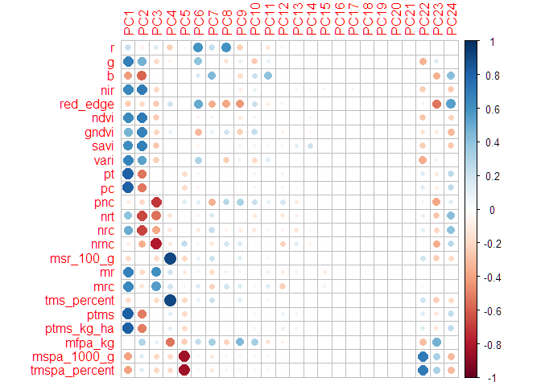
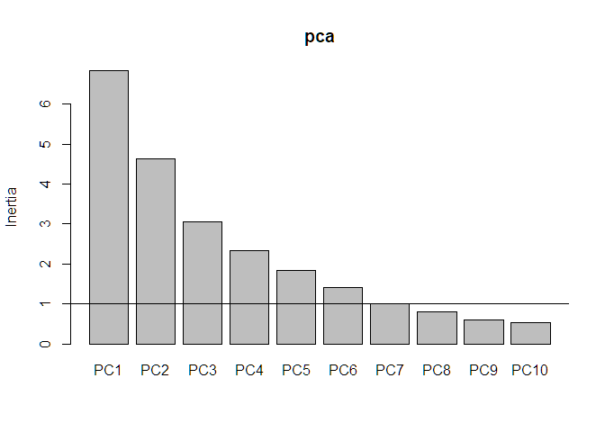

<!-- README.md is generated from README.Rmd. Please edit that file -->

# Análise - Doutorado - Edvaldo Aldo Litos Paulo Nhanombe

## Análise de variância - Batata Doce - VERÃO

### Carregando pacotes e banco de dados

``` r
library(tidyverse)
library(vegan)
library(ExpDes.pt)
data_set_bt <- read_rds("data/batata-doce-ednaldo-v.rds")
glimpse(data_set_bt)
#> Rows: 54
#> Columns: 18
#> $ designacao    <dbl> 1, 1, 1, 2, 2, 2, 3, 3, 3, 4, 4, 4, 5, 5, 5, 6, 6, 6, 7,…
#> $ bloco         <dbl> 1, 2, 3, 1, 2, 3, 1, 2, 3, 1, 2, 3, 1, 2, 3, 1, 2, 3, 1,…
#> $ pt            <dbl> 0.7408333, 0.3133333, 0.2041667, 0.7583333, 0.2258333, 0…
#> $ pc            <dbl> 0.7175000, 0.3133333, 0.1933333, 0.7391667, 0.2191667, 0…
#> $ pnc           <dbl> 0.023333333, 0.000000000, 0.010833333, 0.019166667, 0.00…
#> $ nrt           <dbl> 2.6666667, 1.0000000, 2.1666667, 2.6666667, 1.3333333, 2…
#> $ nrc           <dbl> 2.1666667, 1.0000000, 1.8333333, 2.1666667, 1.1666667, 1…
#> $ nrnc          <dbl> 0.5000000, 0.0000000, 0.3333333, 0.5000000, 0.1666667, 0…
#> $ msr_100_g     <dbl> 0.030, 0.025, 0.035, 0.030, 0.025, 0.025, 0.030, 0.030, …
#> $ mr            <dbl> 0.27781250, 0.31333333, 0.09423077, 0.28437500, 0.169375…
#> $ mrc           <dbl> 0.3311538, 0.3133333, 0.1054545, 0.3411538, 0.1878571, 0…
#> $ tms_percent   <dbl> 30, 25, 35, 30, 25, 25, 30, 30, 30, 25, 25, 25, 30, 30, …
#> $ ptms          <dbl> 0.22225000, 0.07833333, 0.07145833, 0.22750000, 0.056458…
#> $ ptms_kg_ha    <dbl> 1403.0643, 494.5183, 451.1165, 1436.2075, 356.4215, 846.…
#> $ mfpa_kg       <dbl> 1.4450000, 1.4033333, 2.1241667, 0.7275000, 0.4958333, 0…
#> $ mspa_1000_g   <dbl> 0.125, 0.100, 0.165, 0.115, 0.140, 0.150, 0.130, 0.150, …
#> $ tmspa_percent <dbl> 12.5, 10.0, 16.5, 11.5, 14.0, 15.0, 13.0, 15.0, 14.5, 12…
#> $ brix          <dbl> 7.6, 6.5, 7.1, 7.6, 7.4, 8.2, 10.3, 8.1, 8.5, 7.9, 5.3, …
```

``` r
lista_variaveis <- data_set_bt |> select(pt:tmspa_percent) |> names()
```

### Análise de Variância - VERÃO

``` r
map(lista_variaveis, ~{
  print("========================")
  print(.x)
  print("========================")
  y <- data_set_bt |> pull(!!sym(.x))
  trat <- data_set_bt |> pull(designacao) |> as_factor()
  bloco <- data_set_bt |> pull(bloco) |> as_factor()
  dbc(trat,bloco,y,mcomp = "sk")
    print(cat("\n"))
})
```

## Análise exploratória - Multiespectral - VERÃO

### Carregando pacotes e banco de dados

``` r
library(tidyverse)
data_set_mult <- read_rds("data/batata-doce-multiespectral-v.rds")
glimpse(data_set_mult)
#> Rows: 216
#> Columns: 14
#> $ epoca      <dbl> 1, 1, 1, 1, 1, 1, 1, 1, 1, 1, 1, 1, 1, 1, 1, 1, 1, 1, 1, 1,…
#> $ designacao <dbl> 1, 1, 1, 2, 2, 2, 3, 3, 3, 4, 4, 4, 5, 5, 5, 6, 6, 6, 7, 7,…
#> $ rep        <dbl> 1, 2, 3, 1, 2, 3, 1, 2, 3, 1, 2, 3, 1, 2, 3, 1, 2, 3, 1, 2,…
#> $ r          <dbl> 19942.12, 20806.48, 20806.35, 21161.64, 20891.04, 21097.11,…
#> $ g          <dbl> 27621.00, 29823.40, 29960.27, 23863.78, 27079.20, 28653.24,…
#> $ b          <dbl> 137.7584, 138.5132, 135.6616, 131.0940, 138.0996, 135.0067,…
#> $ nir        <dbl> 47355.00, 51920.10, 57472.20, 51559.14, 55239.00, 59944.10,…
#> $ red_edge   <dbl> 21762.94, 31705.17, 22526.24, 22978.82, 31500.33, 23481.31,…
#> $ ndvi       <dbl> 0.34100000, 0.40684066, 0.46332079, 0.40566244, 0.44574740,…
#> $ gndvi      <dbl> 0.23100000, 0.26932817, 0.32691776, 0.36257996, 0.34713362,…
#> $ savi       <dbl> 0.49800000, 0.61025680, 0.69497663, 0.60848943, 0.66861658,…
#> $ osavi      <dbl> 0.03584358, 0.47193413, 0.53745099, 0.47056739, 0.51706586,…
#> $ ndre       <dbl> -0.01962661, 0.23653462, 0.42613949, 0.36570991, 0.26907910…
#> $ vari       <dbl> 0.121000000, 0.155613755, 0.151821825, 0.049606302, 0.11185…
```

``` r
lista_variaveis <- data_set_mult |> select(r:vari) |> names()
```

### Análise considerando parcelas subdivididas

``` r
for(i in seq_along(lista_variaveis)){
  print("========================")
  print(lista_variaveis[i])
  print("========================")
  y <- data_set_mult |> pull(lista_variaveis[i])
  trat <- data_set_mult |> pull(designacao) |> as_factor()
  epoca <- data_set_mult |> pull(epoca) |> as_factor()
  bloco <- data_set_mult |> pull(rep) |> as_factor()
  psub2.dbc(trat,epoca,bloco,y,mcomp = "sk",
            fac.names=c("trat","epoca"),sigT = 0.2)
  print(cat("\n"))
}
#> [1] "========================"
#> [1] "r"
#> [1] "========================"
#> ------------------------------------------------------------------------
#> Legenda:
#> FATOR 1 (parcela):  trat 
#> FATOR 2 (subparcela):  epoca 
#> ------------------------------------------------------------------------
#> 
#> ------------------------------------------------------------------------
#> Quadro da analise de variancia
#> ------------------------------------------------------------------------
#>             GL        SQ      QM     Fc  Pr(>Fc)    
#> trat        17  21035789 1237399 1.3321 0.231995    
#> Bloco        2   3613178 1806589 1.9448 0.158601    
#> Erro a      34  31583892  928938                    
#> epoca        3  18635294 6211765 6.7244 0.000334 ***
#> trat*epoca  51  32533763  637917 0.6906 0.929260    
#> Erro b     108  99766218  923761                    
#> Total      215 207168134                            
#> ---
#> Signif. codes:  0 '***' 0.001 '**' 0.01 '*' 0.05 '.' 0.1 ' ' 1
#> ------------------------------------------------------------------------
#> CV 1 = 4.690116 %
#> CV 2 = 4.67703 %
#> 
#> Interacao nao significativa: analisando os efeitos simples
#> ------------------------------------------------------------------------
#> trat
#> De acordo com o teste F, as medias desse fator sao estatisticamente iguais.
#> ------------------------------------------------------------------------
#>    Niveis   Medias
#> 1       1 20805.25
#> 2      10 20606.96
#> 3      11 20680.45
#> 4      12 20396.56
#> 5      13 20567.10
#> 6      14 20518.17
#> 7      15 20531.12
#> 8      16 21085.86
#> 9      17 19660.71
#> 10     18 20562.39
#> 11      2 21064.52
#> 12      3 20355.16
#> 13      4 20361.70
#> 14      5 20176.99
#> 15      6 20661.00
#> 16      7 20818.81
#> 17      8 20501.75
#> 18      9 20543.73
#> ------------------------------------------------------------------------
#> epoca
#> Teste de Scott-Knott
#> ------------------------------------------------------------------------
#>   Grupos Tratamentos   Medias
#> 1      a           1 20984.55
#> 2      b           5 20565.87
#> 3      b           4 20489.50
#> 4      c           3 20159.68
#> ------------------------------------------------------------------------
#> 
#> 
#> NULL
#> [1] "========================"
#> [1] "g"
#> [1] "========================"
#> ------------------------------------------------------------------------
#> Legenda:
#> FATOR 1 (parcela):  trat 
#> FATOR 2 (subparcela):  epoca 
#> ------------------------------------------------------------------------
#> 
#> ------------------------------------------------------------------------
#> Quadro da analise de variancia
#> ------------------------------------------------------------------------
#>             GL         SQ        QM     Fc   Pr(>Fc)    
#> trat        17  515379053  30316415  3.494  0.000929 ***
#> Bloco        2  204175172 102087586 11.766  0.000131 ***
#> Erro a      34  295009864   8676761                     
#> epoca        3 1362190809 454063603 37.483 < 2.2e-16 ***
#> trat*epoca  51  470189755   9219407  0.761  0.860851    
#> Erro b     108 1308285733  12113757                     
#> Total      215 4155230386                               
#> ---
#> Signif. codes:  0 '***' 0.001 '**' 0.01 '*' 0.05 '.' 0.1 ' ' 1
#> ------------------------------------------------------------------------
#> CV 1 = 11.3978 %
#> CV 2 = 13.46734 %
#> 
#> Interacao nao significativa: analisando os efeitos simples
#> ------------------------------------------------------------------------
#> trat
#> Teste de Scott-Knott
#> ------------------------------------------------------------------------
#>    Grupos Tratamentos   Medias
#> 1       a          12 30144.71
#> 2       b          14 27555.53
#> 3       b          16 27541.63
#> 4       b          17 27267.54
#> 5       b           6 27265.71
#> 6       b           7 26754.83
#> 7       c          15 25875.14
#> 8       c          13 25565.37
#> 9       c           9 25380.83
#> 10      c           1 25195.12
#> 11      c          11 24869.63
#> 12      c           5 24793.43
#> 13      c           4 24690.05
#> 14      c          18 24584.68
#> 15      c           3 24565.46
#> 16      c           8 24431.27
#> 17      c          10 24427.04
#> 18      c           2 24281.78
#> ------------------------------------------------------------------------
#> 
#> epoca
#> Teste de Scott-Knott
#> ------------------------------------------------------------------------
#>   Grupos Tratamentos   Medias
#> 1      a           1 29624.78
#> 2      b           4 26603.53
#> 3      c           3 23723.67
#> 4      c           5 23423.51
#> ------------------------------------------------------------------------
#> 
#> 
#> NULL
#> [1] "========================"
#> [1] "b"
#> [1] "========================"
#> ------------------------------------------------------------------------
#> Legenda:
#> FATOR 1 (parcela):  trat 
#> FATOR 2 (subparcela):  epoca 
#> ------------------------------------------------------------------------
#> 
#> ------------------------------------------------------------------------
#> Quadro da analise de variancia
#> ------------------------------------------------------------------------
#>             GL      SQ      QM     Fc Pr(>Fc)    
#> trat        17  2151.5  126.56  2.497 0.01132 *  
#> Bloco        2     2.6    1.32  0.026 0.97432    
#> Erro a      34  1723.2   50.68                   
#> epoca        3  5386.6 1795.54 43.649 < 2e-16 ***
#> trat*epoca  51  2100.8   41.19  1.001 0.48627    
#> Erro b     108  4442.7   41.14                   
#> Total      215 15807.5                           
#> ---
#> Signif. codes:  0 '***' 0.001 '**' 0.01 '*' 0.05 '.' 0.1 ' ' 1
#> ------------------------------------------------------------------------
#> CV 1 = 5.439989 %
#> CV 2 = 4.901041 %
#> 
#> Interacao nao significativa: analisando os efeitos simples
#> ------------------------------------------------------------------------
#> trat
#> Teste de Scott-Knott
#> ------------------------------------------------------------------------
#>    Grupos Tratamentos   Medias
#> 1       a          13 137.1923
#> 2       a           8 136.2021
#> 3       a          15 133.5895
#> 4       a           7 132.8511
#> 5       a          16 132.2818
#> 6       a          10 132.1871
#> 7       a          14 132.0029
#> 8       a           9 131.5938
#> 9       a           2 131.2540
#> 10      a           4 130.8053
#> 11      a          18 130.4663
#> 12      a           5 130.2510
#> 13      a          11 129.9713
#> 14      b           1 129.0203
#> 15      b           3 128.4058
#> 16      b           6 127.2194
#> 17      b          12 126.5703
#> 18      b          17 123.7129
#> ------------------------------------------------------------------------
#> 
#> epoca
#> Teste de Scott-Knott
#> ------------------------------------------------------------------------
#>   Grupos Tratamentos   Medias
#> 1      a           1 137.5763
#> 2      b           3 132.6886
#> 3      c           4 129.3348
#> 4      d           5 123.8619
#> ------------------------------------------------------------------------
#> 
#> 
#> NULL
#> [1] "========================"
#> [1] "nir"
#> [1] "========================"
#> ------------------------------------------------------------------------
#> Legenda:
#> FATOR 1 (parcela):  trat 
#> FATOR 2 (subparcela):  epoca 
#> ------------------------------------------------------------------------
#> 
#> ------------------------------------------------------------------------
#> Quadro da analise de variancia
#> ------------------------------------------------------------------------
#>             GL         SQ         QM      Fc  Pr(>Fc)    
#> trat        17 2.2675e+09  133382340  0.8611 0.618784    
#> Bloco        2 1.7353e+09  867652607  5.6016 0.007893 ** 
#> Erro a      34 5.2664e+09  154893961                     
#> epoca        3 6.5356e+09 2178538595 12.0923    1e-06 ***
#> trat*epoca  51 5.7802e+09  113337865  0.6291 0.966765    
#> Erro b     108 1.9457e+10  180158451                     
#> Total      215 4.1042e+10                                
#> ---
#> Signif. codes:  0 '***' 0.001 '**' 0.01 '*' 0.05 '.' 0.1 ' ' 1
#> ------------------------------------------------------------------------
#> CV 1 = 26.2067 %
#> CV 2 = 28.26327 %
#> 
#> Interacao nao significativa: analisando os efeitos simples
#> ------------------------------------------------------------------------
#> trat
#> De acordo com o teste F, as medias desse fator sao estatisticamente iguais.
#> ------------------------------------------------------------------------
#>    Niveis   Medias
#> 1       1 50385.55
#> 2      10 39521.03
#> 3      11 52418.79
#> 4      12 48621.46
#> 5      13 46181.37
#> 6      14 46363.99
#> 7      15 43539.86
#> 8      16 50136.37
#> 9      17 50806.35
#> 10     18 49649.78
#> 11      2 45928.81
#> 12      3 44288.09
#> 13      4 43559.83
#> 14      5 50904.86
#> 15      6 47008.19
#> 16      7 50196.96
#> 17      8 46466.71
#> 18      9 48847.37
#> ------------------------------------------------------------------------
#> epoca
#> Teste de Scott-Knott
#> ------------------------------------------------------------------------
#>   Grupos Tratamentos   Medias
#> 1      a           1 51718.28
#> 2      a           4 50641.12
#> 3      a           5 49545.59
#> 4      b           3 38056.20
#> ------------------------------------------------------------------------
#> 
#> 
#> NULL
#> [1] "========================"
#> [1] "red_edge"
#> [1] "========================"
#> ------------------------------------------------------------------------
#> Legenda:
#> FATOR 1 (parcela):  trat 
#> FATOR 2 (subparcela):  epoca 
#> ------------------------------------------------------------------------
#> 
#> ------------------------------------------------------------------------
#> Quadro da analise de variancia
#> ------------------------------------------------------------------------
#>             GL         SQ        QM      Fc   Pr(>Fc)    
#> trat        17   78939770   4643516  1.0456  0.439506    
#> Bloco        2  206359664 103179832 23.2330 < 2.2e-16 ***
#> Erro a      34  150997176   4441093                      
#> epoca        3   90589932  30196644  6.3464  0.000528 ***
#> trat*epoca  51  303185280   5944809  1.2494  0.167526    
#> Erro b     108  513870773   4758063                      
#> Total      215 1343942596                                
#> ---
#> Signif. codes:  0 '***' 0.001 '**' 0.01 '*' 0.05 '.' 0.1 ' ' 1
#> ------------------------------------------------------------------------
#> CV 1 = 6.979684 %
#> CV 2 = 7.224468 %
#> 
#> Interacao nao significativa: analisando os efeitos simples
#> ------------------------------------------------------------------------
#> trat
#> De acordo com o teste F, as medias desse fator sao estatisticamente iguais.
#> ------------------------------------------------------------------------
#>    Niveis   Medias
#> 1       1 29928.96
#> 2      10 30591.58
#> 3      11 30038.16
#> 4      12 28729.28
#> 5      13 29725.35
#> 6      14 29150.97
#> 7      15 29680.45
#> 8      16 30035.22
#> 9      17 30209.46
#> 10     18 31133.35
#> 11      2 30149.89
#> 12      3 30614.86
#> 13      4 30930.97
#> 14      5 30805.28
#> 15      6 30781.67
#> 16      7 29969.70
#> 17      8 30603.38
#> 18      9 30399.13
#> ------------------------------------------------------------------------
#> epoca
#> Teste de Scott-Knott
#> ------------------------------------------------------------------------
#>   Grupos Tratamentos   Medias
#> 1      a           4 30661.48
#> 2      a           3 30591.44
#> 3      a           5 30439.76
#> 4      b           1 29080.13
#> ------------------------------------------------------------------------
#> 
#> 
#> NULL
#> [1] "========================"
#> [1] "ndvi"
#> [1] "========================"
#> ------------------------------------------------------------------------
#> Legenda:
#> FATOR 1 (parcela):  trat 
#> FATOR 2 (subparcela):  epoca 
#> ------------------------------------------------------------------------
#> 
#> ------------------------------------------------------------------------
#> Quadro da analise de variancia
#> ------------------------------------------------------------------------
#>             GL     SQ       QM      Fc Pr(>Fc)    
#> trat        17 0.2904 0.017084  0.9752 0.50484    
#> Bloco        2 0.1679 0.083948  4.7921 0.01467 *  
#> Erro a      34 0.5956 0.017518                    
#> epoca        3 0.7029 0.234316 12.7155 < 2e-16 ***
#> trat*epoca  51 0.6907 0.013542  0.7349 0.88950    
#> Erro b     108 1.9902 0.018428                    
#> Total      215 4.4377                             
#> ---
#> Signif. codes:  0 '***' 0.001 '**' 0.01 '*' 0.05 '.' 0.1 ' ' 1
#> ------------------------------------------------------------------------
#> CV 1 = 34.82319 %
#> CV 2 = 35.71566 %
#> 
#> Interacao nao significativa: analisando os efeitos simples
#> ------------------------------------------------------------------------
#> trat
#> De acordo com o teste F, as medias desse fator sao estatisticamente iguais.
#> ------------------------------------------------------------------------
#>    Niveis    Medias
#> 1       1 0.4033830
#> 2      10 0.2815210
#> 3      11 0.4238135
#> 4      12 0.3821632
#> 5      13 0.3684321
#> 6      14 0.3950491
#> 7      15 0.3437409
#> 8      16 0.3930098
#> 9      17 0.4319938
#> 10     18 0.3975051
#> 11      2 0.3481623
#> 12      3 0.3718794
#> 13      4 0.3305334
#> 14      5 0.4183305
#> 15      6 0.3652239
#> 16      7 0.3932397
#> 17      8 0.3719505
#> 18      9 0.4215299
#> ------------------------------------------------------------------------
#> epoca
#> Teste de Scott-Knott
#> ------------------------------------------------------------------------
#>   Grupos Tratamentos    Medias
#> 1      a           5 0.4293348
#> 2      a           4 0.4093195
#> 3      a           1 0.3985251
#> 4      b           3 0.2831452
#> ------------------------------------------------------------------------
#> 
#> 
#> NULL
#> [1] "========================"
#> [1] "gndvi"
#> [1] "========================"
#> ------------------------------------------------------------------------
#> Legenda:
#> FATOR 1 (parcela):  trat 
#> FATOR 2 (subparcela):  epoca 
#> ------------------------------------------------------------------------
#> 
#> ------------------------------------------------------------------------
#> Quadro da analise de variancia
#> ------------------------------------------------------------------------
#>             GL     SQ       QM      Fc Pr(>Fc)    
#> trat        17 0.3243 0.019077  1.5395 0.13905    
#> Bloco        2 0.1076 0.053790  4.3408 0.02094 *  
#> Erro a      34 0.4213 0.012392                    
#> epoca        3 0.7603 0.253432 21.5651 < 2e-16 ***
#> trat*epoca  51 0.4745 0.009304  0.7917 0.82279    
#> Erro b     108 1.2692 0.011752                    
#> Total      215 3.3572                             
#> ---
#> Signif. codes:  0 '***' 0.001 '**' 0.01 '*' 0.05 '.' 0.1 ' ' 1
#> ------------------------------------------------------------------------
#> CV 1 = 37.98195 %
#> CV 2 = 36.98846 %
#> 
#> Interacao nao significativa: analisando os efeitos simples
#> ------------------------------------------------------------------------
#> trat
#> De acordo com o teste F, as medias desse fator sao estatisticamente iguais.
#> ------------------------------------------------------------------------
#>    Niveis    Medias
#> 1       1 0.3366799
#> 2      10 0.2192938
#> 3      11 0.3550788
#> 4      12 0.2371858
#> 5      13 0.2738915
#> 6      14 0.2500863
#> 7      15 0.2694316
#> 8      16 0.2825102
#> 9      17 0.3069775
#> 10     18 0.3326011
#> 11      2 0.2975743
#> 12      3 0.3020449
#> 13      4 0.2518595
#> 14      5 0.3432018
#> 15      6 0.2594034
#> 16      7 0.2997925
#> 17      8 0.3267865
#> 18      9 0.3310653
#> ------------------------------------------------------------------------
#> epoca
#> Teste de Scott-Knott
#> ------------------------------------------------------------------------
#>   Grupos Tratamentos    Medias
#> 1      a           5 0.3772415
#> 2      b           4 0.3109852
#> 3      c           1 0.2691374
#> 4      d           3 0.2149613
#> ------------------------------------------------------------------------
#> 
#> 
#> NULL
#> [1] "========================"
#> [1] "savi"
#> [1] "========================"
#> ------------------------------------------------------------------------
#> Legenda:
#> FATOR 1 (parcela):  trat 
#> FATOR 2 (subparcela):  epoca 
#> ------------------------------------------------------------------------
#> 
#> ------------------------------------------------------------------------
#> Quadro da analise de variancia
#> ------------------------------------------------------------------------
#>             GL      SQ      QM      Fc Pr(>Fc)    
#> trat        17  0.5935 0.03491  0.8665 0.61323    
#> Bloco        2  0.3191 0.15954  3.9601 0.02844 *  
#> Erro a      34  1.3698 0.04029                    
#> epoca        3  1.6681 0.55605 12.4357 < 2e-16 ***
#> trat*epoca  51  1.9262 0.03777  0.8447 0.74670    
#> Erro b     108  4.8291 0.04471                    
#> Total      215 10.7057                            
#> ---
#> Signif. codes:  0 '***' 0.001 '**' 0.01 '*' 0.05 '.' 0.1 ' ' 1
#> ------------------------------------------------------------------------
#> CV 1 = 35.82174 %
#> CV 2 = 37.7384 %
#> 
#> Interacao nao significativa: analisando os efeitos simples
#> ------------------------------------------------------------------------
#> trat
#> De acordo com o teste F, as medias desse fator sao estatisticamente iguais.
#> ------------------------------------------------------------------------
#>    Niveis    Medias
#> 1       1 0.6039454
#> 2      10 0.4222780
#> 3      11 0.5820586
#> 4      12 0.5732406
#> 5      13 0.5526439
#> 6      14 0.5555959
#> 7      15 0.5156074
#> 8      16 0.5895103
#> 9      17 0.6479858
#> 10     18 0.5962532
#> 11      2 0.5222394
#> 12      3 0.5578149
#> 13      4 0.4957961
#> 14      5 0.6274912
#> 15      6 0.5478317
#> 16      7 0.5898554
#> 17      8 0.5044575
#> 18      9 0.6011676
#> ------------------------------------------------------------------------
#> epoca
#> Teste de Scott-Knott
#> ------------------------------------------------------------------------
#>   Grupos Tratamentos    Medias
#> 1      a           5 0.6439972
#> 2      a           4 0.5940999
#> 3      a           1 0.5906176
#> 4      b           3 0.4125682
#> ------------------------------------------------------------------------
#> 
#> 
#> NULL
#> [1] "========================"
#> [1] "osavi"
#> [1] "========================"
#> ------------------------------------------------------------------------
#> Legenda:
#> FATOR 1 (parcela):  trat 
#> FATOR 2 (subparcela):  epoca 
#> ------------------------------------------------------------------------
#> 
#> ------------------------------------------------------------------------
#> Quadro da analise de variancia
#> ------------------------------------------------------------------------
#>             GL     SQ      QM      Fc   Pr(>Fc)    
#> trat        17 0.4112 0.02419  1.1839  0.327011    
#> Bloco        2 0.2278 0.11390  5.5748  0.008054 ** 
#> Erro a      34 0.6947 0.02043                      
#> epoca        3 1.0349 0.34498 12.5967 < 2.2e-16 ***
#> trat*epoca  51 1.1124 0.02181  0.7964  0.816436    
#> Erro b     108 2.9578 0.02739                      
#> Total      215 6.4388                              
#> ---
#> Signif. codes:  0 '***' 0.001 '**' 0.01 '*' 0.05 '.' 0.1 ' ' 1
#> ------------------------------------------------------------------------
#> CV 1 = 33.10152 %
#> CV 2 = 38.32374 %
#> 
#> Interacao nao significativa: analisando os efeitos simples
#> ------------------------------------------------------------------------
#> trat
#> De acordo com o teste F, as medias desse fator sao estatisticamente iguais.
#> ------------------------------------------------------------------------
#>    Niveis    Medias
#> 1       1 0.4379469
#> 2      10 0.3266647
#> 3      11 0.4636098
#> 4      12 0.4444379
#> 5      13 0.4274568
#> 6      14 0.4162029
#> 7      15 0.3787332
#> 8      16 0.4558903
#> 9      17 0.5011116
#> 10     18 0.4611048
#> 11      2 0.4039035
#> 12      3 0.3965973
#> 13      4 0.3834168
#> 14      5 0.4852622
#> 15      6 0.3958354
#> 16      7 0.4561226
#> 17      8 0.4494718
#> 18      9 0.4889735
#> ------------------------------------------------------------------------
#> epoca
#> Teste de Scott-Knott
#> ------------------------------------------------------------------------
#>   Grupos Tratamentos    Medias
#> 1      a           5 0.4950361
#> 2      a           4 0.4622304
#> 3      a           1 0.4552231
#> 4      b           3 0.3147864
#> ------------------------------------------------------------------------
#> 
#> 
#> NULL
#> [1] "========================"
#> [1] "ndre"
#> [1] "========================"
#> ------------------------------------------------------------------------
#> Legenda:
#> FATOR 1 (parcela):  trat 
#> FATOR 2 (subparcela):  epoca 
#> ------------------------------------------------------------------------
#> 
#> ------------------------------------------------------------------------
#> Quadro da analise de variancia
#> ------------------------------------------------------------------------
#>             GL     SQ      QM      Fc Pr(>Fc)    
#> trat        17 0.3511 0.02065  0.7895  0.6922    
#> Bloco        2 0.0826 0.04128  1.5782  0.2211    
#> Erro a      34 0.8894 0.02616                    
#> epoca        3 1.3428 0.44760 14.3156  <2e-16 ***
#> trat*epoca  51 1.1166 0.02190  0.7002  0.9215    
#> Erro b     108 3.3768 0.03127                    
#> Total      215 7.1593                            
#> ---
#> Signif. codes:  0 '***' 0.001 '**' 0.01 '*' 0.05 '.' 0.1 ' ' 1
#> ------------------------------------------------------------------------
#> CV 1 = 83.78897 %
#> CV 2 = 91.60518 %
#> 
#> Interacao nao significativa: analisando os efeitos simples
#> ------------------------------------------------------------------------
#> trat
#> De acordo com o teste F, as medias desse fator sao estatisticamente iguais.
#> ------------------------------------------------------------------------
#>    Niveis     Medias
#> 1       1 0.21053390
#> 2      10 0.08892659
#> 3      11 0.22585810
#> 4      12 0.22397984
#> 5      13 0.19232793
#> 6      14 0.18593591
#> 7      15 0.18669071
#> 8      16 0.22380736
#> 9      17 0.23137963
#> 10     18 0.20376390
#> 11      2 0.17672813
#> 12      3 0.15985678
#> 13      4 0.12682278
#> 14      5 0.22368823
#> 15      6 0.14121267
#> 16      7 0.23017815
#> 17      8 0.19806225
#> 18      9 0.24475565
#> ------------------------------------------------------------------------
#> epoca
#> Teste de Scott-Knott
#> ------------------------------------------------------------------------
#>   Grupos Tratamentos     Medias
#> 1      a           1 0.26276064
#> 2      a           5 0.23709289
#> 3      a           4 0.21224669
#> 4      b           3 0.06001278
#> ------------------------------------------------------------------------
#> 
#> 
#> NULL
#> [1] "========================"
#> [1] "vari"
#> [1] "========================"
#> ------------------------------------------------------------------------
#> Legenda:
#> FATOR 1 (parcela):  trat 
#> FATOR 2 (subparcela):  epoca 
#> ------------------------------------------------------------------------
#> 
#> ------------------------------------------------------------------------
#> Quadro da analise de variancia
#> ------------------------------------------------------------------------
#>             GL      SQ       QM     Fc   Pr(>Fc)    
#> trat        17 0.14283 0.008402  3.421  0.001107 ** 
#> Bloco        2 0.02029 0.010146  4.131  0.024768 *  
#> Erro a      34 0.08350 0.002456                     
#> epoca        3 0.25154 0.083847 32.180 < 2.2e-16 ***
#> trat*epoca  51 0.17573 0.003446  1.322  0.113935    
#> Erro b     108 0.28140 0.002606                     
#> Total      215 0.95530                              
#> ---
#> Signif. codes:  0 '***' 0.001 '**' 0.01 '*' 0.05 '.' 0.1 ' ' 1
#> ------------------------------------------------------------------------
#> CV 1 = 51.11635 %
#> CV 2 = 52.64972 %
#> 
#> Interacao nao significativa: analisando os efeitos simples
#> ------------------------------------------------------------------------
#> trat
#> Teste de Scott-Knott
#> ------------------------------------------------------------------------
#>    Grupos Tratamentos     Medias
#> 1       a          12 0.15764429
#> 2       a          17 0.14262577
#> 3       b          16 0.12185047
#> 4       b           6 0.11640278
#> 5       b          14 0.11523442
#> 6       b          13 0.10561157
#> 7       b           7 0.10504350
#> 8       b           9 0.10334848
#> 9       c          15 0.09504100
#> 10      c           5 0.08745236
#> 11      c           4 0.08400298
#> 12      c           3 0.07954623
#> 13      c          11 0.07908734
#> 14      c           1 0.07580187
#> 15      c           8 0.07575239
#> 16      c          18 0.07384013
#> 17      c          10 0.06873162
#> 18      c           2 0.05811386
#> ------------------------------------------------------------------------
#> 
#> epoca
#> Teste de Scott-Knott
#> ------------------------------------------------------------------------
#>   Grupos Tratamentos    Medias
#> 1      a           1 0.1453534
#> 2      b           4 0.1108539
#> 3      c           3 0.0753210
#> 4      d           5 0.0562786
#> ------------------------------------------------------------------------
#> 
#> 
#> NULL
```

## Análise de Correlação Linear entre as variáveis

### Juntando as bases

``` r
data_set <- data_set_mult |> 
  left_join( data_set_bt |> 
               rename(rep = bloco),
             by = c("designacao","rep"))
```

``` r
walk(c(1,3:5), ~{
  dfau <- data_set |> 
    filter(epoca == .x) |> 
    select(r:tmspa_percent) 
  
  dfau_cor <- cor(dfau) 
  
  corrplot::corrplot(dfau_cor, method = "color",
         outline = TRUE,
         addgrid.col = "darkgray", cl.pos = "r", tl.col = "black",
         tl.cex = 1, cl.cex = 1, type = "upper", bg="azure2",
         diag = FALSE,
         cl.ratio = 0.2,
         cl.length = 5,
         number.cex = 0.4)
  print(dfau_cor)
})
```

<!-- -->

    #>                         r           g           b         nir     red_edge
    #> r              1.00000000  0.23267552  0.09016220  0.05546035 -0.037086071
    #> g              0.23267552  1.00000000 -0.52347023  0.76045785 -0.088595183
    #> b              0.09016220 -0.52347023  1.00000000 -0.64751323  0.237555899
    #> nir            0.05546035  0.76045785 -0.64751323  1.00000000 -0.213586222
    #> red_edge      -0.03708607 -0.08859518  0.23755590 -0.21358622  1.000000000
    #> ndvi           0.03772631  0.75387061 -0.60661564  0.98077457 -0.219760159
    #> gndvi         -0.01048051  0.43099234 -0.52415391  0.88735577 -0.273062288
    #> savi           0.03383997  0.72613197 -0.59239896  0.93163661 -0.230616473
    #> osavi          0.24009664  0.66686072 -0.48246898  0.85565697 -0.100834629
    #> ndre           0.27536938  0.66839227 -0.49005105  0.86559862 -0.441895910
    #> vari           0.09041303  0.98036449 -0.52055452  0.81230041 -0.061584484
    #> pt             0.18760389  0.26948744 -0.04261222  0.15997283 -0.090086531
    #> pc             0.18948062  0.26680026 -0.04135399  0.15875171 -0.100906734
    #> pnc           -0.05375400 -0.04219761  0.05609112 -0.04122604  0.219814469
    #> nrt            0.08883937  0.05539745  0.26257997 -0.11357303  0.057519456
    #> nrc            0.11688275  0.08204136  0.25048955 -0.08240741 -0.004234793
    #> nrnc          -0.02747396 -0.05876933  0.19661085 -0.17618164  0.220981074
    #> msr_100_g     -0.17872236 -0.09419732  0.11797582 -0.02343786  0.180721635
    #> mr             0.22890867  0.26042404 -0.25029441  0.18036814 -0.216692751
    #> mrc            0.27948474  0.28326562 -0.25419480  0.18810494 -0.192683367
    #> tms_percent   -0.17872236 -0.09419732  0.11797582 -0.02343786  0.180721635
    #> ptms           0.14637947  0.29012339 -0.06562421  0.17496074 -0.067739996
    #> ptms_kg_ha     0.14637947  0.29012339 -0.06562421  0.17496074 -0.067739996
    #> mfpa_kg        0.11478127  0.26446926 -0.06479228  0.15366473 -0.196333307
    #> mspa_1000_g   -0.06215805 -0.16440280  0.05910315 -0.11272410  0.092672464
    #> tmspa_percent -0.06215805 -0.16440280  0.05910315 -0.11272410  0.092672464
    #>                      ndvi       gndvi        savi       osavi        ndre
    #> r              0.03772631 -0.01048051  0.03383997  0.24009664  0.27536938
    #> g              0.75387061  0.43099234  0.72613197  0.66686072  0.66839227
    #> b             -0.60661564 -0.52415391 -0.59239896 -0.48246898 -0.49005105
    #> nir            0.98077457  0.88735577  0.93163661  0.85565697  0.86559862
    #> red_edge      -0.21976016 -0.27306229 -0.23061647 -0.10083463 -0.44189591
    #> ndvi           1.00000000  0.91429991  0.95019427  0.87282723  0.88725538
    #> gndvi          0.91429991  1.00000000  0.86279948  0.80512703  0.83272820
    #> savi           0.95019427  0.86279948  1.00000000  0.83049168  0.85510240
    #> osavi          0.87282723  0.80512703  0.83049168  1.00000000  0.90708146
    #> ndre           0.88725538  0.83272820  0.85510240  0.90708146  1.00000000
    #> vari           0.81452829  0.51047515  0.78095495  0.70366252  0.69075687
    #> pt             0.14207552  0.04327703  0.13992581  0.08290887  0.18061194
    #> pc             0.14210947  0.04484364  0.13795845  0.08533105  0.18526593
    #> pnc           -0.06577068 -0.06921748 -0.01906375 -0.12304182 -0.15190154
    #> nrt           -0.07095420 -0.12738225 -0.05321440 -0.13457724 -0.03935629
    #> nrc           -0.04546461 -0.10691953 -0.04124791 -0.09628545  0.01432075
    #> nrnc          -0.12747757 -0.14149559 -0.07555892 -0.19952769 -0.19357373
    #> msr_100_g     -0.01448145  0.02089037 -0.03854698 -0.06930616 -0.14671668
    #> mr             0.13760974  0.05134096  0.11120881  0.12609415  0.19679651
    #> mrc            0.14368713  0.04865467  0.13099036  0.11921779  0.18804248
    #> tms_percent   -0.01448145  0.02089037 -0.03854698 -0.06930616 -0.14671668
    #> ptms           0.15882547  0.04997059  0.14829638  0.06690578  0.15652452
    #> ptms_kg_ha     0.15882547  0.04997059  0.14829638  0.06690578  0.15652452
    #> mfpa_kg        0.13418577  0.02552199  0.14890445  0.18353864  0.21585197
    #> mspa_1000_g   -0.12952252 -0.08263625 -0.10704971 -0.09169868 -0.13874183
    #> tmspa_percent -0.12952252 -0.08263625 -0.10704971 -0.09169868 -0.13874183
    #>                      vari          pt          pc         pnc          nrt
    #> r              0.09041303  0.18760389  0.18948062 -0.05375400  0.088839370
    #> g              0.98036449  0.26948744  0.26680026 -0.04219761  0.055397448
    #> b             -0.52055452 -0.04261222 -0.04135399  0.05609112  0.262579967
    #> nir            0.81230041  0.15997283  0.15875171 -0.04122604 -0.113573034
    #> red_edge      -0.06158448 -0.09008653 -0.10090673  0.21981447  0.057519456
    #> ndvi           0.81452829  0.14207552  0.14210947 -0.06577068 -0.070954196
    #> gndvi          0.51047515  0.04327703  0.04484364 -0.06921748 -0.127382252
    #> savi           0.78095495  0.13992581  0.13795845 -0.01906375 -0.053214398
    #> osavi          0.70366252  0.08290887  0.08533105 -0.12304182 -0.134577244
    #> ndre           0.69075687  0.18061194  0.18526593 -0.15190154 -0.039356291
    #> vari           1.00000000  0.23441953  0.23206573 -0.03548011  0.032983226
    #> pt             0.23441953  1.00000000  0.99872447  0.01608017  0.663344269
    #> pc             0.23206573  0.99872447  1.00000000 -0.03025087  0.647407889
    #> pnc           -0.03548011  0.01608017 -0.03025087  1.00000000  0.351786435
    #> nrt            0.03298323  0.66334427  0.64740789  0.35178643  1.000000000
    #> nrc            0.05685015  0.75771076  0.75040104  0.16314446  0.969584289
    #> nrnc          -0.06447260  0.05649868  0.02158504  0.76541236  0.642049915
    #> msr_100_g     -0.06201093 -0.19171379 -0.19619033  0.11133476 -0.110643183
    #> mr             0.20904343  0.64729009  0.66203272 -0.35752687  0.003814564
    #> mrc            0.22308573  0.57805976  0.58801654 -0.25089663 -0.009678776
    #> tms_percent   -0.06201093 -0.19171379 -0.19619033  0.11133476 -0.110643183
    #> ptms           0.25915654  0.97776613  0.97576822  0.03199393  0.638734008
    #> ptms_kg_ha     0.25915654  0.97776613  0.97576822  0.03199393  0.638734008
    #> mfpa_kg        0.25232607 -0.09001346 -0.08853713 -0.13872371 -0.166802498
    #> mspa_1000_g   -0.15393821 -0.24384268 -0.24789359  0.07098113 -0.145755864
    #> tmspa_percent -0.15393821 -0.24384268 -0.24789359  0.07098113 -0.145755864
    #>                        nrc         nrnc    msr_100_g           mr          mrc
    #> r              0.116882746 -0.027473961 -0.178722361  0.228908666  0.279484745
    #> g              0.082041362 -0.058769334 -0.094197316  0.260424043  0.283265616
    #> b              0.250489548  0.196610848  0.117975823 -0.250294411 -0.254194804
    #> nir           -0.082407410 -0.176181639 -0.023437861  0.180368142  0.188104937
    #> red_edge      -0.004234793  0.220981074  0.180721635 -0.216692751 -0.192683367
    #> ndvi          -0.045464606 -0.127477568 -0.014481448  0.137609737  0.143687126
    #> gndvi         -0.106919533 -0.141495587  0.020890370  0.051340956  0.048654669
    #> savi          -0.041247908 -0.075558924 -0.038546985  0.111208805  0.130990360
    #> osavi         -0.096285454 -0.199527693 -0.069306159  0.126094149  0.119217787
    #> ndre           0.014320754 -0.193573729 -0.146716684  0.196796506  0.188042483
    #> vari           0.056850153 -0.064472597 -0.062010927  0.209043430  0.223085731
    #> pt             0.757710757  0.056498676 -0.191713786  0.647290086  0.578059762
    #> pc             0.750401036  0.021585040 -0.196190333  0.662032720  0.588016537
    #> pnc            0.163144461  0.765412355  0.111334756 -0.357526869 -0.250896633
    #> nrt            0.969584289  0.642049915 -0.110643183  0.003814564 -0.009678776
    #> nrc            1.000000000  0.435303168 -0.132520835  0.153447258  0.094425919
    #> nrnc           0.435303168  1.000000000  0.005345742 -0.471671513 -0.338027580
    #> msr_100_g     -0.132520835  0.005345742  1.000000000 -0.084354301 -0.060601586
    #> mr             0.153447258 -0.471671513 -0.084354301  1.000000000  0.946864812
    #> mrc            0.094425919 -0.338027580 -0.060601586  0.946864812  1.000000000
    #> tms_percent   -0.132520835  0.005345742  1.000000000 -0.084354301 -0.060601586
    #> ptms           0.729874375  0.052630711 -0.031385388  0.655762790  0.587598325
    #> ptms_kg_ha     0.729874375  0.052630711 -0.031385388  0.655762790  0.587598325
    #> mfpa_kg       -0.143365651 -0.168060355 -0.287515083 -0.079711668 -0.066331594
    #> mspa_1000_g   -0.170160353 -0.005329181  0.088589502 -0.332389445 -0.353674973
    #> tmspa_percent -0.170160353 -0.005329181  0.088589502 -0.332389445 -0.353674973
    #>                tms_percent        ptms  ptms_kg_ha     mfpa_kg  mspa_1000_g
    #> r             -0.178722361  0.14637947  0.14637947  0.11478127 -0.062158052
    #> g             -0.094197316  0.29012339  0.29012339  0.26446926 -0.164402795
    #> b              0.117975823 -0.06562421 -0.06562421 -0.06479228  0.059103148
    #> nir           -0.023437861  0.17496074  0.17496074  0.15366473 -0.112724095
    #> red_edge       0.180721635 -0.06774000 -0.06774000 -0.19633331  0.092672464
    #> ndvi          -0.014481448  0.15882547  0.15882547  0.13418577 -0.129522522
    #> gndvi          0.020890370  0.04997059  0.04997059  0.02552199 -0.082636254
    #> savi          -0.038546985  0.14829638  0.14829638  0.14890445 -0.107049714
    #> osavi         -0.069306159  0.06690578  0.06690578  0.18353864 -0.091698677
    #> ndre          -0.146716684  0.15652452  0.15652452  0.21585197 -0.138741827
    #> vari          -0.062010927  0.25915654  0.25915654  0.25232607 -0.153938206
    #> pt            -0.191713786  0.97776613  0.97776613 -0.09001346 -0.243842684
    #> pc            -0.196190333  0.97576822  0.97576822 -0.08853713 -0.247893592
    #> pnc            0.111334756  0.03199393  0.03199393 -0.13872371  0.070981126
    #> nrt           -0.110643183  0.63873401  0.63873401 -0.16680250 -0.145755864
    #> nrc           -0.132520835  0.72987437  0.72987437 -0.14336565 -0.170160353
    #> nrnc           0.005345742  0.05263071  0.05263071 -0.16806035 -0.005329181
    #> msr_100_g      1.000000000 -0.03138539 -0.03138539 -0.28751508  0.088589502
    #> mr            -0.084354301  0.65576279  0.65576279 -0.07971167 -0.332389445
    #> mrc           -0.060601586  0.58759832  0.58759832 -0.06633159 -0.353674973
    #> tms_percent    1.000000000 -0.03138539 -0.03138539 -0.28751508  0.088589502
    #> ptms          -0.031385388  1.00000000  1.00000000 -0.13618193 -0.266325501
    #> ptms_kg_ha    -0.031385388  1.00000000  1.00000000 -0.13618193 -0.266325501
    #> mfpa_kg       -0.287515083 -0.13618193 -0.13618193  1.00000000  0.193434816
    #> mspa_1000_g    0.088589502 -0.26632550 -0.26632550  0.19343482  1.000000000
    #> tmspa_percent  0.088589502 -0.26632550 -0.26632550  0.19343482  1.000000000
    #>               tmspa_percent
    #> r              -0.062158052
    #> g              -0.164402795
    #> b               0.059103148
    #> nir            -0.112724095
    #> red_edge        0.092672464
    #> ndvi           -0.129522522
    #> gndvi          -0.082636254
    #> savi           -0.107049714
    #> osavi          -0.091698677
    #> ndre           -0.138741827
    #> vari           -0.153938206
    #> pt             -0.243842684
    #> pc             -0.247893592
    #> pnc             0.070981126
    #> nrt            -0.145755864
    #> nrc            -0.170160353
    #> nrnc           -0.005329181
    #> msr_100_g       0.088589502
    #> mr             -0.332389445
    #> mrc            -0.353674973
    #> tms_percent     0.088589502
    #> ptms           -0.266325501
    #> ptms_kg_ha     -0.266325501
    #> mfpa_kg         0.193434816
    #> mspa_1000_g     1.000000000
    #> tmspa_percent   1.000000000

<!-- -->

    #>                          r           g           b         nir    red_edge
    #> r              1.000000000 -0.01103790  0.12943995  0.23209803 -0.03798624
    #> g             -0.011037896  1.00000000 -0.26246522  0.84496056  0.06296281
    #> b              0.129439952 -0.26246522  1.00000000 -0.31368370 -0.33110111
    #> nir            0.232098029  0.84496056 -0.31368370  1.00000000  0.09988560
    #> red_edge      -0.037986244  0.06296281 -0.33110111  0.09988560  1.00000000
    #> ndvi           0.004133809  0.77548870 -0.34206113  0.91116356  0.07156868
    #> gndvi          0.191729005  0.61388844 -0.32436017  0.88253063  0.07048067
    #> savi          -0.021588706  0.76982469 -0.27319967  0.86072361  0.06597306
    #> osavi          0.065639257  0.78848904 -0.30213097  0.92567582  0.04036589
    #> ndre           0.205905231  0.74583094 -0.21638546  0.89845164 -0.15216369
    #> vari          -0.419922683  0.87280913 -0.24929236  0.63772121  0.02986006
    #> pt             0.149679638 -0.05361853  0.18913437 -0.13762826 -0.09773584
    #> pc             0.148494894 -0.05267405  0.17737314 -0.13503879 -0.09049851
    #> pnc            0.056033512  0.05264868  0.22243519  0.02789402 -0.07862920
    #> nrt            0.084190747 -0.12131487  0.31589097 -0.18814862 -0.23295784
    #> nrc            0.070602229 -0.11127806  0.28042009 -0.19140554 -0.19429941
    #> nrnc           0.073822194 -0.10098157  0.27408220 -0.09674618 -0.24412055
    #> msr_100_g      0.087079585 -0.04416111  0.31559824 -0.05193056 -0.06793989
    #> mr             0.078763131 -0.01522281  0.02587291 -0.10783526  0.05524442
    #> mrc            0.075133301 -0.07259555  0.07853537 -0.14817637  0.04136745
    #> tms_percent    0.087079585 -0.04416111  0.31559824 -0.05193056 -0.06793989
    #> ptms           0.151163013 -0.02977081  0.22147548 -0.13806481 -0.10664964
    #> ptms_kg_ha     0.151163013 -0.02977081  0.22147548 -0.13806481 -0.10664964
    #> mfpa_kg       -0.322357590  0.11394899 -0.21290857  0.05365052  0.02661196
    #> mspa_1000_g    0.042986512  0.06654720 -0.16754161  0.11816794  0.11015720
    #> tmspa_percent  0.042986512  0.06654720 -0.16754161  0.11816794  0.11015720
    #>                       ndvi       gndvi        savi       osavi         ndre
    #> r              0.004133809  0.19172900 -0.02158871  0.06563926  0.205905231
    #> g              0.775488701  0.61388844  0.76982469  0.78848904  0.745830941
    #> b             -0.342061126 -0.32436017 -0.27319967 -0.30213097 -0.216385455
    #> nir            0.911163564  0.88253063  0.86072361  0.92567582  0.898451638
    #> red_edge       0.071568683  0.07048067  0.06597306  0.04036589 -0.152163690
    #> ndvi           1.000000000  0.95482789  0.95268493  0.94720224  0.892622996
    #> gndvi          0.954827886  1.00000000  0.89250745  0.89026737  0.863494361
    #> savi           0.952684932  0.89250745  1.00000000  0.89662447  0.841887792
    #> osavi          0.947202238  0.89026737  0.89662447  1.00000000  0.969597827
    #> ndre           0.892622996  0.86349436  0.84188779  0.96959783  1.000000000
    #> vari           0.727003024  0.49318032  0.73340767  0.72299759  0.632048899
    #> pt            -0.167119749 -0.17751665 -0.11454261 -0.18410444 -0.144507186
    #> pc            -0.162459171 -0.17309659 -0.11008746 -0.17867214 -0.140587456
    #> pnc           -0.012210306 -0.01167770 -0.01293090 -0.03819414 -0.019602130
    #> nrt           -0.223302070 -0.21279490 -0.16884059 -0.20855976 -0.135224561
    #> nrc           -0.208930702 -0.20516935 -0.14950427 -0.19800519 -0.133093204
    #> nrnc          -0.169298785 -0.14411564 -0.15531569 -0.14930068 -0.085236087
    #> msr_100_g     -0.033278280 -0.01560110 -0.01401062 -0.04003604 -0.006485969
    #> mr            -0.091991757 -0.12295961 -0.04020018 -0.15237078 -0.170679233
    #> mrc           -0.148221381 -0.17539060 -0.10789452 -0.21894726 -0.241817987
    #> tms_percent   -0.033278280 -0.01560110 -0.01401062 -0.04003604 -0.006485969
    #> ptms          -0.158300011 -0.17676690 -0.10099574 -0.17879940 -0.135615020
    #> ptms_kg_ha    -0.158300011 -0.17676690 -0.10099574 -0.17879940 -0.135615020
    #> mfpa_kg        0.054658434 -0.01390358  0.03736948  0.11026851  0.061071589
    #> mspa_1000_g    0.116973996  0.14951388  0.04905540  0.07325204  0.061174301
    #> tmspa_percent  0.116973996  0.14951388  0.04905540  0.07325204  0.061174301
    #>                       vari          pt          pc         pnc          nrt
    #> r             -0.419922683  0.14967964  0.14849489  0.05603351  0.084190747
    #> g              0.872809126 -0.05361853 -0.05267405  0.05264868 -0.121314873
    #> b             -0.249292363  0.18913437  0.17737314  0.22243519  0.315890971
    #> nir            0.637721214 -0.13762826 -0.13503879  0.02789402 -0.188148623
    #> red_edge       0.029860059 -0.09773584 -0.09049851 -0.07862920 -0.232957837
    #> ndvi           0.727003024 -0.16711975 -0.16245917 -0.01221031 -0.223302070
    #> gndvi          0.493180318 -0.17751665 -0.17309659 -0.01167770 -0.212794903
    #> savi           0.733407674 -0.11454261 -0.11008746 -0.01293090 -0.168840586
    #> osavi          0.722997587 -0.18410444 -0.17867214 -0.03819414 -0.208559764
    #> ndre           0.632048899 -0.14450719 -0.14058746 -0.01960213 -0.135224561
    #> vari           1.000000000 -0.09601844 -0.09239296 -0.01818741 -0.163970995
    #> pt            -0.096018437  1.00000000  0.99872447  0.01608017  0.663344269
    #> pc            -0.092392962  0.99872447  1.00000000 -0.03025087  0.647407889
    #> pnc           -0.018187410  0.01608017 -0.03025087  1.00000000  0.351786435
    #> nrt           -0.163970995  0.66334427  0.64740789  0.35178643  1.000000000
    #> nrc           -0.137853255  0.75771076  0.75040104  0.16314446  0.969584289
    #> nrnc          -0.168959429  0.05649868  0.02158504  0.76541236  0.642049915
    #> msr_100_g     -0.063283150 -0.19171379 -0.19619033  0.11133476 -0.110643183
    #> mr            -0.005281005  0.64729009  0.66203272 -0.35752687  0.003814564
    #> mrc           -0.058952472  0.57805976  0.58801654 -0.25089663 -0.009678776
    #> tms_percent   -0.063283150 -0.19171379 -0.19619033  0.11133476 -0.110643183
    #> ptms          -0.069274035  0.97776613  0.97576822  0.03199393  0.638734008
    #> ptms_kg_ha    -0.069274035  0.97776613  0.97576822  0.03199393  0.638734008
    #> mfpa_kg        0.213194809 -0.09001346 -0.08853713 -0.13872371 -0.166802498
    #> mspa_1000_g    0.003682310 -0.24384268 -0.24789359  0.07098113 -0.145755864
    #> tmspa_percent  0.003682310 -0.24384268 -0.24789359  0.07098113 -0.145755864
    #>                       nrc         nrnc    msr_100_g           mr          mrc
    #> r              0.07060223  0.073822194  0.087079585  0.078763131  0.075133301
    #> g             -0.11127806 -0.100981569 -0.044161115 -0.015222815 -0.072595548
    #> b              0.28042009  0.274082203  0.315598237  0.025872907  0.078535372
    #> nir           -0.19140554 -0.096746176 -0.051930559 -0.107835261 -0.148176367
    #> red_edge      -0.19429941 -0.244120550 -0.067939893  0.055244425  0.041367453
    #> ndvi          -0.20893070 -0.169298785 -0.033278280 -0.091991757 -0.148221381
    #> gndvi         -0.20516935 -0.144115644 -0.015601097 -0.122959609 -0.175390601
    #> savi          -0.14950427 -0.155315688 -0.014010622 -0.040200184 -0.107894522
    #> osavi         -0.19800519 -0.149300685 -0.040036038 -0.152370783 -0.218947259
    #> ndre          -0.13309320 -0.085236087 -0.006485969 -0.170679233 -0.241817987
    #> vari          -0.13785326 -0.168959429 -0.063283150 -0.005281005 -0.058952472
    #> pt             0.75771076  0.056498676 -0.191713786  0.647290086  0.578059762
    #> pc             0.75040104  0.021585040 -0.196190333  0.662032720  0.588016537
    #> pnc            0.16314446  0.765412355  0.111334756 -0.357526869 -0.250896633
    #> nrt            0.96958429  0.642049915 -0.110643183  0.003814564 -0.009678776
    #> nrc            1.00000000  0.435303168 -0.132520835  0.153447258  0.094425919
    #> nrnc           0.43530317  1.000000000  0.005345742 -0.471671513 -0.338027580
    #> msr_100_g     -0.13252083  0.005345742  1.000000000 -0.084354301 -0.060601586
    #> mr             0.15344726 -0.471671513 -0.084354301  1.000000000  0.946864812
    #> mrc            0.09442592 -0.338027580 -0.060601586  0.946864812  1.000000000
    #> tms_percent   -0.13252083  0.005345742  1.000000000 -0.084354301 -0.060601586
    #> ptms           0.72987437  0.052630711 -0.031385388  0.655762790  0.587598325
    #> ptms_kg_ha     0.72987437  0.052630711 -0.031385388  0.655762790  0.587598325
    #> mfpa_kg       -0.14336565 -0.168060355 -0.287515083 -0.079711668 -0.066331594
    #> mspa_1000_g   -0.17016035 -0.005329181  0.088589502 -0.332389445 -0.353674973
    #> tmspa_percent -0.17016035 -0.005329181  0.088589502 -0.332389445 -0.353674973
    #>                tms_percent        ptms  ptms_kg_ha     mfpa_kg  mspa_1000_g
    #> r              0.087079585  0.15116301  0.15116301 -0.32235759  0.042986512
    #> g             -0.044161115 -0.02977081 -0.02977081  0.11394899  0.066547196
    #> b              0.315598237  0.22147548  0.22147548 -0.21290857 -0.167541606
    #> nir           -0.051930559 -0.13806481 -0.13806481  0.05365052  0.118167938
    #> red_edge      -0.067939893 -0.10664964 -0.10664964  0.02661196  0.110157196
    #> ndvi          -0.033278280 -0.15830001 -0.15830001  0.05465843  0.116973996
    #> gndvi         -0.015601097 -0.17676690 -0.17676690 -0.01390358  0.149513881
    #> savi          -0.014010622 -0.10099574 -0.10099574  0.03736948  0.049055398
    #> osavi         -0.040036038 -0.17879940 -0.17879940  0.11026851  0.073252042
    #> ndre          -0.006485969 -0.13561502 -0.13561502  0.06107159  0.061174301
    #> vari          -0.063283150 -0.06927403 -0.06927403  0.21319481  0.003682310
    #> pt            -0.191713786  0.97776613  0.97776613 -0.09001346 -0.243842684
    #> pc            -0.196190333  0.97576822  0.97576822 -0.08853713 -0.247893592
    #> pnc            0.111334756  0.03199393  0.03199393 -0.13872371  0.070981126
    #> nrt           -0.110643183  0.63873401  0.63873401 -0.16680250 -0.145755864
    #> nrc           -0.132520835  0.72987437  0.72987437 -0.14336565 -0.170160353
    #> nrnc           0.005345742  0.05263071  0.05263071 -0.16806035 -0.005329181
    #> msr_100_g      1.000000000 -0.03138539 -0.03138539 -0.28751508  0.088589502
    #> mr            -0.084354301  0.65576279  0.65576279 -0.07971167 -0.332389445
    #> mrc           -0.060601586  0.58759832  0.58759832 -0.06633159 -0.353674973
    #> tms_percent    1.000000000 -0.03138539 -0.03138539 -0.28751508  0.088589502
    #> ptms          -0.031385388  1.00000000  1.00000000 -0.13618193 -0.266325501
    #> ptms_kg_ha    -0.031385388  1.00000000  1.00000000 -0.13618193 -0.266325501
    #> mfpa_kg       -0.287515083 -0.13618193 -0.13618193  1.00000000  0.193434816
    #> mspa_1000_g    0.088589502 -0.26632550 -0.26632550  0.19343482  1.000000000
    #> tmspa_percent  0.088589502 -0.26632550 -0.26632550  0.19343482  1.000000000
    #>               tmspa_percent
    #> r               0.042986512
    #> g               0.066547196
    #> b              -0.167541606
    #> nir             0.118167938
    #> red_edge        0.110157196
    #> ndvi            0.116973996
    #> gndvi           0.149513881
    #> savi            0.049055398
    #> osavi           0.073252042
    #> ndre            0.061174301
    #> vari            0.003682310
    #> pt             -0.243842684
    #> pc             -0.247893592
    #> pnc             0.070981126
    #> nrt            -0.145755864
    #> nrc            -0.170160353
    #> nrnc           -0.005329181
    #> msr_100_g       0.088589502
    #> mr             -0.332389445
    #> mrc            -0.353674973
    #> tms_percent     0.088589502
    #> ptms           -0.266325501
    #> ptms_kg_ha     -0.266325501
    #> mfpa_kg         0.193434816
    #> mspa_1000_g     1.000000000
    #> tmspa_percent   1.000000000

<!-- -->

    #>                         r           g           b          nir    red_edge
    #> r              1.00000000  0.49395614 -0.19977399  0.577199547  0.18149489
    #> g              0.49395614  1.00000000 -0.17657847  0.754208319  0.10636597
    #> b             -0.19977399 -0.17657847  1.00000000 -0.302756220 -0.12998245
    #> nir            0.57719955  0.75420832 -0.30275622  1.000000000  0.10501335
    #> red_edge       0.18149489  0.10636597 -0.12998245  0.105013346  1.00000000
    #> ndvi           0.50126157  0.75714793 -0.20237325  0.964592237  0.04975096
    #> gndvi          0.46827098  0.51659182 -0.27047992  0.888009850  0.12075961
    #> savi           0.41190981  0.66495123 -0.26135822  0.914398862  0.01561055
    #> osavi          0.54082050  0.73557460 -0.36124519  0.955398868  0.01446781
    #> ndre           0.61040958  0.73553731 -0.34253339  0.934312435 -0.09007597
    #> vari           0.06219743  0.78477757 -0.11827871  0.576379462 -0.09578172
    #> pt             0.17738563 -0.04032326  0.07565276 -0.133577666 -0.06244570
    #> pc             0.18303601 -0.04219488  0.07282721 -0.138340950 -0.05004377
    #> pnc           -0.01570993  0.13006069  0.07504821  0.173630400 -0.16626521
    #> nrt            0.22435769  0.10637507  0.00817099  0.015457848 -0.12319169
    #> nrc            0.23892788  0.08152800  0.01059692 -0.030544860 -0.08870494
    #> nrnc           0.07911784  0.13664120 -0.01252423  0.152618126 -0.16975062
    #> msr_100_g      0.13165290  0.02499836  0.16054437 -0.006695754 -0.06342999
    #> mr             0.02003465 -0.15744461  0.02474259 -0.255195739 -0.01194224
    #> mrc           -0.06052840 -0.14840380  0.03890204 -0.246985135 -0.03838909
    #> tms_percent    0.13165290  0.02499836  0.16054437 -0.006695754 -0.06342999
    #> ptms           0.21678793 -0.01405532  0.08739588 -0.137801929 -0.07287706
    #> ptms_kg_ha     0.21678793 -0.01405532  0.08739588 -0.137801929 -0.07287706
    #> mfpa_kg       -0.24960865 -0.03522640  0.03563666 -0.038243366  0.11532473
    #> mspa_1000_g   -0.01172628  0.22723948  0.10655193  0.370260351  0.17503322
    #> tmspa_percent -0.01172628  0.22723948  0.10655193  0.370260351  0.17503322
    #>                       ndvi       gndvi        savi        osavi        ndre
    #> r              0.501261570  0.46827098  0.41190981  0.540820496  0.61040958
    #> g              0.757147928  0.51659182  0.66495123  0.735574601  0.73553731
    #> b             -0.202373250 -0.27047992 -0.26135822 -0.361245188 -0.34253339
    #> nir            0.964592237  0.88800985  0.91439886  0.955398868  0.93431243
    #> red_edge       0.049750961  0.12075961  0.01561055  0.014467813 -0.09007597
    #> ndvi           1.000000000  0.86853638  0.89995832  0.936132341  0.91320614
    #> gndvi          0.868536376  1.00000000  0.83136440  0.862768953  0.83358875
    #> savi           0.899958324  0.83136440  1.00000000  0.899830776  0.86974560
    #> osavi          0.936132341  0.86276895  0.89983078  1.000000000  0.97690924
    #> ndre           0.913206139  0.83358875  0.86974560  0.976909239  1.00000000
    #> vari           0.576584127  0.32441734  0.58653170  0.609087727  0.56307949
    #> pt            -0.140436844 -0.04893798 -0.16326400 -0.109709398 -0.05921242
    #> pc            -0.147126832 -0.05614201 -0.17039546 -0.115696114 -0.06589285
    #> pnc            0.206774694  0.20972915  0.20633906  0.179018443  0.19256087
    #> nrt            0.007074898  0.05186629 -0.05172292  0.035377303  0.09785965
    #> nrc           -0.038657686  0.02346628 -0.11173753 -0.008845973  0.05493686
    #> nrnc           0.147276353  0.11690766  0.16058260  0.158038529  0.18715837
    #> msr_100_g      0.001323226 -0.07054036  0.05428346 -0.002512479  0.03726904
    #> mr            -0.261566710 -0.20221043 -0.23287892 -0.213444934 -0.19978585
    #> mrc           -0.244136045 -0.21256333 -0.20700042 -0.202458752 -0.19916587
    #> tms_percent    0.001323226 -0.07054036  0.05428346 -0.002512479  0.03726904
    #> ptms          -0.140557938 -0.08898271 -0.15487571 -0.117433364 -0.05681393
    #> ptms_kg_ha    -0.140557938 -0.08898271 -0.15487571 -0.117433364 -0.05681393
    #> mfpa_kg       -0.005144690 -0.04647244  0.02924756  0.006642794 -0.07419282
    #> mspa_1000_g    0.398959198  0.36328557  0.35172218  0.330078794  0.28488242
    #> tmspa_percent  0.398959198  0.36328557  0.35172218  0.330078794  0.28488242
    #>                        vari          pt          pc         pnc          nrt
    #> r              0.0621974262  0.17738563  0.18303601 -0.01570993  0.224357695
    #> g              0.7847775688 -0.04032326 -0.04219488  0.13006069  0.106375073
    #> b             -0.1182787067  0.07565276  0.07282721  0.07504821  0.008170990
    #> nir            0.5763794621 -0.13357767 -0.13834095  0.17363040  0.015457848
    #> red_edge      -0.0957817153 -0.06244570 -0.05004377 -0.16626521 -0.123191689
    #> ndvi           0.5765841266 -0.14043684 -0.14712683  0.20677469  0.007074898
    #> gndvi          0.3244173450 -0.04893798 -0.05614201  0.20972915  0.051866292
    #> savi           0.5865316962 -0.16326400 -0.17039546  0.20633906 -0.051722919
    #> osavi          0.6090877268 -0.10970940 -0.11569611  0.17901844  0.035377303
    #> ndre           0.5630794895 -0.05921242 -0.06589285  0.19256087  0.097859648
    #> vari           1.0000000000 -0.16207763 -0.16498286  0.11149178  0.057467696
    #> pt            -0.1620776281  1.00000000  0.99872447  0.01608017  0.663344269
    #> pc            -0.1649828644  0.99872447  1.00000000 -0.03025087  0.647407889
    #> pnc            0.1114917783  0.01608017 -0.03025087  1.00000000  0.351786435
    #> nrt            0.0574676955  0.66334427  0.64740789  0.35178643  1.000000000
    #> nrc           -0.0008793419  0.75771076  0.75040104  0.16314446  0.969584289
    #> nrnc           0.2128016885  0.05649868  0.02158504  0.76541236  0.642049915
    #> msr_100_g     -0.0300844839 -0.19171379 -0.19619033  0.11133476 -0.110643183
    #> mr            -0.2532121070  0.64729009  0.66203272 -0.35752687  0.003814564
    #> mrc           -0.1913275319  0.57805976  0.58801654 -0.25089663 -0.009678776
    #> tms_percent   -0.0300844839 -0.19171379 -0.19619033  0.11133476 -0.110643183
    #> ptms          -0.1600642200  0.97776613  0.97576822  0.03199393  0.638734008
    #> ptms_kg_ha    -0.1600642200  0.97776613  0.97576822  0.03199393  0.638734008
    #> mfpa_kg        0.1567967388 -0.09001346 -0.08853713 -0.13872371 -0.166802498
    #> mspa_1000_g    0.2798421770 -0.24384268 -0.24789359  0.07098113 -0.145755864
    #> tmspa_percent  0.2798421770 -0.24384268 -0.24789359  0.07098113 -0.145755864
    #>                         nrc         nrnc    msr_100_g           mr          mrc
    #> r              0.2389278782  0.079117840  0.131652899  0.020034650 -0.060528398
    #> g              0.0815280010  0.136641203  0.024998362 -0.157444615 -0.148403795
    #> b              0.0105969201 -0.012524226  0.160544368  0.024742594  0.038902037
    #> nir           -0.0305448597  0.152618126 -0.006695754 -0.255195739 -0.246985135
    #> red_edge      -0.0887049448 -0.169750623 -0.063429988 -0.011942239 -0.038389086
    #> ndvi          -0.0386576864  0.147276353  0.001323226 -0.261566710 -0.244136045
    #> gndvi          0.0234662805  0.116907661 -0.070540358 -0.202210430 -0.212563333
    #> savi          -0.1117375311  0.160582596  0.054283460 -0.232878916 -0.207000418
    #> osavi         -0.0088459734  0.158038529 -0.002512479 -0.213444934 -0.202458752
    #> ndre           0.0549368582  0.187158368  0.037269043 -0.199785853 -0.199165874
    #> vari          -0.0008793419  0.212801688 -0.030084484 -0.253212107 -0.191327532
    #> pt             0.7577107572  0.056498676 -0.191713786  0.647290086  0.578059762
    #> pc             0.7504010357  0.021585040 -0.196190333  0.662032720  0.588016537
    #> pnc            0.1631444606  0.765412355  0.111334756 -0.357526869 -0.250896633
    #> nrt            0.9695842894  0.642049915 -0.110643183  0.003814564 -0.009678776
    #> nrc            1.0000000000  0.435303168 -0.132520835  0.153447258  0.094425919
    #> nrnc           0.4353031685  1.000000000  0.005345742 -0.471671513 -0.338027580
    #> msr_100_g     -0.1325208347  0.005345742  1.000000000 -0.084354301 -0.060601586
    #> mr             0.1534472582 -0.471671513 -0.084354301  1.000000000  0.946864812
    #> mrc            0.0944259189 -0.338027580 -0.060601586  0.946864812  1.000000000
    #> tms_percent   -0.1325208347  0.005345742  1.000000000 -0.084354301 -0.060601586
    #> ptms           0.7298743748  0.052630711 -0.031385388  0.655762790  0.587598325
    #> ptms_kg_ha     0.7298743748  0.052630711 -0.031385388  0.655762790  0.587598325
    #> mfpa_kg       -0.1433656510 -0.168060355 -0.287515083 -0.079711668 -0.066331594
    #> mspa_1000_g   -0.1701603528 -0.005329181  0.088589502 -0.332389445 -0.353674973
    #> tmspa_percent -0.1701603528 -0.005329181  0.088589502 -0.332389445 -0.353674973
    #>                tms_percent        ptms  ptms_kg_ha      mfpa_kg  mspa_1000_g
    #> r              0.131652899  0.21678793  0.21678793 -0.249608651 -0.011726276
    #> g              0.024998362 -0.01405532 -0.01405532 -0.035226400  0.227239483
    #> b              0.160544368  0.08739588  0.08739588  0.035636656  0.106551926
    #> nir           -0.006695754 -0.13780193 -0.13780193 -0.038243366  0.370260351
    #> red_edge      -0.063429988 -0.07287706 -0.07287706  0.115324734  0.175033220
    #> ndvi           0.001323226 -0.14055794 -0.14055794 -0.005144690  0.398959198
    #> gndvi         -0.070540358 -0.08898271 -0.08898271 -0.046472435  0.363285572
    #> savi           0.054283460 -0.15487571 -0.15487571  0.029247562  0.351722181
    #> osavi         -0.002512479 -0.11743336 -0.11743336  0.006642794  0.330078794
    #> ndre           0.037269043 -0.05681393 -0.05681393 -0.074192824  0.284882422
    #> vari          -0.030084484 -0.16006422 -0.16006422  0.156796739  0.279842177
    #> pt            -0.191713786  0.97776613  0.97776613 -0.090013463 -0.243842684
    #> pc            -0.196190333  0.97576822  0.97576822 -0.088537132 -0.247893592
    #> pnc            0.111334756  0.03199393  0.03199393 -0.138723715  0.070981126
    #> nrt           -0.110643183  0.63873401  0.63873401 -0.166802498 -0.145755864
    #> nrc           -0.132520835  0.72987437  0.72987437 -0.143365651 -0.170160353
    #> nrnc           0.005345742  0.05263071  0.05263071 -0.168060355 -0.005329181
    #> msr_100_g      1.000000000 -0.03138539 -0.03138539 -0.287515083  0.088589502
    #> mr            -0.084354301  0.65576279  0.65576279 -0.079711668 -0.332389445
    #> mrc           -0.060601586  0.58759832  0.58759832 -0.066331594 -0.353674973
    #> tms_percent    1.000000000 -0.03138539 -0.03138539 -0.287515083  0.088589502
    #> ptms          -0.031385388  1.00000000  1.00000000 -0.136181928 -0.266325501
    #> ptms_kg_ha    -0.031385388  1.00000000  1.00000000 -0.136181928 -0.266325501
    #> mfpa_kg       -0.287515083 -0.13618193 -0.13618193  1.000000000  0.193434816
    #> mspa_1000_g    0.088589502 -0.26632550 -0.26632550  0.193434816  1.000000000
    #> tmspa_percent  0.088589502 -0.26632550 -0.26632550  0.193434816  1.000000000
    #>               tmspa_percent
    #> r              -0.011726276
    #> g               0.227239483
    #> b               0.106551926
    #> nir             0.370260351
    #> red_edge        0.175033220
    #> ndvi            0.398959198
    #> gndvi           0.363285572
    #> savi            0.351722181
    #> osavi           0.330078794
    #> ndre            0.284882422
    #> vari            0.279842177
    #> pt             -0.243842684
    #> pc             -0.247893592
    #> pnc             0.070981126
    #> nrt            -0.145755864
    #> nrc            -0.170160353
    #> nrnc           -0.005329181
    #> msr_100_g       0.088589502
    #> mr             -0.332389445
    #> mrc            -0.353674973
    #> tms_percent     0.088589502
    #> ptms           -0.266325501
    #> ptms_kg_ha     -0.266325501
    #> mfpa_kg         0.193434816
    #> mspa_1000_g     1.000000000
    #> tmspa_percent   1.000000000

<!-- -->

    #>                          r           g           b         nir     red_edge
    #> r              1.000000000  0.11259660  0.07191722  0.32229240 -0.107991420
    #> g              0.112596599  1.00000000  0.21802662  0.45679142 -0.268064934
    #> b              0.071917223  0.21802662  1.00000000 -0.03898041 -0.253654552
    #> nir            0.322292400  0.45679142 -0.03898041  1.00000000 -0.015912059
    #> red_edge      -0.107991420 -0.26806493 -0.25365455 -0.01591206  1.000000000
    #> ndvi          -0.037767456  0.40555437 -0.22838346  0.82391710  0.176711684
    #> gndvi          0.221762596 -0.55188226 -0.30110259  0.45748587  0.396768620
    #> savi          -0.037773700  0.40555798 -0.22837958  0.82391720  0.176703068
    #> osavi          0.213857612  0.33702215 -0.27085296  0.79373858  0.324179263
    #> ndre           0.542772346  0.47924287 -0.06959074  0.76896807 -0.289827328
    #> vari          -0.304506531  0.86642950  0.15389428  0.23792450 -0.337249692
    #> pt             0.010953766  0.19750224  0.18627561 -0.22401859 -0.133689769
    #> pc             0.001516976  0.19377840  0.18608602 -0.22557086 -0.130759982
    #> pnc            0.169839437  0.04570242  0.03646123 -0.02892506  0.005619408
    #> nrt            0.055550221  0.17897074  0.20382333 -0.20146611 -0.062501720
    #> nrc            0.014157946  0.17632371  0.19643439 -0.23341768 -0.049659744
    #> nrnc           0.154263772  0.09837052  0.12772623 -0.01949542 -0.068474786
    #> msr_100_g      0.237366399  0.05471748  0.05480361 -0.02166130 -0.084629012
    #> mr            -0.110093809  0.16295414  0.05203180 -0.13041180 -0.163341761
    #> mrc           -0.046997683  0.20057584  0.02761658 -0.09281656 -0.182120533
    #> tms_percent    0.237366399  0.05471748  0.05480361 -0.02166130 -0.084629012
    #> ptms           0.042479599  0.24670394  0.15138279 -0.21456171 -0.152473387
    #> ptms_kg_ha     0.042479599  0.24670394  0.15138279 -0.21456171 -0.152473387
    #> mfpa_kg       -0.034081145 -0.09571256 -0.11990570  0.03142227  0.002860239
    #> mspa_1000_g    0.263647449 -0.28027394  0.18866380 -0.13206303  0.119190398
    #> tmspa_percent  0.263647449 -0.28027394  0.18866380 -0.13206303  0.119190398
    #>                      ndvi       gndvi        savi        osavi        ndre
    #> r             -0.03776746  0.22176260 -0.03777370  0.213857612  0.54277235
    #> g              0.40555437 -0.55188226  0.40555798  0.337022148  0.47924287
    #> b             -0.22838346 -0.30110259 -0.22837958 -0.270852959 -0.06959074
    #> nir            0.82391710  0.45748587  0.82391720  0.793738576  0.76896807
    #> red_edge       0.17671168  0.39676862  0.17670307  0.324179263 -0.28982733
    #> ndvi           1.00000000  0.37689582  1.00000000  0.914276468  0.65146021
    #> gndvi          0.37689582  1.00000000  0.37688918  0.488484816  0.24997780
    #> savi           1.00000000  0.37688918  1.00000000  0.914270410  0.65145699
    #> osavi          0.91427647  0.48848482  0.91427041  1.000000000  0.74666427
    #> ndre           0.65146021  0.24997780  0.65145699  0.746664268  1.00000000
    #> vari           0.31094502 -0.67634913  0.31095297  0.103437118  0.18180035
    #> pt            -0.29927538 -0.41443483 -0.29927491 -0.261950881 -0.07887578
    #> pc            -0.29744093 -0.41270226 -0.29744039 -0.262940430 -0.08465791
    #> pnc           -0.08755714 -0.05334962 -0.08755925 -0.007254071  0.06729322
    #> nrt           -0.28045420 -0.33959888 -0.28045696 -0.163181299  0.01306331
    #> nrc           -0.29125098 -0.36806319 -0.29125343 -0.183959070 -0.02353833
    #> nrnc          -0.12474558 -0.09519632 -0.12474817 -0.027563339  0.11268632
    #> msr_100_g     -0.12975930 -0.06699981 -0.12976077 -0.048922982  0.07165967
    #> mr            -0.14453601 -0.32721167 -0.14453198 -0.230286570 -0.15079733
    #> mrc           -0.13341617 -0.32457910 -0.13341243 -0.207620006 -0.10508499
    #> tms_percent   -0.12975930 -0.06699981 -0.12976077 -0.048922982  0.07165967
    #> ptms          -0.29339558 -0.45712902 -0.29339493 -0.254423348 -0.05250890
    #> ptms_kg_ha    -0.29339558 -0.45712902 -0.29339493 -0.254423348 -0.05250890
    #> mfpa_kg        0.07645294  0.15755087  0.07645168  0.083046374  0.02858603
    #> mspa_1000_g   -0.24072465  0.19536242 -0.24072728 -0.154223836 -0.14333350
    #> tmspa_percent -0.24072465  0.19536242 -0.24072728 -0.154223836 -0.14333350
    #>                       vari          pt           pc          pnc          nrt
    #> r             -0.304506531  0.01095377  0.001516976  0.169839437  0.055550221
    #> g              0.866429499  0.19750224  0.193778405  0.045702424  0.178970744
    #> b              0.153894283  0.18627561  0.186086016  0.036461227  0.203823326
    #> nir            0.237924499 -0.22401859 -0.225570859 -0.028925056 -0.201466108
    #> red_edge      -0.337249692 -0.13368977 -0.130759982  0.005619408 -0.062501720
    #> ndvi           0.310945019 -0.29927538 -0.297440926 -0.087557137 -0.280454202
    #> gndvi         -0.676349131 -0.41443483 -0.412702263 -0.053349621 -0.339598883
    #> savi           0.310952966 -0.29927491 -0.297440393 -0.087559248 -0.280456957
    #> osavi          0.103437118 -0.26195088 -0.262940430 -0.007254071 -0.163181299
    #> ndre           0.181800345 -0.07887578 -0.084657915  0.067293221  0.013063308
    #> vari           1.000000000  0.22320618  0.223964316 -0.047223126  0.117714518
    #> pt             0.223206176  1.00000000  0.998724471  0.016080167  0.663344269
    #> pc             0.223964316  0.99872447  1.000000000 -0.030250872  0.647407889
    #> pnc           -0.047223126  0.01608017 -0.030250872  1.000000000  0.351786435
    #> nrt            0.117714518  0.66334427  0.647407889  0.351786435  1.000000000
    #> nrc            0.135575372  0.75771076  0.750401036  0.163144461  0.969584289
    #> nrnc           0.004731367  0.05649868  0.021585040  0.765412355  0.642049915
    #> msr_100_g     -0.048839435 -0.19171379 -0.196190333  0.111334756 -0.110643183
    #> mr             0.287436025  0.64729009  0.662032720 -0.357526869  0.003814564
    #> mrc            0.302251606  0.57805976  0.588016537 -0.250896633 -0.009678776
    #> tms_percent   -0.048839435 -0.19171379 -0.196190333  0.111334756 -0.110643183
    #> ptms           0.260340222  0.97776613  0.975768219  0.031993929  0.638734008
    #> ptms_kg_ha     0.260340222  0.97776613  0.975768219  0.031993929  0.638734008
    #> mfpa_kg       -0.054460558 -0.09001346 -0.088537132 -0.138723715 -0.166802498
    #> mspa_1000_g   -0.403560051 -0.24384268 -0.247893592  0.070981126 -0.145755864
    #> tmspa_percent -0.403560051 -0.24384268 -0.247893592  0.070981126 -0.145755864
    #>                       nrc         nrnc    msr_100_g           mr          mrc
    #> r              0.01415795  0.154263772  0.237366399 -0.110093809 -0.046997683
    #> g              0.17632371  0.098370521  0.054717484  0.162954136  0.200575840
    #> b              0.19643439  0.127726227  0.054803613  0.052031800  0.027616575
    #> nir           -0.23341768 -0.019495420 -0.021661304 -0.130411802 -0.092816565
    #> red_edge      -0.04965974 -0.068474786 -0.084629012 -0.163341761 -0.182120533
    #> ndvi          -0.29125098 -0.124745583 -0.129759300 -0.144536013 -0.133416169
    #> gndvi         -0.36806319 -0.095196324 -0.066999812 -0.327211669 -0.324579097
    #> savi          -0.29125343 -0.124748171 -0.129760773 -0.144531984 -0.133412429
    #> osavi         -0.18395907 -0.027563339 -0.048922982 -0.230286570 -0.207620006
    #> ndre          -0.02353833  0.112686324  0.071659669 -0.150797329 -0.105084989
    #> vari           0.13557537  0.004731367 -0.048839435  0.287436025  0.302251606
    #> pt             0.75771076  0.056498676 -0.191713786  0.647290086  0.578059762
    #> pc             0.75040104  0.021585040 -0.196190333  0.662032720  0.588016537
    #> pnc            0.16314446  0.765412355  0.111334756 -0.357526869 -0.250896633
    #> nrt            0.96958429  0.642049915 -0.110643183  0.003814564 -0.009678776
    #> nrc            1.00000000  0.435303168 -0.132520835  0.153447258  0.094425919
    #> nrnc           0.43530317  1.000000000  0.005345742 -0.471671513 -0.338027580
    #> msr_100_g     -0.13252083  0.005345742  1.000000000 -0.084354301 -0.060601586
    #> mr             0.15344726 -0.471671513 -0.084354301  1.000000000  0.946864812
    #> mrc            0.09442592 -0.338027580 -0.060601586  0.946864812  1.000000000
    #> tms_percent   -0.13252083  0.005345742  1.000000000 -0.084354301 -0.060601586
    #> ptms           0.72987437  0.052630711 -0.031385388  0.655762790  0.587598325
    #> ptms_kg_ha     0.72987437  0.052630711 -0.031385388  0.655762790  0.587598325
    #> mfpa_kg       -0.14336565 -0.168060355 -0.287515083 -0.079711668 -0.066331594
    #> mspa_1000_g   -0.17016035 -0.005329181  0.088589502 -0.332389445 -0.353674973
    #> tmspa_percent -0.17016035 -0.005329181  0.088589502 -0.332389445 -0.353674973
    #>                tms_percent        ptms  ptms_kg_ha      mfpa_kg  mspa_1000_g
    #> r              0.237366399  0.04247960  0.04247960 -0.034081145  0.263647449
    #> g              0.054717484  0.24670394  0.24670394 -0.095712562 -0.280273940
    #> b              0.054803613  0.15138279  0.15138279 -0.119905697  0.188663804
    #> nir           -0.021661304 -0.21456171 -0.21456171  0.031422274 -0.132063034
    #> red_edge      -0.084629012 -0.15247339 -0.15247339  0.002860239  0.119190398
    #> ndvi          -0.129759300 -0.29339558 -0.29339558  0.076452943 -0.240724651
    #> gndvi         -0.066999812 -0.45712902 -0.45712902  0.157550868  0.195362415
    #> savi          -0.129760773 -0.29339493 -0.29339493  0.076451682 -0.240727283
    #> osavi         -0.048922982 -0.25442335 -0.25442335  0.083046374 -0.154223836
    #> ndre           0.071659669 -0.05250890 -0.05250890  0.028586028 -0.143333496
    #> vari          -0.048839435  0.26034022  0.26034022 -0.054460558 -0.403560051
    #> pt            -0.191713786  0.97776613  0.97776613 -0.090013463 -0.243842684
    #> pc            -0.196190333  0.97576822  0.97576822 -0.088537132 -0.247893592
    #> pnc            0.111334756  0.03199393  0.03199393 -0.138723715  0.070981126
    #> nrt           -0.110643183  0.63873401  0.63873401 -0.166802498 -0.145755864
    #> nrc           -0.132520835  0.72987437  0.72987437 -0.143365651 -0.170160353
    #> nrnc           0.005345742  0.05263071  0.05263071 -0.168060355 -0.005329181
    #> msr_100_g      1.000000000 -0.03138539 -0.03138539 -0.287515083  0.088589502
    #> mr            -0.084354301  0.65576279  0.65576279 -0.079711668 -0.332389445
    #> mrc           -0.060601586  0.58759832  0.58759832 -0.066331594 -0.353674973
    #> tms_percent    1.000000000 -0.03138539 -0.03138539 -0.287515083  0.088589502
    #> ptms          -0.031385388  1.00000000  1.00000000 -0.136181928 -0.266325501
    #> ptms_kg_ha    -0.031385388  1.00000000  1.00000000 -0.136181928 -0.266325501
    #> mfpa_kg       -0.287515083 -0.13618193 -0.13618193  1.000000000  0.193434816
    #> mspa_1000_g    0.088589502 -0.26632550 -0.26632550  0.193434816  1.000000000
    #> tmspa_percent  0.088589502 -0.26632550 -0.26632550  0.193434816  1.000000000
    #>               tmspa_percent
    #> r               0.263647449
    #> g              -0.280273940
    #> b               0.188663804
    #> nir            -0.132063034
    #> red_edge        0.119190398
    #> ndvi           -0.240724651
    #> gndvi           0.195362415
    #> savi           -0.240727283
    #> osavi          -0.154223836
    #> ndre           -0.143333496
    #> vari           -0.403560051
    #> pt             -0.243842684
    #> pc             -0.247893592
    #> pnc             0.070981126
    #> nrt            -0.145755864
    #> nrc            -0.170160353
    #> nrnc           -0.005329181
    #> msr_100_g       0.088589502
    #> mr             -0.332389445
    #> mrc            -0.353674973
    #> tms_percent     0.088589502
    #> ptms           -0.266325501
    #> ptms_kg_ha     -0.266325501
    #> mfpa_kg         0.193434816
    #> mspa_1000_g     1.000000000
    #> tmspa_percent   1.000000000

## Análise de agrupamento hierárquico - Por época

``` r
map(c(1,3:5), ~{
  print("========================")
  print(paste0("Época: ",.x))
  print("========================")
  da_pad<-decostand(  data_set |> 
    filter(epoca == .x) |> 
    select(r:tmspa_percent) , 
                  method = "standardize",
                  na.rm=TRUE)
  labs <- data_set |> filter(epoca == .x) |> pull(designacao)
  da_pad_euc<-vegdist(da_pad,"euclidean") 
  da_pad_euc_ward<-hclust(da_pad_euc, method="ward.D")
  plot(da_pad_euc_ward,labels = labs,
     ylab="Distancia Euclidiana",
     xlab="Acessos", hang=-1,
     col="blue", las=1,
     cex=.6,lwd=1.5)
}) 
#> [1] "========================"
#> [1] "Época: 1"
#> [1] "========================"
```

<!-- -->

    #> [1] "========================"
    #> [1] "Época: 3"
    #> [1] "========================"

<!-- -->

    #> [1] "========================"
    #> [1] "Época: 4"
    #> [1] "========================"

<!-- -->

    #> [1] "========================"
    #> [1] "Época: 5"
    #> [1] "========================"

<!-- -->

    #> [[1]]
    #> NULL
    #> 
    #> [[2]]
    #> NULL
    #> 
    #> [[3]]
    #> NULL
    #> 
    #> [[4]]
    #> NULL

## Componentes principais - Por época

``` r
for(.x in c(1,3,4,5)){
  print("========================")
  print(paste0("Época: ",.x))
  print("========================")
  print("======== Análise de Componentes Principais ========== ")
  da_pad<-decostand(  data_set |> 
    filter(epoca == .x) |> 
    select(r:tmspa_percent) , 
                  method = "standardize",
                  na.rm=TRUE)
  pca <-  prcomp(da_pad,scale.=TRUE)
  # Autovalores
  eig<-pca$sdev^2
  print("==== Autovalores ====")
  print(round(eig,3))
  print("==== % da variância explicada ====")
  ve<-eig/sum(eig)
  print(round(ve,4))
  print("==== % da variância explicada acumulada ====")
  print(round(cumsum(ve),4)*100)
  print("==== Poder Discriminante ====")
  mcor<-cor(da_pad,pca$x)
  corrplot::corrplot(mcor)
  print("==== screeplot ====")
  screeplot(pca)
  abline(h=1)
  labs <- data_set |> filter(epoca == .x) |> pull(designacao)
  pc1V<-cor(da_pad,pca$x)[,1]/sd(cor(da_pad,pca$x)[,1])
  pc2V<-cor(da_pad,pca$x)[,2]/sd(cor(da_pad,pca$x)[,2])
  pc1c<-pca$x[,1]/sd(pca$x[,1])
  pc2c<-pca$x[,2]/sd(pca$x[,2])
  nv<-ncol(da_pad) # número de variáveis utilizadas na análise
  bip<-data.frame(pc1c,pc2c,labs)
  texto <- data.frame(
    x = pc1V,
    y = pc2V,
    # z = pc3V,
    label = names(da_pad)
  )
  
  print("==== Tabela da correlação dos atributos com cada PC ====")
  ck<-sum(pca$sdev^2>=0.98)
  tabelapca<-vector()
  for( l in 1:ck) tabelapca<-cbind(tabelapca,mcor[,l])
  colnames(tabelapca)<-paste(rep(c("PC"),ck),1:ck,sep="")
  pcat<-round(tabelapca,3)
  tabelapca<-tabelapca[order(abs(tabelapca[,1])),]
  
  
  bi_plot <- bip |>
    ggplot(aes(x=pc1c,y=pc2c))+
    # geom_point() +
    theme_minimal() +
    geom_text(aes(label = labs), vjust = -0.5, size = 3) +  # nomes dos tratamentos
    # # scale_shape_manual(values=16:18)+
    # # scale_color_manual(values=c("#009E73", "#999999","#D55E00")) +
    annotate(geom="text", x=pc1V, y=pc2V, label=names(pc1V),
              color="black",font=3) +
    geom_vline(aes(xintercept=0),
                color="black", size=1)+
    geom_hline(aes(yintercept=0),
                color="black", size=1) +
    annotate(geom="segment",
              x=rep(0,length(da_pad)),
              xend=texto$x,
              y=rep(0,length(da_pad)),
              yend=texto$y,color="black",lwd=.5) +
    geom_label(data=texto,aes(x=x,y=y,label=label),
               color="black",angle=0,fontface="bold",size=4,fill="white") +
    labs(x=paste("CP1 (",round(100*ve[1],2),"%)",sep=""),
         y=paste("CP2 (",round(100*ve[2],2),"%)",sep=""))+
    theme(legend.position = "top")
  
    print(bi_plot)
    print(tabelapca[,1:3])
} 
#> [1] "========================"
#> [1] "Época: 1"
#> [1] "========================"
#> [1] "======== Análise de Componentes Principais ========== "
#> [1] "==== Autovalores ===="
#>  [1] 7.962 5.706 2.878 2.260 1.793 1.180 1.055 0.892 0.835 0.499 0.322 0.231
#> [13] 0.160 0.089 0.070 0.025 0.017 0.013 0.010 0.003 0.000 0.000 0.000 0.000
#> [25] 0.000 0.000
#> [1] "==== % da variância explicada ===="
#>  [1] 0.3062 0.2195 0.1107 0.0869 0.0690 0.0454 0.0406 0.0343 0.0321 0.0192
#> [11] 0.0124 0.0089 0.0061 0.0034 0.0027 0.0010 0.0007 0.0005 0.0004 0.0001
#> [21] 0.0000 0.0000 0.0000 0.0000 0.0000 0.0000
#> [1] "==== % da variância explicada acumulada ===="
#>  [1]  30.62  52.57  63.64  72.33  79.23  83.77  87.83  91.26  94.47  96.38
#> [11]  97.62  98.51  99.12  99.47  99.74  99.84  99.90  99.95  99.99 100.00
#> [21] 100.00 100.00 100.00 100.00 100.00 100.00
#> [1] "==== Poder Discriminante ===="
```

<!-- -->

    #> [1] "==== screeplot ===="

<!-- -->

    #> [1] "==== Tabela da correlação dos atributos com cada PC ===="

<!-- -->

    #>                      PC1         PC2         PC3
    #> mfpa_kg        0.1277117  0.26712665  0.10277322
    #> pnc           -0.1412866 -0.12478616 -0.71667081
    #> nrt            0.1595834 -0.74231252 -0.57222577
    #> msr_100_g     -0.1680522  0.10532982 -0.17402512
    #> tms_percent   -0.1680522  0.10532982 -0.17402512
    #> nrnc          -0.1816823 -0.26674104 -0.81645775
    #> r              0.2217602 -0.13563746  0.13041994
    #> nrc            0.2420635 -0.78642799 -0.40939666
    #> red_edge      -0.2986002 -0.08141871 -0.27651307
    #> tmspa_percent -0.3156104  0.28020227 -0.21590659
    #> mspa_1000_g   -0.3156104  0.28020227 -0.21590659
    #> mrc            0.5049474 -0.40934209  0.56996845
    #> mr             0.5245810 -0.45023797  0.62631882
    #> ptms           0.5578917 -0.78273986 -0.02617917
    #> ptms_kg_ha     0.5578917 -0.78273986 -0.02617917
    #> pt             0.5589779 -0.79457497 -0.01009514
    #> pc             0.5623040 -0.79044376  0.02326224
    #> b             -0.5793441 -0.36250535 -0.09257866
    #> gndvi          0.7090268  0.47040143 -0.17482076
    #> osavi          0.7750750  0.45126165 -0.11776361
    #> g              0.8030584  0.18371857 -0.13543951
    #> vari           0.8087906  0.24479229 -0.18372634
    #> savi           0.8303335  0.41667716 -0.22686878
    #> ndre           0.8453952  0.36395205 -0.06974892
    #> ndvi           0.8614581  0.43066875 -0.20003932
    #> nir            0.8652223  0.42536265 -0.15548245
    #> [1] "========================"
    #> [1] "Época: 3"
    #> [1] "========================"
    #> [1] "======== Análise de Componentes Principais ========== "
    #> [1] "==== Autovalores ===="
    #>  [1] 7.833 5.346 3.128 2.347 1.850 1.420 1.062 0.798 0.615 0.538 0.448 0.251
    #> [13] 0.120 0.087 0.073 0.041 0.023 0.011 0.009 0.001 0.000 0.000 0.000 0.000
    #> [25] 0.000 0.000
    #> [1] "==== % da variância explicada ===="
    #>  [1] 0.3013 0.2056 0.1203 0.0903 0.0712 0.0546 0.0409 0.0307 0.0236 0.0207
    #> [11] 0.0172 0.0096 0.0046 0.0033 0.0028 0.0016 0.0009 0.0004 0.0003 0.0000
    #> [21] 0.0000 0.0000 0.0000 0.0000 0.0000 0.0000
    #> [1] "==== % da variância explicada acumulada ===="
    #>  [1]  30.13  50.69  62.72  71.75  78.86  84.32  88.41  91.48  93.84  95.91
    #> [11]  97.63  98.60  99.06  99.39  99.67  99.83  99.92  99.96 100.00 100.00
    #> [21] 100.00 100.00 100.00 100.00 100.00 100.00
    #> [1] "==== Poder Discriminante ===="

<!-- -->

    #> [1] "==== screeplot ===="

<!-- -->

    #> [1] "==== Tabela da correlação dos atributos com cada PC ===="

<!-- -->

    #>                       PC1         PC2         PC3
    #> msr_100_g      0.02065165 -0.20592123 -0.25203615
    #> tms_percent    0.02065165 -0.20592123 -0.25203615
    #> pnc           -0.04902192 -0.04289112 -0.72001261
    #> r             -0.05375438  0.15434700 -0.19743534
    #> red_edge       0.13733139 -0.07298637  0.32120451
    #> mfpa_kg        0.18106363 -0.06305925  0.24812211
    #> nrnc          -0.20846797 -0.07010768 -0.84282572
    #> mspa_1000_g    0.29773682 -0.29889484 -0.19813576
    #> tmspa_percent  0.29773682 -0.29889484 -0.19813576
    #> mr            -0.41197703  0.55779524  0.60388605
    #> b             -0.42571086 -0.03925270 -0.36592557
    #> mrc           -0.43931885  0.46674779  0.55997030
    #> nrt           -0.54447255  0.42267245 -0.62087285
    #> nrc           -0.57217729  0.51607818 -0.45840923
    #> ptms          -0.61985012  0.73824784 -0.03971289
    #> ptms_kg_ha    -0.61985012  0.73824784 -0.03971289
    #> pc            -0.62160113  0.74691313  0.01553740
    #> pt            -0.62694804  0.74277761 -0.01626269
    #> vari           0.64583838  0.44243870  0.05406905
    #> g              0.68997900  0.52596134 -0.06428217
    #> savi           0.78127007  0.52460421 -0.05868237
    #> ndre           0.78560129  0.48173429 -0.18678089
    #> gndvi          0.79672547  0.42492056 -0.09904107
    #> nir            0.80839320  0.49435445 -0.11102085
    #> ndvi           0.84376078  0.48859483 -0.05685073
    #> osavi          0.84728609  0.47310105 -0.08817400
    #> [1] "========================"
    #> [1] "Época: 4"
    #> [1] "========================"
    #> [1] "======== Análise de Componentes Principais ========== "
    #> [1] "==== Autovalores ===="
    #>  [1] 7.869 5.753 2.753 2.254 1.837 1.283 0.960 0.775 0.741 0.677 0.370 0.259
    #> [13] 0.156 0.089 0.071 0.058 0.042 0.019 0.017 0.010 0.007 0.000 0.000 0.000
    #> [25] 0.000 0.000
    #> [1] "==== % da variância explicada ===="
    #>  [1] 0.3027 0.2213 0.1059 0.0867 0.0706 0.0494 0.0369 0.0298 0.0285 0.0260
    #> [11] 0.0142 0.0100 0.0060 0.0034 0.0027 0.0022 0.0016 0.0007 0.0006 0.0004
    #> [21] 0.0003 0.0000 0.0000 0.0000 0.0000 0.0000
    #> [1] "==== % da variância explicada acumulada ===="
    #>  [1]  30.27  52.39  62.98  71.65  78.72  83.65  87.34  90.32  93.17  95.78
    #> [11]  97.20  98.20  98.80  99.14  99.41  99.63  99.80  99.87  99.93  99.97
    #> [21] 100.00 100.00 100.00 100.00 100.00 100.00
    #> [1] "==== Poder Discriminante ===="

<!-- -->

    #> [1] "==== screeplot ===="

<!-- -->

    #> [1] "==== Tabela da correlação dos atributos com cada PC ===="

<!-- -->

    #>                       PC1         PC2          PC3
    #> mfpa_kg       -0.04839689  0.18852410 -0.224419450
    #> tms_percent   -0.08161957  0.13600698  0.246522998
    #> msr_100_g     -0.08161957  0.13600698  0.246522998
    #> red_edge      -0.08899980  0.06788097 -0.266398778
    #> nrt            0.17322092 -0.73447470  0.562347515
    #> nrnc          -0.19314131 -0.27100091  0.835649170
    #> pnc           -0.22684344 -0.17972400  0.702649840
    #> nrc            0.26414055 -0.77399970  0.392933626
    #> b              0.26557898  0.12495703  0.218317590
    #> r             -0.38821834 -0.50626841 -0.106878308
    #> ptms           0.49023243 -0.83223735 -0.034040765
    #> ptms_kg_ha     0.49023243 -0.83223735 -0.034040765
    #> pt             0.49069532 -0.84017411 -0.058828231
    #> pc             0.49844248 -0.83334356 -0.091353381
    #> mrc            0.52449781 -0.38085872 -0.534094639
    #> tmspa_percent -0.52928403  0.14538675  0.016004294
    #> mspa_1000_g   -0.52928403  0.14538675  0.016004294
    #> mr             0.55554930 -0.42385686 -0.604591686
    #> vari          -0.62781783 -0.17775734  0.007697518
    #> g             -0.70091007 -0.39124495 -0.098442323
    #> gndvi         -0.78140917 -0.36678064 -0.141793285
    #> ndre          -0.84246485 -0.44323909 -0.102302994
    #> savi          -0.86121316 -0.29638010 -0.137885112
    #> osavi         -0.87902434 -0.38886529 -0.156238492
    #> ndvi          -0.89074639 -0.34496992 -0.126987154
    #> nir           -0.89909164 -0.36565935 -0.151450776
    #> [1] "========================"
    #> [1] "Época: 5"
    #> [1] "========================"
    #> [1] "======== Análise de Componentes Principais ========== "
    #> [1] "==== Autovalores ===="
    #>  [1] 7.232 4.790 3.137 2.487 2.069 1.748 1.116 0.871 0.790 0.589 0.494 0.265
    #> [13] 0.201 0.089 0.054 0.025 0.022 0.013 0.006 0.002 0.000 0.000 0.000 0.000
    #> [25] 0.000 0.000
    #> [1] "==== % da variância explicada ===="
    #>  [1] 0.2781 0.1842 0.1206 0.0957 0.0796 0.0672 0.0429 0.0335 0.0304 0.0227
    #> [11] 0.0190 0.0102 0.0077 0.0034 0.0021 0.0010 0.0008 0.0005 0.0002 0.0001
    #> [21] 0.0000 0.0000 0.0000 0.0000 0.0000 0.0000
    #> [1] "==== % da variância explicada acumulada ===="
    #>  [1]  27.81  46.24  58.30  67.87  75.83  82.55  86.84  90.19  93.23  95.50
    #> [11]  97.40  98.42  99.19  99.53  99.74  99.83  99.92  99.97  99.99 100.00
    #> [21] 100.00 100.00 100.00 100.00 100.00 100.00
    #> [1] "==== Poder Discriminante ===="

<!-- -->

    #> [1] "==== screeplot ===="

<!-- -->

    #> [1] "==== Tabela da correlação dos atributos com cada PC ===="

<!-- -->

    #>                       PC1         PC2          PC3
    #> pnc            0.02869954 -0.10334859  0.701930785
    #> msr_100_g     -0.08974357 -0.15100432  0.247915623
    #> tms_percent   -0.08974357 -0.15100432  0.247915623
    #> r             -0.10912166  0.05179554  0.456927195
    #> nrnc           0.11334792 -0.06879904  0.833635620
    #> mfpa_kg       -0.18021856 -0.03040432 -0.207189347
    #> g              0.20241265  0.71407084  0.215387671
    #> red_edge      -0.26041425 -0.10317473 -0.075137076
    #> b              0.26335221 -0.11284229  0.224501662
    #> ndre          -0.28735910  0.70969953  0.383213828
    #> mspa_1000_g   -0.29095579 -0.57235505  0.204437388
    #> tmspa_percent -0.29095579 -0.57235505  0.204437388
    #> vari           0.30898856  0.61799751 -0.056231130
    #> nir           -0.46110917  0.75038623  0.172530935
    #> savi          -0.52724429  0.79971756 -0.015928485
    #> ndvi          -0.52724714  0.79971607 -0.015923626
    #> osavi         -0.53489224  0.72778506  0.163582006
    #> mrc            0.60031492  0.26265388 -0.511125657
    #> mr             0.64736205  0.24618174 -0.576037041
    #> gndvi         -0.66034162 -0.01586253 -0.012985120
    #> nrt            0.66474574  0.04277597  0.612833654
    #> nrc            0.74300006  0.06965116  0.451664487
    #> ptms           0.91686719  0.19724047  0.060651252
    #> ptms_kg_ha     0.91686719  0.19724047  0.060651252
    #> pc             0.91785661  0.18154951  0.002311764
    #> pt             0.91882947  0.17917766  0.034474898

### Análise de Variância - INVERNO

``` r
data_set_bt <- read_rds("data/batata-doce-ednaldo-i.rds") |> 
  drop_na()
glimpse(data_set_bt)
#> Rows: 54
#> Columns: 18
#> $ designacao    <dbl> 1, 1, 1, 2, 2, 2, 3, 3, 3, 4, 4, 4, 5, 5, 5, 6, 6, 6, 7,…
#> $ bloco         <dbl> 1, 2, 3, 1, 2, 3, 1, 2, 3, 1, 2, 3, 1, 2, 3, 1, 2, 3, 1,…
#> $ pt            <dbl> 1.20000, 1.32500, 1.16000, 1.01250, 0.65000, 0.26000, 1.…
#> $ pc            <dbl> 1.00000, 1.12500, 1.11750, 0.88750, 0.55000, 0.26000, 1.…
#> $ pnc           <dbl> 0.20000, 0.20000, 0.04250, 0.12500, 0.10000, 0.00000, 0.…
#> $ nrt           <dbl> 4.75, 5.75, 5.00, 3.25, 2.25, 1.25, 4.50, 7.00, 11.50, 2…
#> $ nrc           <dbl> 3.75, 5.25, 4.00, 3.00, 1.75, 1.25, 4.00, 6.25, 7.75, 2.…
#> $ nrnc          <dbl> 1.00, 0.50, 1.00, 0.25, 0.50, 0.00, 0.50, 0.75, 3.75, 0.…
#> $ msr_100_g     <dbl> 0.020, 0.025, 0.020, 0.025, 0.025, 0.025, 0.025, 0.030, …
#> $ mr            <dbl> 0.2526316, 0.2304348, 0.2320000, 0.3115385, 0.2888889, 0…
#> $ mrc           <dbl> 0.2666667, 0.2142857, 0.2793750, 0.2958333, 0.3142857, 0…
#> $ tms_percent   <dbl> 20, 25, 20, 25, 25, 25, 25, 30, 25, 20, 25, 20, 25, 25, …
#> $ ptms          <dbl> 0.2400000, 0.3312500, 0.2320000, 0.2531250, 0.1625000, 0…
#> $ ptms_kg_ha    <dbl> 2272.6800, 3136.7719, 2196.9240, 2396.9672, 1538.7938, 6…
#> $ mfpa_kg_pl    <dbl> 1.45375, 0.63875, 1.40625, 0.25750, 0.54000, 0.21250, 0.…
#> $ mspa_1000_g   <dbl> 0.145, 0.145, 0.140, 0.175, 0.185, 0.155, 0.175, 0.170, …
#> $ tmspa_percent <dbl> 14.5, 14.5, 14.0, 17.5, 18.5, 15.5, 17.5, 17.0, 14.5, 14…
#> $ brix_percent  <dbl> 9.1, 8.2, 9.0, 11.0, 9.5, 7.7, 9.7, 10.2, 12.9, 8.8, 9.4…
lista_variaveis <- data_set_bt |> select(pt:tmspa_percent) |> names()
```

``` r
map(lista_variaveis, ~{
  print("========================")
  print(.x)
  print("========================")
  y <- data_set_bt |> pull(!!sym(.x))
  trat <- data_set_bt |> pull(designacao) |> as_factor()
  bloco <- data_set_bt |> pull(bloco) |> as_factor()
  dbc(trat,bloco,y,mcomp = "sk")
    print(cat("\n"))
})
```

## Análise exploratória - Multiespectral - INVERNO

### Carregando pacotes e banco de dados

``` r
data_set_mult <- read_rds("data/batata-doce-multiespectral-i.rds") |> 
  drop_na()
glimpse(data_set_mult)
#> Rows: 324
#> Columns: 14
#> $ epoca      <dbl> 1, 1, 1, 1, 1, 1, 1, 1, 1, 1, 1, 1, 1, 1, 1, 1, 1, 1, 1, 1,…
#> $ designacao <dbl> 1, 1, 1, 2, 2, 2, 3, 3, 3, 4, 4, 4, 5, 5, 5, 6, 6, 6, 7, 7,…
#> $ rep        <dbl> 1, 2, 3, 1, 2, 3, 1, 2, 3, 1, 2, 3, 1, 2, 3, 1, 2, 3, 1, 2,…
#> $ r          <dbl> 20996.98, 21346.19, 20721.87, 21386.90, 21371.51, 21002.62,…
#> $ g          <dbl> 20211.96, 20228.18, 18186.79, 21175.77, 20038.51, 18906.09,…
#> $ b          <dbl> 165.2193, 143.1611, 135.3819, 145.8785, 153.8130, 148.6734,…
#> $ nir        <dbl> 24566.97, 24889.61, 18138.42, 23605.04, 21057.52, 17780.29,…
#> $ red_edge   <dbl> 20905.55, 21509.03, 20210.94, 21833.07, 21702.27, 20822.76,…
#> $ ndvi       <dbl> 0.060217781, 0.076052903, -0.042665408, 0.041549128, -0.009…
#> $ gndvi      <dbl> 0.079323672, 0.097887466, 0.008871708, 0.046258094, 0.02134…
#> $ savi       <dbl> 0.09032571, 0.11407789, -0.06399754, 0.06232293, -0.0143927…
#> $ osavi      <dbl> 0.069852388, 0.088221004, -0.049491733, 0.048196800, -0.011…
#> $ ndre       <dbl> 0.066550160, 0.063179495, -0.040571137, 0.031557240, -0.015…
#> $ vari       <dbl> -0.018546088, -0.021417526, -0.053250500, -0.004290357, -0.…
```

``` r
lista_variaveis <- data_set_mult |> select(r:vari) |> names()
```

### Análise considerando parcelas subdivididas

``` r
for(i in seq_along(lista_variaveis)){
  print("========================")
  print(lista_variaveis[i])
  print("========================")
  y <- data_set_mult |> pull(lista_variaveis[i])
  trat <- data_set_mult |> pull(designacao) |> as_factor()
  epoca <- data_set_mult |> pull(epoca) |> as_factor()
  bloco <- data_set_mult |> pull(rep) |> as_factor()
  psub2.dbc(trat,epoca,bloco,y,mcomp = "sk",
            fac.names=c("trat","epoca"),sigT = 0.2)
  print(cat("\n"))
}
#> [1] "========================"
#> [1] "r"
#> [1] "========================"
#> ------------------------------------------------------------------------
#> Legenda:
#> FATOR 1 (parcela):  trat 
#> FATOR 2 (subparcela):  epoca 
#> ------------------------------------------------------------------------
#> 
#> ------------------------------------------------------------------------
#> Quadro da analise de variancia
#> ------------------------------------------------------------------------
#>             GL        SQ      QM      Fc Pr(>Fc)    
#> trat        17   5444368  320257  0.5958  0.8715    
#> Bloco        2  13872177 6936088 12.9048 6.8e-05 ***
#> Erro a      34  18274353  537481                    
#> epoca        5  25991329 5198266 12.3778 < 2e-16 ***
#> trat*epoca  85  30890367  363416  0.8653  0.7723    
#> Erro b     180  75593983  419967                    
#> Total      323 170066576                            
#> ---
#> Signif. codes:  0 '***' 0.001 '**' 0.01 '*' 0.05 '.' 0.1 ' ' 1
#> ------------------------------------------------------------------------
#> CV 1 = 3.50231 %
#> CV 2 = 3.095853 %
#> 
#> Interacao nao significativa: analisando os efeitos simples
#> ------------------------------------------------------------------------
#> trat
#> De acordo com o teste F, as medias desse fator sao estatisticamente iguais.
#> ------------------------------------------------------------------------
#>    Niveis   Medias
#> 1       1 20726.77
#> 2      10 21131.92
#> 3      11 21018.29
#> 4      12 20962.46
#> 5      13 20934.90
#> 6      14 20881.60
#> 7      15 21109.46
#> 8      16 20892.66
#> 9      17 20910.47
#> 10     18 20679.17
#> 11      2 20846.33
#> 12      3 20777.13
#> 13      4 21148.40
#> 14      5 20969.25
#> 15      6 20944.52
#> 16      7 21005.43
#> 17      8 21041.59
#> 18      9 20809.77
#> ------------------------------------------------------------------------
#> epoca
#> Teste de Scott-Knott
#> ------------------------------------------------------------------------
#>   Grupos Tratamentos   Medias
#> 1      a           1 21237.94
#> 2      a           6 21105.81
#> 3      a           2 21074.13
#> 4      b           4 20981.39
#> 5      b           5 20836.14
#> 6      c           7 20361.31
#> ------------------------------------------------------------------------
#> 
#> 
#> NULL
#> [1] "========================"
#> [1] "g"
#> [1] "========================"
#> ------------------------------------------------------------------------
#> Legenda:
#> FATOR 1 (parcela):  trat 
#> FATOR 2 (subparcela):  epoca 
#> ------------------------------------------------------------------------
#> 
#> ------------------------------------------------------------------------
#> Quadro da analise de variancia
#> ------------------------------------------------------------------------
#>             GL        SQ       QM     Fc Pr(>Fc)    
#> trat        17   7900046   464709  1.141  0.3598    
#> Bloco        2  36210429 18105214 44.436  <2e-16 ***
#> Erro a      34  13853249   407448                   
#> epoca        5 148576508 29715302 38.655  <2e-16 ***
#> trat*epoca  85  34018982   400223  0.521  0.9996    
#> Erro b     180 138371100   768728                   
#> Total      323 378930313                            
#> ---
#> Signif. codes:  0 '***' 0.001 '**' 0.01 '*' 0.05 '.' 0.1 ' ' 1
#> ------------------------------------------------------------------------
#> CV 1 = 3.113811 %
#> CV 2 = 4.27703 %
#> 
#> Interacao nao significativa: analisando os efeitos simples
#> ------------------------------------------------------------------------
#> trat
#> De acordo com o teste F, as medias desse fator sao estatisticamente iguais.
#> ------------------------------------------------------------------------
#>    Niveis   Medias
#> 1       1 20484.34
#> 2      10 20356.30
#> 3      11 20556.55
#> 4      12 20184.08
#> 5      13 20829.79
#> 6      14 20640.88
#> 7      15 20645.22
#> 8      16 20632.28
#> 9      17 20290.05
#> 10     18 20379.88
#> 11      2 20557.21
#> 12      3 20283.45
#> 13      4 20385.13
#> 14      5 20621.58
#> 15      6 20552.70
#> 16      7 20477.46
#> 17      8 20582.65
#> 18      9 20532.16
#> ------------------------------------------------------------------------
#> epoca
#> Teste de Scott-Knott
#> ------------------------------------------------------------------------
#>   Grupos Tratamentos   Medias
#> 1      a           7 21781.31
#> 2      b           6 20865.39
#> 3      c           2 20520.66
#> 4      d           4 20093.10
#> 5      d           5 19946.86
#> 6      d           1 19789.93
#> ------------------------------------------------------------------------
#> 
#> 
#> NULL
#> [1] "========================"
#> [1] "b"
#> [1] "========================"
#> ------------------------------------------------------------------------
#> Legenda:
#> FATOR 1 (parcela):  trat 
#> FATOR 2 (subparcela):  epoca 
#> ------------------------------------------------------------------------
#> 
#> ------------------------------------------------------------------------
#> Quadro da analise de variancia
#> ------------------------------------------------------------------------
#>             GL    SQ      QM     Fc Pr(>Fc)    
#> trat        17  5719  336.39  2.298  0.0191 *  
#> Bloco        2  4441 2220.54 15.166   2e-05 ***
#> Erro a      34  4978  146.41                   
#> epoca        5 13340 2668.06 45.140  <2e-16 ***
#> trat*epoca  85  6170   72.59  1.228  0.1279    
#> Erro b     180 10639   59.11                   
#> Total      323 45287                           
#> ---
#> Signif. codes:  0 '***' 0.001 '**' 0.01 '*' 0.05 '.' 0.1 ' ' 1
#> ------------------------------------------------------------------------
#> CV 1 = 8.27681 %
#> CV 2 = 5.258884 %
#> 
#> Interacao nao significativa: analisando os efeitos simples
#> ------------------------------------------------------------------------
#> trat
#> Teste de Scott-Knott
#> ------------------------------------------------------------------------
#>    Grupos Tratamentos   Medias
#> 1       a          15 154.6431
#> 2       a          16 151.6570
#> 3       a           1 151.0250
#> 4       a          18 150.2247
#> 5       a          13 149.8095
#> 6       b           6 147.5296
#> 7       b           8 147.0240
#> 8       b           5 146.3975
#> 9       b           7 146.2407
#> 10      b           9 146.1406
#> 11      b           4 145.5022
#> 12      b          14 145.3411
#> 13      b           2 144.5542
#> 14      b          12 143.8125
#> 15      b          10 143.5061
#> 16      b          11 140.2280
#> 17      b           3 140.1403
#> 18      b          17 137.6933
#> ------------------------------------------------------------------------
#> 
#> epoca
#> Teste de Scott-Knott
#> ------------------------------------------------------------------------
#>   Grupos Tratamentos   Medias
#> 1      a           6 154.0823
#> 2      a           1 152.5603
#> 3      b           2 149.7464
#> 4      c           4 142.3524
#> 5      c           5 142.3130
#> 6      d           7 136.1021
#> ------------------------------------------------------------------------
#> 
#> 
#> NULL
#> [1] "========================"
#> [1] "nir"
#> [1] "========================"
#> ------------------------------------------------------------------------
#> Legenda:
#> FATOR 1 (parcela):  trat 
#> FATOR 2 (subparcela):  epoca 
#> ------------------------------------------------------------------------
#> 
#> ------------------------------------------------------------------------
#> Quadro da analise de variancia
#> ------------------------------------------------------------------------
#>             GL         SQ         QM     Fc Pr(>Fc)    
#> trat        17 1.3496e+09   79389556  4.712   6e-05 ***
#> Bloco        2 1.0368e+09  518422998 30.770  <2e-16 ***
#> Erro a      34 5.7285e+08   16848541                   
#> epoca        5 9.4658e+09 1893152105 94.104  <2e-16 ***
#> trat*epoca  85 1.5134e+09   17804756  0.885  0.7349    
#> Erro b     180 3.6212e+09   20117574                   
#> Total      323 1.7560e+10                              
#> ---
#> Signif. codes:  0 '***' 0.001 '**' 0.01 '*' 0.05 '.' 0.1 ' ' 1
#> ------------------------------------------------------------------------
#> CV 1 = 15.16293 %
#> CV 2 = 16.56875 %
#> 
#> Interacao nao significativa: analisando os efeitos simples
#> ------------------------------------------------------------------------
#> trat
#> Teste de Scott-Knott
#> ------------------------------------------------------------------------
#>    Grupos Tratamentos   Medias
#> 1       a          11 30651.52
#> 2       a           3 30234.84
#> 3       a          10 29960.66
#> 4       a          17 29234.58
#> 5       a           9 28488.20
#> 6       a           5 28207.20
#> 7       b           4 27490.40
#> 8       b          14 27218.66
#> 9       b           1 27117.58
#> 10      b           8 27000.32
#> 11      b           2 26735.08
#> 12      b          12 26170.07
#> 13      b           6 25850.53
#> 14      b          13 25689.96
#> 15      c           7 25023.43
#> 16      c          18 24139.75
#> 17      c          15 24050.06
#> 18      c          16 24008.10
#> ------------------------------------------------------------------------
#> 
#> epoca
#> Teste de Scott-Knott
#> ------------------------------------------------------------------------
#>   Grupos Tratamentos   Medias
#> 1      a           7 37415.94
#> 2      b           6 29772.81
#> 3      c           4 26478.68
#> 4      d           5 24668.21
#> 5      d           2 23511.76
#> 6      e           1 20576.24
#> ------------------------------------------------------------------------
#> 
#> 
#> NULL
#> [1] "========================"
#> [1] "red_edge"
#> [1] "========================"
#> ------------------------------------------------------------------------
#> Legenda:
#> FATOR 1 (parcela):  trat 
#> FATOR 2 (subparcela):  epoca 
#> ------------------------------------------------------------------------
#> 
#> ------------------------------------------------------------------------
#> Quadro da analise de variancia
#> ------------------------------------------------------------------------
#>             GL         SQ        QM      Fc Pr(>Fc)    
#> trat        17   42121725   2477749   0.854  0.6259    
#> Bloco        2  291989544 145994772  50.332  <2e-16 ***
#> Erro a      34   98622455   2900660                    
#> epoca        5 1677989273 335597855 127.653  <2e-16 ***
#> trat*epoca  85   98833515   1162747   0.442  1.0000    
#> Erro b     180  473215892   2628977                    
#> Total      323 2682772404                              
#> ---
#> Signif. codes:  0 '***' 0.001 '**' 0.01 '*' 0.05 '.' 0.1 ' ' 1
#> ------------------------------------------------------------------------
#> CV 1 = 7.048614 %
#> CV 2 = 6.710404 %
#> 
#> Interacao nao significativa: analisando os efeitos simples
#> ------------------------------------------------------------------------
#> trat
#> De acordo com o teste F, as medias desse fator sao estatisticamente iguais.
#> ------------------------------------------------------------------------
#>    Niveis   Medias
#> 1       1 23775.66
#> 2      10 24402.38
#> 3      11 23879.83
#> 4      12 24600.38
#> 5      13 24541.49
#> 6      14 24146.79
#> 7      15 24861.03
#> 8      16 24148.56
#> 9      17 24198.99
#> 10     18 23321.04
#> 11      2 24044.97
#> 12      3 23756.44
#> 13      4 24533.38
#> 14      5 24039.56
#> 15      6 24353.77
#> 16      7 24415.77
#> 17      8 23973.41
#> 18      9 23934.44
#> ------------------------------------------------------------------------
#> epoca
#> Teste de Scott-Knott
#> ------------------------------------------------------------------------
#>   Grupos Tratamentos   Medias
#> 1      a           7 28348.77
#> 2      b           6 25327.12
#> 3      c           4 24126.78
#> 4      d           2 23201.94
#> 5      d           5 22932.12
#> 6      e           1 21039.22
#> ------------------------------------------------------------------------
#> 
#> 
#> NULL
#> [1] "========================"
#> [1] "ndvi"
#> [1] "========================"
#> ------------------------------------------------------------------------
#> Legenda:
#> FATOR 1 (parcela):  trat 
#> FATOR 2 (subparcela):  epoca 
#> ------------------------------------------------------------------------
#> 
#> ------------------------------------------------------------------------
#> Quadro da analise de variancia
#> ------------------------------------------------------------------------
#>             GL     SQ      QM      Fc Pr(>Fc)    
#> trat        17 0.3531 0.02077   5.718   8e-06 ***
#> Bloco        2 0.2617 0.13087  36.024  <2e-16 ***
#> Erro a      34 0.1235 0.00363                    
#> epoca        5 2.9089 0.58179 203.132  <2e-16 ***
#> trat*epoca  85 0.2522 0.00297   1.036  0.4162    
#> Erro b     180 0.5155 0.00286                    
#> Total      323 4.4150                            
#> ---
#> Signif. codes:  0 '***' 0.001 '**' 0.01 '*' 0.05 '.' 0.1 ' ' 1
#> ------------------------------------------------------------------------
#> CV 1 = 56.46607 %
#> CV 2 = 50.13789 %
#> 
#> Interacao nao significativa: analisando os efeitos simples
#> ------------------------------------------------------------------------
#> trat
#> Teste de Scott-Knott
#> ------------------------------------------------------------------------
#>    Grupos Tratamentos     Medias
#> 1       a           3 0.16265972
#> 2       a          11 0.15990791
#> 3       a          17 0.14958064
#> 4       a          10 0.14802760
#> 5       b           9 0.12863840
#> 6       b           5 0.12097130
#> 7       b           1 0.11759767
#> 8       c           2 0.10963896
#> 9       c          14 0.10322226
#> 10      c           7 0.10165310
#> 11      c           4 0.09898455
#> 12      c           8 0.09761894
#> 13      c          12 0.08952918
#> 14      c          13 0.08175479
#> 15      c           6 0.07883150
#> 16      d          18 0.06355963
#> 17      d          16 0.06253982
#> 18      d          15 0.04660214
#> ------------------------------------------------------------------------
#> 
#> epoca
#> Teste de Scott-Knott
#> ------------------------------------------------------------------------
#>   Grupos Tratamentos      Medias
#> 1      a           7  0.28454380
#> 2      b           6  0.14163486
#> 3      c           4  0.11107573
#> 4      d           5  0.08409760
#> 5      e           2  0.03793148
#> 6      f           1 -0.01884410
#> ------------------------------------------------------------------------
#> 
#> 
#> NULL
#> [1] "========================"
#> [1] "gndvi"
#> [1] "========================"
#> ------------------------------------------------------------------------
#> Legenda:
#> FATOR 1 (parcela):  trat 
#> FATOR 2 (subparcela):  epoca 
#> ------------------------------------------------------------------------
#> 
#> ------------------------------------------------------------------------
#> Quadro da analise de variancia
#> ------------------------------------------------------------------------
#>             GL     SQ      QM      Fc Pr(>Fc)    
#> trat        17 0.3701 0.02177   6.207   3e-06 ***
#> Bloco        2 0.1639 0.08194  23.366  <2e-16 ***
#> Erro a      34 0.1192 0.00351                    
#> epoca        5 1.8374 0.36749 105.343  <2e-16 ***
#> trat*epoca  85 0.2630 0.00309   0.887  0.7314    
#> Erro b     180 0.6279 0.00349                    
#> Total      323 3.3815                            
#> ---
#> Signif. codes:  0 '***' 0.001 '**' 0.01 '*' 0.05 '.' 0.1 ' ' 1
#> ------------------------------------------------------------------------
#> CV 1 = 49.32462 %
#> CV 2 = 49.19425 %
#> 
#> Interacao nao significativa: analisando os efeitos simples
#> ------------------------------------------------------------------------
#> trat
#> Teste de Scott-Knott
#> ------------------------------------------------------------------------
#>    Grupos Tratamentos     Medias
#> 1       a           3 0.17387793
#> 2       a          11 0.17228686
#> 3       a          10 0.16852234
#> 4       a          17 0.16416209
#> 5       b           9 0.13740502
#> 6       b           5 0.13398649
#> 7       c           1 0.12591968
#> 8       c           4 0.12175488
#> 9       c           7 0.11969363
#> 10      c           2 0.11699346
#> 11      c           8 0.11442151
#> 12      c          14 0.11417537
#> 13      c          12 0.11147786
#> 14      d           6 0.09558184
#> 15      d          13 0.08766893
#> 16      d          18 0.07571314
#> 17      d          16 0.06414497
#> 18      d          15 0.06333279
#> ------------------------------------------------------------------------
#> 
#> epoca
#> Teste de Scott-Knott
#> ------------------------------------------------------------------------
#>   Grupos Tratamentos     Medias
#> 1      a           7 0.25509853
#> 2      b           6 0.15277206
#> 3      c           4 0.13128896
#> 4      d           5 0.10298633
#> 5      e           2 0.06359866
#> 6      f           1 0.01462840
#> ------------------------------------------------------------------------
#> 
#> 
#> NULL
#> [1] "========================"
#> [1] "savi"
#> [1] "========================"
#> ------------------------------------------------------------------------
#> Legenda:
#> FATOR 1 (parcela):  trat 
#> FATOR 2 (subparcela):  epoca 
#> ------------------------------------------------------------------------
#> 
#> ------------------------------------------------------------------------
#> Quadro da analise de variancia
#> ------------------------------------------------------------------------
#>             GL      SQ      QM      Fc Pr(>Fc)    
#> trat        17  0.8285 0.04874   6.034   5e-06 ***
#> Bloco        2  0.6079 0.30394  37.630  <2e-16 ***
#> Erro a      34  0.2746 0.00808                    
#> epoca        5  6.6356 1.32713 212.680  <2e-16 ***
#> trat*epoca  85  0.5319 0.00626   1.003  0.4853    
#> Erro b     180  1.1232 0.00624                    
#> Total      323 10.0017                            
#> ---
#> Signif. codes:  0 '***' 0.001 '**' 0.01 '*' 0.05 '.' 0.1 ' ' 1
#> ------------------------------------------------------------------------
#> CV 1 = 56.46436 %
#> CV 2 = 49.62967 %
#> 
#> Interacao nao significativa: analisando os efeitos simples
#> ------------------------------------------------------------------------
#> trat
#> Teste de Scott-Knott
#> ------------------------------------------------------------------------
#>    Grupos Tratamentos     Medias
#> 1       a           3 0.24398713
#> 2       a          11 0.23985957
#> 3       a          17 0.22436859
#> 4       a          10 0.22203927
#> 5       b           9 0.19295577
#> 6       b           5 0.18145522
#> 7       b           1 0.17639460
#> 8       c           2 0.15839652
#> 9       c          14 0.15592153
#> 10      c           7 0.15247823
#> 11      c           4 0.14847551
#> 12      c           8 0.14642705
#> 13      c          12 0.13429239
#> 14      c          13 0.12173243
#> 15      c           6 0.12171649
#> 16      d          18 0.09533845
#> 17      d          16 0.07925358
#> 18      d          15 0.06990254
#> ------------------------------------------------------------------------
#> 
#> epoca
#> Teste de Scott-Knott
#> ------------------------------------------------------------------------
#>   Grupos Tratamentos      Medias
#> 1      a           7  0.42681192
#> 2      b           6  0.21245038
#> 3      c           4  0.16631202
#> 4      d           5  0.12614467
#> 5      e           2  0.05487676
#> 6      f           1 -0.03159747
#> ------------------------------------------------------------------------
#> 
#> 
#> NULL
#> [1] "========================"
#> [1] "osavi"
#> [1] "========================"
#> ------------------------------------------------------------------------
#> Legenda:
#> FATOR 1 (parcela):  trat 
#> FATOR 2 (subparcela):  epoca 
#> ------------------------------------------------------------------------
#> 
#> ------------------------------------------------------------------------
#> Quadro da analise de variancia
#> ------------------------------------------------------------------------
#>             GL     SQ      QM      Fc Pr(>Fc)    
#> trat        17 0.4767 0.02804   5.778   7e-06 ***
#> Bloco        2 0.3439 0.17196  35.437  <2e-16 ***
#> Erro a      34 0.1650 0.00485                    
#> epoca        5 3.8695 0.77390 197.746  <2e-16 ***
#> trat*epoca  85 0.3304 0.00389   0.993   0.506    
#> Erro b     180 0.7045 0.00391                    
#> Total      323 5.8899                            
#> ---
#> Signif. codes:  0 '***' 0.001 '**' 0.01 '*' 0.05 '.' 0.1 ' ' 1
#> ------------------------------------------------------------------------
#> CV 1 = 56.82608 %
#> CV 2 = 51.03309 %
#> 
#> Interacao nao significativa: analisando os efeitos simples
#> ------------------------------------------------------------------------
#> trat
#> Teste de Scott-Knott
#> ------------------------------------------------------------------------
#>    Grupos Tratamentos     Medias
#> 1       a           3 0.18868467
#> 2       a          11 0.18549261
#> 3       a          17 0.17351295
#> 4       b          10 0.16035523
#> 5       b           9 0.14922009
#> 6       b           5 0.14032628
#> 7       b           1 0.13641283
#> 8       c           2 0.12718076
#> 9       c          14 0.12058011
#> 10      c           4 0.11482175
#> 11      c           7 0.11375966
#> 12      c           8 0.11323763
#> 13      c          12 0.10385351
#> 14      c          13 0.09483525
#> 15      c           6 0.09412803
#> 16      d          18 0.07478326
#> 17      d          16 0.06128985
#> 18      d          15 0.05405831
#> ------------------------------------------------------------------------
#> 
#> epoca
#> Teste de Scott-Knott
#> ------------------------------------------------------------------------
#>   Grupos Tratamentos      Medias
#> 1      a           7  0.32628445
#> 2      b           6  0.16429596
#> 3      c           4  0.12884733
#> 4      d           5  0.09616693
#> 5      e           2  0.04400042
#> 6      f           1 -0.02408416
#> ------------------------------------------------------------------------
#> 
#> 
#> NULL
#> [1] "========================"
#> [1] "ndre"
#> [1] "========================"
#> ------------------------------------------------------------------------
#> Legenda:
#> FATOR 1 (parcela):  trat 
#> FATOR 2 (subparcela):  epoca 
#> ------------------------------------------------------------------------
#> 
#> ------------------------------------------------------------------------
#> Quadro da analise de variancia
#> ------------------------------------------------------------------------
#>             GL      SQ       QM     Fc Pr(>Fc)    
#> trat        17 0.38129 0.022429  7.169   1e-06 ***
#> Bloco        2 0.21403 0.107017 34.204  <2e-16 ***
#> Erro a      34 0.10638 0.003129                   
#> epoca        5 0.67847 0.135693 36.426  <2e-16 ***
#> trat*epoca  85 0.26941 0.003169  0.851  0.7982    
#> Erro b     180 0.67053 0.003725                   
#> Total      323 2.32011                            
#> ---
#> Signif. codes:  0 '***' 0.001 '**' 0.01 '*' 0.05 '.' 0.1 ' ' 1
#> ------------------------------------------------------------------------
#> CV 1 = 133.6988 %
#> CV 2 = 145.8852 %
#> 
#> Interacao nao significativa: analisando os efeitos simples
#> ------------------------------------------------------------------------
#> trat
#> Teste de Scott-Knott
#> ------------------------------------------------------------------------
#>    Grupos Tratamentos       Medias
#> 1       a          11  0.099142788
#> 2       a           3  0.097353424
#> 3       a          10  0.086029311
#> 4       a          17  0.076895642
#> 5       b           9  0.064372732
#> 6       b           5  0.061012152
#> 7       b           1  0.052401171
#> 8       c           8  0.041522793
#> 9       c          14  0.040922701
#> 10      c           2  0.039562751
#> 11      c           7  0.039250633
#> 12      c           4  0.035624892
#> 13      d          12  0.020043871
#> 14      d           6  0.016256321
#> 15      d          13  0.012868391
#> 16      d          18  0.008313265
#> 17      e          16 -0.014778827
#> 18      e          15 -0.023727364
#> ------------------------------------------------------------------------
#> 
#> epoca
#> Teste de Scott-Knott
#> ------------------------------------------------------------------------
#>   Grupos Tratamentos       Medias
#> 1      a           7  0.127688089
#> 2      b           6  0.064239961
#> 3      c           4  0.040007219
#> 4      c           5  0.029350245
#> 5      d           2  0.002630893
#> 6      d           1 -0.012894191
#> ------------------------------------------------------------------------
#> 
#> 
#> NULL
#> [1] "========================"
#> [1] "vari"
#> [1] "========================"
#> ------------------------------------------------------------------------
#> Legenda:
#> FATOR 1 (parcela):  trat 
#> FATOR 2 (subparcela):  epoca 
#> ------------------------------------------------------------------------
#> 
#> ------------------------------------------------------------------------
#> Quadro da analise de variancia
#> ------------------------------------------------------------------------
#>             GL      SQ       QM     Fc Pr(>Fc)    
#> trat        17 0.00807 0.000475  0.771  0.7110    
#> Bloco        2 0.01632 0.008162 13.261 5.5e-05 ***
#> Erro a      34 0.02093 0.000615                   
#> epoca        5 0.15343 0.030686 38.381 < 2e-16 ***
#> trat*epoca  85 0.07125 0.000838  1.048  0.3912    
#> Erro b     180 0.14391 0.000800                   
#> Total      323 0.41391                            
#> ---
#> Signif. codes:  0 '***' 0.001 '**' 0.01 '*' 0.05 '.' 0.1 ' ' 1
#> ------------------------------------------------------------------------
#> CV 1 = -202.6305 %
#> CV 2 = -230.9503 %
#> 
#> Interacao nao significativa: analisando os efeitos simples
#> ------------------------------------------------------------------------
#> trat
#> De acordo com o teste F, as medias desse fator sao estatisticamente iguais.
#> ------------------------------------------------------------------------
#>    Niveis       Medias
#> 1       1 -0.007603058
#> 2      10 -0.019736236
#> 3      11 -0.011534243
#> 4      12 -0.004223950
#> 5      13 -0.004776148
#> 6      14 -0.009834515
#> 7      15 -0.015689883
#> 8      16 -0.010752913
#> 9      17 -0.013031139
#> 10     18 -0.009844317
#> 11      2 -0.006801262
#> 12      3 -0.021530323
#> 13      4 -0.019478594
#> 14      5 -0.012681796
#> 15      6 -0.013065083
#> 16      7 -0.016615849
#> 17      8 -0.015749374
#> 18      9 -0.007430095
#> ------------------------------------------------------------------------
#> epoca
#> Teste de Scott-Knott
#> ------------------------------------------------------------------------
#>   Grupos Tratamentos       Medias
#> 1      a           7  0.032332160
#> 2      b           6 -0.006782771
#> 3      c           5 -0.017455842
#> 4      c           4 -0.020021254
#> 5      d           2 -0.025731535
#> 6      e           1 -0.035800349
#> ------------------------------------------------------------------------
#> 
#> 
#> NULL
```

## Análise de Correlação Linear entre as variáveis

### Juntando as bases

``` r
data_set <- data_set_mult |> 
  left_join( data_set_bt |> 
               rename(rep = bloco),
             by = c("designacao","rep"))
```

``` r
walk(c(1:2,4:7), ~{
  dfau <- data_set |> 
    filter(epoca == .x) |> 
    select(r:tmspa_percent) 
  
  dfau_cor <- cor(dfau) 
  
  corrplot::corrplot(dfau_cor, method = "color",
         outline = TRUE,
         addgrid.col = "darkgray", cl.pos = "r", tl.col = "black",
         tl.cex = 1, cl.cex = 1, type = "upper", bg="azure2",
         diag = FALSE,
         cl.ratio = 0.2,
         cl.length = 5,
         number.cex = 0.4)
  print(dfau_cor)
})
```

<!-- -->

    #>                           r           g            b         nir    red_edge
    #> r              1.0000000000  0.38590047  0.475316696  0.04753415  0.15683977
    #> g              0.3859004725  1.00000000  0.259176924  0.57745092  0.67511819
    #> b              0.4753166963  0.25917692  1.000000000 -0.27331447 -0.06183173
    #> nir            0.0475341483  0.57745092 -0.273314468  1.00000000  0.71948806
    #> red_edge       0.1568397653  0.67511819 -0.061831725  0.71948806  1.00000000
    #> ndvi          -0.1728851747  0.40120888 -0.400799116  0.87742795  0.65109472
    #> gndvi         -0.0934191673  0.32666551 -0.436147705  0.95353258  0.60460598
    #> savi          -0.1545381902  0.48971591 -0.415945601  0.96555680  0.69024326
    #> osavi         -0.1549603840  0.48621697 -0.409976203  0.96621652  0.68349089
    #> ndre          -0.0125291102  0.45697929 -0.339480608  0.96128973  0.50967363
    #> vari          -0.2618038124  0.72372657 -0.152120189  0.64845993  0.62252853
    #> pt            -0.0926114822  0.18862511 -0.217247880  0.37984146  0.24426419
    #> pc            -0.1071243278  0.17627960 -0.178017481  0.27430982  0.18551237
    #> pnc            0.0469161397  0.06376984 -0.168543534  0.43513713  0.24517706
    #> nrt           -0.0150688800  0.09986017 -0.371233245  0.38152743  0.04307395
    #> nrc           -0.1276334808  0.07984699 -0.446253596  0.40511958  0.06721327
    #> nrnc           0.1945212164  0.09382956 -0.079046679  0.17784456 -0.01869468
    #> msr_100_g      0.0827508233  0.09272658  0.023746270  0.08859110  0.08954717
    #> mr            -0.1033437546  0.13450885  0.082793950  0.06091238  0.18301568
    #> mrc           -0.0857520963  0.14651829  0.115234800  0.01913368  0.14214222
    #> tms_percent    0.0827508233  0.09272658  0.023746270  0.08859110  0.08954717
    #> ptms          -0.0728419376  0.19727263 -0.250221090  0.40905385  0.26132190
    #> ptms_kg_ha    -0.0728419376  0.19727263 -0.250221090  0.40905385  0.26132190
    #> mfpa_kg_pl    -0.0966659448 -0.08359079 -0.004005825  0.02129837 -0.10613643
    #> mspa_1000_g   -0.0008341659  0.30412909  0.021471953  0.27247117  0.17370149
    #> tmspa_percent -0.0008341659  0.30412909  0.021471953  0.27247117  0.17370149
    #>                      ndvi       gndvi        savi       osavi        ndre
    #> r             -0.17288517 -0.09341917 -0.15453819 -0.15496038 -0.01252911
    #> g              0.40120888  0.32666551  0.48971591  0.48621697  0.45697929
    #> b             -0.40079912 -0.43614770 -0.41594560 -0.40997620 -0.33948061
    #> nir            0.87742795  0.95353258  0.96555680  0.96621652  0.96128973
    #> red_edge       0.65109472  0.60460598  0.69024326  0.68349089  0.50967363
    #> ndvi           1.00000000  0.88075322  0.89942871  0.89805708  0.83838281
    #> gndvi          0.88075322  1.00000000  0.96353488  0.96493979  0.95429224
    #> savi           0.89942871  0.96353488  1.00000000  0.99914642  0.94108743
    #> osavi          0.89805708  0.96493979  0.99914642  1.00000000  0.94239128
    #> ndre           0.83838281  0.95429224  0.94108743  0.94239128  1.00000000
    #> vari           0.61550234  0.52803038  0.72006262  0.72550739  0.56869853
    #> pt             0.31979971  0.36575498  0.37387502  0.36845288  0.39018187
    #> pc             0.22643123  0.25062694  0.27732880  0.27159308  0.28378379
    #> pnc            0.38353390  0.47036697  0.40044108  0.40114954  0.43935412
    #> nrt            0.32929972  0.40553670  0.37096467  0.36579015  0.46968754
    #> nrc            0.38563528  0.43835656  0.41556496  0.41101103  0.48760354
    #> nrnc           0.08855248  0.17505659  0.13381284  0.12970267  0.23902951
    #> msr_100_g      0.05039400  0.10289647  0.11317197  0.11575375  0.08241681
    #> mr             0.03119455  0.02033934  0.06968623  0.06581227  0.01550606
    #> mrc           -0.02800353 -0.02577880  0.03249400  0.02659749 -0.01183534
    #> tms_percent    0.05039400  0.10289647  0.11317197  0.11575375  0.08241681
    #> ptms           0.34735893  0.40503857  0.41052935  0.40544771  0.42211808
    #> ptms_kg_ha     0.34735893  0.40503857  0.41052935  0.40544771  0.42211808
    #> mfpa_kg_pl    -0.02988593  0.05465336  0.03366044  0.03050932  0.08130594
    #> mspa_1000_g    0.03137131  0.20284709  0.26009799  0.27413389  0.25394591
    #> tmspa_percent  0.03137131  0.20284709  0.26009799  0.27413389  0.25394591
    #>                      vari          pt          pc         pnc         nrt
    #> r             -0.26180381 -0.09261148 -0.10712433  0.04691614 -0.01506888
    #> g              0.72372657  0.18862511  0.17627960  0.06376984  0.09986017
    #> b             -0.15212019 -0.21724788 -0.17801748 -0.16854353 -0.37123324
    #> nir            0.64845993  0.37984146  0.27430982  0.43513713  0.38152743
    #> red_edge       0.62252853  0.24426419  0.18551237  0.24517706  0.04307395
    #> ndvi           0.61550234  0.31979971  0.22643123  0.38353390  0.32929972
    #> gndvi          0.52803038  0.36575498  0.25062694  0.47036697  0.40553670
    #> savi           0.72006262  0.37387502  0.27732880  0.40044108  0.37096467
    #> osavi          0.72550739  0.36845288  0.27159308  0.40114954  0.36579015
    #> ndre           0.56869853  0.39018187  0.28378379  0.43935412  0.46968754
    #> vari           1.00000000  0.22708300  0.21251220  0.07566222  0.10987839
    #> pt             0.22708300  1.00000000  0.96647482  0.21669496  0.54329926
    #> pc             0.21251220  0.96647482  1.00000000 -0.04123037  0.47602508
    #> pnc            0.07566222  0.21669496 -0.04123037  1.00000000  0.30426245
    #> nrt            0.10987839  0.54329926  0.47602508  0.30426245  1.00000000
    #> nrc            0.17318149  0.67525601  0.63730590  0.20454286  0.92258726
    #> nrnc          -0.05080398  0.07566805 -0.01614417  0.35583338  0.71754249
    #> msr_100_g      0.14103871 -0.12727059 -0.10337304 -0.10221760 -0.01532493
    #> mr             0.15440746  0.72514076  0.75722252 -0.05727607 -0.13194243
    #> mrc            0.13706471  0.72595425  0.79268111 -0.18892854 -0.07304137
    #> tms_percent    0.14103871 -0.12727059 -0.10337304 -0.10221760 -0.01532493
    #> ptms           0.24991901  0.95847735  0.93290934  0.18273578  0.57014653
    #> ptms_kg_ha     0.24991901  0.95847735  0.93290934  0.18273578  0.57014653
    #> mfpa_kg_pl    -0.03803458  0.35228618  0.37764505 -0.06498383  0.08321202
    #> mspa_1000_g    0.39843725 -0.13278926 -0.15229764  0.06232480  0.03346486
    #> tmspa_percent  0.39843725 -0.13278926 -0.15229764  0.06232480  0.03346486
    #>                        nrc        nrnc    msr_100_g          mr         mrc
    #> r             -0.127633481  0.19452122  0.082750823 -0.10334375 -0.08575210
    #> g              0.079846988  0.09382956  0.092726576  0.13450885  0.14651829
    #> b             -0.446253596 -0.07904668  0.023746270  0.08279395  0.11523480
    #> nir            0.405119581  0.17784456  0.088591103  0.06091238  0.01913368
    #> red_edge       0.067213271 -0.01869468  0.089547167  0.18301568  0.14214222
    #> ndvi           0.385635280  0.08855248  0.050393997  0.03119455 -0.02800353
    #> gndvi          0.438356565  0.17505659  0.102896468  0.02033934 -0.02577880
    #> savi           0.415564964  0.13381284  0.113171968  0.06968623  0.03249400
    #> osavi          0.411011033  0.12970267  0.115753748  0.06581227  0.02659749
    #> ndre           0.487603541  0.23902951  0.082416808  0.01550606 -0.01183534
    #> vari           0.173181491 -0.05080398  0.141038708  0.15440746  0.13706471
    #> pt             0.675256011  0.07566805 -0.127270586  0.72514076  0.72595425
    #> pc             0.637305899 -0.01614417 -0.103373038  0.75722252  0.79268111
    #> pnc            0.204542864  0.35583338 -0.102217600 -0.05727607 -0.18892854
    #> nrt            0.922587262  0.71754249 -0.015324927 -0.13194243 -0.07304137
    #> nrc            1.000000000  0.39328820  0.004114424  0.07664796  0.08051048
    #> nrnc           0.393288200  1.00000000 -0.043950844 -0.45282928 -0.31942916
    #> msr_100_g      0.004114424 -0.04395084  1.000000000 -0.11724118 -0.12442879
    #> mr             0.076647963 -0.45282928 -0.117241178  1.00000000  0.95397524
    #> mrc            0.080510480 -0.31942916 -0.124428787  0.95397524  1.00000000
    #> tms_percent    0.004114424 -0.04395084  1.000000000 -0.11724118 -0.12442879
    #> ptms           0.707924811  0.08066946  0.124530912  0.65926536  0.66724342
    #> ptms_kg_ha     0.707924811  0.08066946  0.124530912  0.65926536  0.66724342
    #> mfpa_kg_pl     0.138250102 -0.05128933  0.164575122  0.38129499  0.39651232
    #> mspa_1000_g    0.021761176  0.04046549  0.249303221 -0.19465889 -0.20376204
    #> tmspa_percent  0.021761176  0.04046549  0.249303221 -0.19465889 -0.20376204
    #>                tms_percent        ptms  ptms_kg_ha   mfpa_kg_pl   mspa_1000_g
    #> r              0.082750823 -0.07284194 -0.07284194 -0.096665945 -0.0008341659
    #> g              0.092726576  0.19727263  0.19727263 -0.083590788  0.3041290949
    #> b              0.023746270 -0.25022109 -0.25022109 -0.004005825  0.0214719525
    #> nir            0.088591103  0.40905385  0.40905385  0.021298366  0.2724711738
    #> red_edge       0.089547167  0.26132190  0.26132190 -0.106136433  0.1737014854
    #> ndvi           0.050393997  0.34735893  0.34735893 -0.029885925  0.0313713126
    #> gndvi          0.102896468  0.40503857  0.40503857  0.054653362  0.2028470871
    #> savi           0.113171968  0.41052935  0.41052935  0.033660440  0.2600979946
    #> osavi          0.115753748  0.40544771  0.40544771  0.030509318  0.2741338854
    #> ndre           0.082416808  0.42211808  0.42211808  0.081305939  0.2539459082
    #> vari           0.141038708  0.24991901  0.24991901 -0.038034582  0.3984372543
    #> pt            -0.127270586  0.95847735  0.95847735  0.352286184 -0.1327892589
    #> pc            -0.103373038  0.93290934  0.93290934  0.377645048 -0.1522976352
    #> pnc           -0.102217600  0.18273578  0.18273578 -0.064983826  0.0623247974
    #> nrt           -0.015324927  0.57014653  0.57014653  0.083212021  0.0334648583
    #> nrc            0.004114424  0.70792481  0.70792481  0.138250102  0.0217611756
    #> nrnc          -0.043950844  0.08066946  0.08066946 -0.051289332  0.0404654946
    #> msr_100_g      1.000000000  0.12453091  0.12453091  0.164575122  0.2493032213
    #> mr            -0.117241178  0.65926536  0.65926536  0.381294991 -0.1946588895
    #> mrc           -0.124428787  0.66724342  0.66724342  0.396512320 -0.2037620420
    #> tms_percent    1.000000000  0.12453091  0.12453091  0.164575122  0.2493032213
    #> ptms           0.124530912  1.00000000  1.00000000  0.363371632 -0.0911013444
    #> ptms_kg_ha     0.124530912  1.00000000  1.00000000  0.363371632 -0.0911013444
    #> mfpa_kg_pl     0.164575122  0.36337163  0.36337163  1.000000000 -0.1889076008
    #> mspa_1000_g    0.249303221 -0.09110134 -0.09110134 -0.188907601  1.0000000000
    #> tmspa_percent  0.249303221 -0.09110134 -0.09110134 -0.188907601  1.0000000000
    #>               tmspa_percent
    #> r             -0.0008341659
    #> g              0.3041290949
    #> b              0.0214719525
    #> nir            0.2724711738
    #> red_edge       0.1737014854
    #> ndvi           0.0313713126
    #> gndvi          0.2028470871
    #> savi           0.2600979946
    #> osavi          0.2741338854
    #> ndre           0.2539459082
    #> vari           0.3984372543
    #> pt            -0.1327892589
    #> pc            -0.1522976352
    #> pnc            0.0623247974
    #> nrt            0.0334648583
    #> nrc            0.0217611756
    #> nrnc           0.0404654946
    #> msr_100_g      0.2493032213
    #> mr            -0.1946588895
    #> mrc           -0.2037620420
    #> tms_percent    0.2493032213
    #> ptms          -0.0911013444
    #> ptms_kg_ha    -0.0911013444
    #> mfpa_kg_pl    -0.1889076008
    #> mspa_1000_g    1.0000000000
    #> tmspa_percent  1.0000000000

<!-- -->

    #>                          r            g             b        nir      red_edge
    #> r              1.000000000  0.179700906  0.4630146722 -0.2566683 -0.2582771176
    #> g              0.179700906  1.000000000  0.1651904311  0.1356399 -0.0377784362
    #> b              0.463014672  0.165190431  1.0000000000 -0.6234137 -0.3281828079
    #> nir           -0.256668339  0.135639856 -0.6234137075  1.0000000  0.2437749433
    #> red_edge      -0.258277118 -0.037778436 -0.3281828079  0.2437749  1.0000000000
    #> ndvi          -0.400760041  0.069427365 -0.7437155604  0.9681241  0.3329035438
    #> gndvi         -0.323103440 -0.098480740 -0.7286190576  0.9661193  0.2650878340
    #> savi          -0.381068930  0.062311293 -0.7393323129  0.9551271  0.3735901778
    #> osavi         -0.400759922  0.069427504 -0.7437153741  0.9681243  0.3329032516
    #> ndre          -0.181734028  0.129587388 -0.5581256261  0.9330218 -0.1128659491
    #> vari          -0.483111749  0.580830632 -0.4390741771  0.5211718  0.3955775265
    #> pt             0.104129911  0.036044317 -0.2646709604  0.4553710  0.0714858220
    #> pc             0.080304871  0.016672805 -0.2449410649  0.4225761  0.1250161010
    #> pnc            0.099877121  0.076869102 -0.0986316179  0.1653224 -0.1971503607
    #> nrt            0.025894658 -0.084957550 -0.3363291991  0.4545317 -0.0086362085
    #> nrc           -0.008131172  0.003344616 -0.4347649625  0.5226501  0.0560764513
    #> nrnc           0.076392703 -0.208510224 -0.0166049240  0.1396357 -0.1218241087
    #> msr_100_g     -0.284140972  0.011300354 -0.1168161602  0.2436148  0.1765796169
    #> mr             0.069548217  0.061582418  0.0008719006  0.1088627  0.0859301044
    #> mrc            0.088839529  0.004854600  0.0222425722  0.1141686  0.0996067880
    #> tms_percent   -0.284140972  0.011300354 -0.1168161602  0.2436148  0.1765796169
    #> ptms           0.036333498  0.049823418 -0.3254701110  0.5306320  0.1361421327
    #> ptms_kg_ha     0.036333498  0.049823418 -0.3254701110  0.5306320  0.1361421327
    #> mfpa_kg_pl     0.023854697 -0.144682099 -0.1067049877  0.2371278  0.0007453841
    #> mspa_1000_g   -0.029903993  0.284423742  0.1036510567  0.1386817 -0.0393127134
    #> tmspa_percent -0.029903993  0.284423742  0.1036510567  0.1386817 -0.0393127134
    #>                      ndvi       gndvi        savi       osavi        ndre
    #> r             -0.40076004 -0.32310344 -0.38106893 -0.40075992 -0.18173403
    #> g              0.06942737 -0.09848074  0.06231129  0.06942750  0.12958739
    #> b             -0.74371556 -0.72861906 -0.73933231 -0.74371537 -0.55812563
    #> nir            0.96812412  0.96611935  0.95512712  0.96812427  0.93302178
    #> red_edge       0.33290354  0.26508783  0.37359018  0.33290325 -0.11286595
    #> ndvi           1.00000000  0.97091545  0.98424398  1.00000000  0.88144977
    #> gndvi          0.97091545  1.00000000  0.95959855  0.97091551  0.90297050
    #> savi           0.98424398  0.95959855  1.00000000  0.98424398  0.85027370
    #> osavi          1.00000000  0.97091551  0.98424398  1.00000000  0.88144999
    #> ndre           0.88144977  0.90297050  0.85027370  0.88144999  1.00000000
    #> vari           0.62548066  0.42080915  0.60184510  0.62548046  0.39875828
    #> pt             0.39083496  0.43675426  0.38565400  0.39083507  0.44794275
    #> pc             0.36484340  0.40664035  0.36043770  0.36484349  0.39284950
    #> pnc            0.13369662  0.15346763  0.13028670  0.13369672  0.24944056
    #> nrt            0.44061031  0.48015183  0.44487359  0.44061034  0.47402155
    #> nrc            0.51434627  0.53475384  0.50892954  0.51434629  0.52579644
    #> nrnc           0.12145019  0.17884146  0.14139001  0.12145022  0.18040371
    #> msr_100_g      0.28158269  0.23997731  0.27200650  0.28158262  0.18133298
    #> mr             0.04253438  0.07594338  0.03336664  0.04253451  0.08410697
    #> mrc            0.04457055  0.08882971  0.04292241  0.04457067  0.08048148
    #> tms_percent    0.28158269  0.23997731  0.27200650  0.28158262  0.18133298
    #> ptms           0.48109112  0.51089318  0.47243178  0.48109120  0.50038526
    #> ptms_kg_ha     0.48109112  0.51089318  0.47243178  0.48109120  0.50038526
    #> mfpa_kg_pl     0.19039815  0.26467858  0.21182735  0.19039828  0.23932256
    #> mspa_1000_g    0.12656408  0.06592953  0.10318288  0.12656412  0.14984625
    #> tmspa_percent  0.12656408  0.06592953  0.10318288  0.12656412  0.14984625
    #>                       vari          pt          pc          pnc          nrt
    #> r             -0.483111749  0.10412991  0.08030487  0.099877121  0.025894658
    #> g              0.580830632  0.03604432  0.01667281  0.076869102 -0.084957550
    #> b             -0.439074177 -0.26467096 -0.24494106 -0.098631618 -0.336329199
    #> nir            0.521171803  0.45537103  0.42257607  0.165322415  0.454531672
    #> red_edge       0.395577527  0.07148582  0.12501610 -0.197150361 -0.008636209
    #> ndvi           0.625480661  0.39083496  0.36484340  0.133696616  0.440610314
    #> gndvi          0.420809147  0.43675426  0.40664035  0.153467627  0.480151825
    #> savi           0.601845101  0.38565400  0.36043770  0.130286705  0.444873589
    #> osavi          0.625480455  0.39083507  0.36484349  0.133696720  0.440610341
    #> ndre           0.398758275  0.44794275  0.39284950  0.249440558  0.474021551
    #> vari           1.000000000  0.05500868  0.05587753  0.001604825  0.094079423
    #> pt             0.055008682  1.00000000  0.96647482  0.216694960  0.543299263
    #> pc             0.055877535  0.96647482  1.00000000 -0.041230367  0.476025083
    #> pnc            0.001604825  0.21669496 -0.04123037  1.000000000  0.304262449
    #> nrt            0.094079423  0.54329926  0.47602508  0.304262449  1.000000000
    #> nrc            0.194579624  0.67525601  0.63730590  0.204542864  0.922587262
    #> nrnc          -0.127089129  0.07566805 -0.01614417  0.355833377  0.717542485
    #> msr_100_g      0.299843677 -0.12727059 -0.10337304 -0.102217600 -0.015324927
    #> mr            -0.078007944  0.72514076  0.75722252 -0.057276068 -0.131942430
    #> mrc           -0.111934279  0.72595425  0.79268111 -0.188928537 -0.073041374
    #> tms_percent    0.299843677 -0.12727059 -0.10337304 -0.102217600 -0.015324927
    #> ptms           0.157895995  0.95847735  0.93290934  0.182735783  0.570146531
    #> ptms_kg_ha     0.157895995  0.95847735  0.93290934  0.182735783  0.570146531
    #> mfpa_kg_pl    -0.127644036  0.35228618  0.37764505 -0.064983826  0.083212021
    #> mspa_1000_g    0.269663571 -0.13278926 -0.15229764  0.062324797  0.033464858
    #> tmspa_percent  0.269663571 -0.13278926 -0.15229764  0.062324797  0.033464858
    #>                        nrc        nrnc    msr_100_g            mr         mrc
    #> r             -0.008131172  0.07639270 -0.284140972  0.0695482170  0.08883953
    #> g              0.003344616 -0.20851022  0.011300354  0.0615824181  0.00485460
    #> b             -0.434764963 -0.01660492 -0.116816160  0.0008719006  0.02224257
    #> nir            0.522650097  0.13963572  0.243614753  0.1088626854  0.11416860
    #> red_edge       0.056076451 -0.12182411  0.176579617  0.0859301044  0.09960679
    #> ndvi           0.514346265  0.12145019  0.281582690  0.0425343790  0.04457055
    #> gndvi          0.534753844  0.17884146  0.239977309  0.0759433837  0.08882971
    #> savi           0.508929537  0.14139001  0.272006495  0.0333666388  0.04292241
    #> osavi          0.514346287  0.12145022  0.281582620  0.0425345086  0.04457067
    #> ndre           0.525796438  0.18040371  0.181332978  0.0841069695  0.08048148
    #> vari           0.194579624 -0.12708913  0.299843677 -0.0780079441 -0.11193428
    #> pt             0.675256011  0.07566805 -0.127270586  0.7251407595  0.72595425
    #> pc             0.637305899 -0.01614417 -0.103373038  0.7572225213  0.79268111
    #> pnc            0.204542864  0.35583338 -0.102217600 -0.0572760683 -0.18892854
    #> nrt            0.922587262  0.71754249 -0.015324927 -0.1319424302 -0.07304137
    #> nrc            1.000000000  0.39328820  0.004114424  0.0766479627  0.08051048
    #> nrnc           0.393288200  1.00000000 -0.043950844 -0.4528292849 -0.31942916
    #> msr_100_g      0.004114424 -0.04395084  1.000000000 -0.1172411778 -0.12442879
    #> mr             0.076647963 -0.45282928 -0.117241178  1.0000000000  0.95397524
    #> mrc            0.080510480 -0.31942916 -0.124428787  0.9539752386  1.00000000
    #> tms_percent    0.004114424 -0.04395084  1.000000000 -0.1172411778 -0.12442879
    #> ptms           0.707924811  0.08066946  0.124530912  0.6592653603  0.66724342
    #> ptms_kg_ha     0.707924811  0.08066946  0.124530912  0.6592653603  0.66724342
    #> mfpa_kg_pl     0.138250102 -0.05128933  0.164575122  0.3812949905  0.39651232
    #> mspa_1000_g    0.021761176  0.04046549  0.249303221 -0.1946588895 -0.20376204
    #> tmspa_percent  0.021761176  0.04046549  0.249303221 -0.1946588895 -0.20376204
    #>                tms_percent        ptms  ptms_kg_ha    mfpa_kg_pl mspa_1000_g
    #> r             -0.284140972  0.03633350  0.03633350  0.0238546967 -0.02990399
    #> g              0.011300354  0.04982342  0.04982342 -0.1446820991  0.28442374
    #> b             -0.116816160 -0.32547011 -0.32547011 -0.1067049877  0.10365106
    #> nir            0.243614753  0.53063197  0.53063197  0.2371277839  0.13868173
    #> red_edge       0.176579617  0.13614213  0.13614213  0.0007453841 -0.03931271
    #> ndvi           0.281582690  0.48109112  0.48109112  0.1903981485  0.12656408
    #> gndvi          0.239977309  0.51089318  0.51089318  0.2646785786  0.06592953
    #> savi           0.272006495  0.47243178  0.47243178  0.2118273512  0.10318288
    #> osavi          0.281582620  0.48109120  0.48109120  0.1903982787  0.12656412
    #> ndre           0.181332978  0.50038526  0.50038526  0.2393225625  0.14984625
    #> vari           0.299843677  0.15789600  0.15789600 -0.1276440364  0.26966357
    #> pt            -0.127270586  0.95847735  0.95847735  0.3522861836 -0.13278926
    #> pc            -0.103373038  0.93290934  0.93290934  0.3776450482 -0.15229764
    #> pnc           -0.102217600  0.18273578  0.18273578 -0.0649838258  0.06232480
    #> nrt           -0.015324927  0.57014653  0.57014653  0.0832120215  0.03346486
    #> nrc            0.004114424  0.70792481  0.70792481  0.1382501025  0.02176118
    #> nrnc          -0.043950844  0.08066946  0.08066946 -0.0512893321  0.04046549
    #> msr_100_g      1.000000000  0.12453091  0.12453091  0.1645751223  0.24930322
    #> mr            -0.117241178  0.65926536  0.65926536  0.3812949905 -0.19465889
    #> mrc           -0.124428787  0.66724342  0.66724342  0.3965123205 -0.20376204
    #> tms_percent    1.000000000  0.12453091  0.12453091  0.1645751223  0.24930322
    #> ptms           0.124530912  1.00000000  1.00000000  0.3633716324 -0.09110134
    #> ptms_kg_ha     0.124530912  1.00000000  1.00000000  0.3633716324 -0.09110134
    #> mfpa_kg_pl     0.164575122  0.36337163  0.36337163  1.0000000000 -0.18890760
    #> mspa_1000_g    0.249303221 -0.09110134 -0.09110134 -0.1889076008  1.00000000
    #> tmspa_percent  0.249303221 -0.09110134 -0.09110134 -0.1889076008  1.00000000
    #>               tmspa_percent
    #> r               -0.02990399
    #> g                0.28442374
    #> b                0.10365106
    #> nir              0.13868173
    #> red_edge        -0.03931271
    #> ndvi             0.12656408
    #> gndvi            0.06592953
    #> savi             0.10318288
    #> osavi            0.12656412
    #> ndre             0.14984625
    #> vari             0.26966357
    #> pt              -0.13278926
    #> pc              -0.15229764
    #> pnc              0.06232480
    #> nrt              0.03346486
    #> nrc              0.02176118
    #> nrnc             0.04046549
    #> msr_100_g        0.24930322
    #> mr              -0.19465889
    #> mrc             -0.20376204
    #> tms_percent      0.24930322
    #> ptms            -0.09110134
    #> ptms_kg_ha      -0.09110134
    #> mfpa_kg_pl      -0.18890760
    #> mspa_1000_g      1.00000000
    #> tmspa_percent    1.00000000

<!-- -->

    #>                         r           g            b         nir    red_edge
    #> r              1.00000000  0.09824713  0.107307439 -0.16575788  0.13946480
    #> g              0.09824713  1.00000000  0.156393008 -0.10571235 -0.11150310
    #> b              0.10730744  0.15639301  1.000000000 -0.34435699 -0.32855951
    #> nir           -0.16575788 -0.10571235 -0.344356986  1.00000000  0.17818404
    #> red_edge       0.13946480 -0.11150310 -0.328559514  0.17818404  1.00000000
    #> ndvi          -0.28818201 -0.17744276 -0.372658548  0.97848119  0.21817205
    #> gndvi         -0.18454294 -0.31356573 -0.373194857  0.96969909  0.25109868
    #> savi          -0.29286577 -0.17859512 -0.371867122  0.97749597  0.21933842
    #> osavi         -0.28818193 -0.17744248 -0.372658461  0.97848130  0.21817182
    #> ndre          -0.18804191 -0.06321720 -0.174633144  0.87436979 -0.29948668
    #> vari          -0.54999820  0.71949375 -0.016435387  0.06687504 -0.12848238
    #> pt             0.04900700  0.05988866 -0.029594140  0.38412685 -0.02070919
    #> pc             0.02185978  0.04761051 -0.060757433  0.40436587  0.05693550
    #> pnc            0.10758996  0.05202685  0.115846159 -0.04267646 -0.29706279
    #> nrt            0.06806292 -0.11293861 -0.003072446  0.32514432 -0.03541363
    #> nrc            0.03908553 -0.11214246 -0.055950684  0.46395791  0.02411718
    #> nrnc           0.09164203 -0.06669096  0.093692852 -0.06275687 -0.12794008
    #> msr_100_g      0.07866683 -0.10346942 -0.229594210  0.32657276  0.15661263
    #> mr             0.03807255  0.11521117 -0.051412902  0.18382737 -0.01435369
    #> mrc            0.05873968  0.14504111 -0.051774229  0.18455130  0.01270568
    #> tms_percent    0.07866683 -0.10346942 -0.229594210  0.32657276  0.15661263
    #> ptms           0.06055349  0.03387911 -0.099552911  0.48116166  0.04413023
    #> ptms_kg_ha     0.06055349  0.03387911 -0.099552911  0.48116166  0.04413023
    #> mfpa_kg_pl     0.03853875 -0.04588732 -0.019393857  0.25682516  0.02830647
    #> mspa_1000_g    0.24169785  0.21705842 -0.045065565  0.19556116 -0.21793360
    #> tmspa_percent  0.24169785  0.21705842 -0.045065565  0.19556116 -0.21793360
    #>                      ndvi       gndvi        savi       osavi         ndre
    #> r             -0.28818201 -0.18454294 -0.29286577 -0.28818193 -0.188041906
    #> g             -0.17744276 -0.31356573 -0.17859512 -0.17744248 -0.063217199
    #> b             -0.37265855 -0.37319486 -0.37186712 -0.37265846 -0.174633144
    #> nir            0.97848119  0.96969909  0.97749597  0.97848130  0.874369787
    #> red_edge       0.21817205  0.25109868  0.21933842  0.21817182 -0.299486683
    #> ndvi           1.00000000  0.98211251  0.99962404  1.00000000  0.839166161
    #> gndvi          0.98211251  1.00000000  0.98163317  0.98211250  0.818376461
    #> savi           0.99962404  0.98163317  1.00000000  0.99962404  0.834319218
    #> osavi          1.00000000  0.98211250  0.99962404  1.00000000  0.839166343
    #> ndre           0.83916616  0.81837646  0.83431922  0.83916634  1.000000000
    #> vari           0.11708552 -0.07153411  0.11759958  0.11708557  0.108060941
    #> pt             0.33748456  0.33509157  0.33788669  0.33748466  0.386293913
    #> pc             0.35773999  0.35554431  0.35902790  0.35774009  0.360450167
    #> pnc           -0.04690064 -0.04786435 -0.05023262 -0.04690064  0.132729421
    #> nrt            0.31353610  0.33260954  0.31236730  0.31353610  0.339098545
    #> nrc            0.45098720  0.46772402  0.45034474  0.45098721  0.443247102
    #> nrnc          -0.06700398 -0.05176512 -0.06862955 -0.06700400  0.007890936
    #> msr_100_g      0.32148149  0.33986486  0.31853994  0.32148146  0.257830940
    #> mr             0.13011452  0.12258939  0.13169517  0.13011465  0.185793821
    #> mrc            0.12522734  0.11446314  0.12746757  0.12522748  0.167462801
    #> tms_percent    0.32148149  0.33986486  0.31853994  0.32148146  0.257830940
    #> ptms           0.43482228  0.43510002  0.43443538  0.43482237  0.451252865
    #> ptms_kg_ha     0.43482228  0.43510002  0.43443538  0.43482237  0.451252865
    #> mfpa_kg_pl     0.22700223  0.22816598  0.22675348  0.22700229  0.243863976
    #> mspa_1000_g    0.15089993  0.14237166  0.14412969  0.15090004  0.321434127
    #> tmspa_percent  0.15089993  0.14237166  0.14412969  0.15090004  0.321434127
    #>                       vari           pt          pc         pnc          nrt
    #> r             -0.549998205  0.049006997  0.02185978  0.10758996  0.068062921
    #> g              0.719493751  0.059888663  0.04761051  0.05202685 -0.112938609
    #> b             -0.016435387 -0.029594140 -0.06075743  0.11584616 -0.003072446
    #> nir            0.066875043  0.384126847  0.40436587 -0.04267646  0.325144322
    #> red_edge      -0.128482378 -0.020709188  0.05693550 -0.29706279 -0.035413631
    #> ndvi           0.117085518  0.337484558  0.35773999 -0.04690064  0.313536102
    #> gndvi         -0.071534106  0.335091574  0.35554431 -0.04786435  0.332609541
    #> savi           0.117599577  0.337886688  0.35902790 -0.05023262  0.312367299
    #> osavi          0.117085566  0.337484658  0.35774009 -0.04690064  0.313536098
    #> ndre           0.108060941  0.386293913  0.36045017  0.13272942  0.339098545
    #> vari           1.000000000  0.007761488  0.01164472 -0.01407199 -0.108643966
    #> pt             0.007761488  1.000000000  0.96647482  0.21669496  0.543299263
    #> pc             0.011644718  0.966474822  1.00000000 -0.04123037  0.476025083
    #> pnc           -0.014071991  0.216694960 -0.04123037  1.00000000  0.304262449
    #> nrt           -0.108643966  0.543299263  0.47602508  0.30426245  1.000000000
    #> nrc           -0.096013828  0.675256011  0.63730590  0.20454286  0.922587262
    #> nrnc          -0.085575060  0.075668048 -0.01614417  0.35583338  0.717542485
    #> msr_100_g     -0.087226507 -0.127270586 -0.10337304 -0.10221760 -0.015324927
    #> mr             0.039736530  0.725140759  0.75722252 -0.05727607 -0.131942430
    #> mrc            0.060300811  0.725954247  0.79268111 -0.18892854 -0.073041374
    #> tms_percent   -0.087226507 -0.127270586 -0.10337304 -0.10221760 -0.015324927
    #> ptms          -0.004836490  0.958477346  0.93290934  0.18273578  0.570146531
    #> ptms_kg_ha    -0.004836490  0.958477346  0.93290934  0.18273578  0.570146531
    #> mfpa_kg_pl    -0.011857686  0.352286184  0.37764505 -0.06498383  0.083212021
    #> mspa_1000_g    0.042839747 -0.132789259 -0.15229764  0.06232480  0.033464858
    #> tmspa_percent  0.042839747 -0.132789259 -0.15229764  0.06232480  0.033464858
    #>                        nrc         nrnc    msr_100_g          mr         mrc
    #> r              0.039085534  0.091642026  0.078666832  0.03807255  0.05873968
    #> g             -0.112142460 -0.066690958 -0.103469415  0.11521117  0.14504111
    #> b             -0.055950684  0.093692852 -0.229594210 -0.05141290 -0.05177423
    #> nir            0.463957911 -0.062756870  0.326572758  0.18382737  0.18455130
    #> red_edge       0.024117184 -0.127940076  0.156612628 -0.01435369  0.01270568
    #> ndvi           0.450987203 -0.067003977  0.321481488  0.13011452  0.12522734
    #> gndvi          0.467724015 -0.051765124  0.339864859  0.12258939  0.11446314
    #> savi           0.450344736 -0.068629552  0.318539941  0.13169517  0.12746757
    #> osavi          0.450987209 -0.067003998  0.321481463  0.13011465  0.12522748
    #> ndre           0.443247102  0.007890936  0.257830940  0.18579382  0.16746280
    #> vari          -0.096013828 -0.085575060 -0.087226507  0.03973653  0.06030081
    #> pt             0.675256011  0.075668048 -0.127270586  0.72514076  0.72595425
    #> pc             0.637305899 -0.016144169 -0.103373038  0.75722252  0.79268111
    #> pnc            0.204542864  0.355833377 -0.102217600 -0.05727607 -0.18892854
    #> nrt            0.922587262  0.717542485 -0.015324927 -0.13194243 -0.07304137
    #> nrc            1.000000000  0.393288200  0.004114424  0.07664796  0.08051048
    #> nrnc           0.393288200  1.000000000 -0.043950844 -0.45282928 -0.31942916
    #> msr_100_g      0.004114424 -0.043950844  1.000000000 -0.11724118 -0.12442879
    #> mr             0.076647963 -0.452829285 -0.117241178  1.00000000  0.95397524
    #> mrc            0.080510480 -0.319429163 -0.124428787  0.95397524  1.00000000
    #> tms_percent    0.004114424 -0.043950844  1.000000000 -0.11724118 -0.12442879
    #> ptms           0.707924811  0.080669460  0.124530912  0.65926536  0.66724342
    #> ptms_kg_ha     0.707924811  0.080669460  0.124530912  0.65926536  0.66724342
    #> mfpa_kg_pl     0.138250102 -0.051289332  0.164575122  0.38129499  0.39651232
    #> mspa_1000_g    0.021761176  0.040465495  0.249303221 -0.19465889 -0.20376204
    #> tmspa_percent  0.021761176  0.040465495  0.249303221 -0.19465889 -0.20376204
    #>                tms_percent        ptms  ptms_kg_ha  mfpa_kg_pl mspa_1000_g
    #> r              0.078666832  0.06055349  0.06055349  0.03853875  0.24169785
    #> g             -0.103469415  0.03387911  0.03387911 -0.04588732  0.21705842
    #> b             -0.229594210 -0.09955291 -0.09955291 -0.01939386 -0.04506557
    #> nir            0.326572758  0.48116166  0.48116166  0.25682516  0.19556116
    #> red_edge       0.156612628  0.04413023  0.04413023  0.02830647 -0.21793360
    #> ndvi           0.321481488  0.43482228  0.43482228  0.22700223  0.15089993
    #> gndvi          0.339864859  0.43510002  0.43510002  0.22816598  0.14237166
    #> savi           0.318539941  0.43443538  0.43443538  0.22675348  0.14412969
    #> osavi          0.321481463  0.43482237  0.43482237  0.22700229  0.15090004
    #> ndre           0.257830940  0.45125286  0.45125286  0.24386398  0.32143413
    #> vari          -0.087226507 -0.00483649 -0.00483649 -0.01185769  0.04283975
    #> pt            -0.127270586  0.95847735  0.95847735  0.35228618 -0.13278926
    #> pc            -0.103373038  0.93290934  0.93290934  0.37764505 -0.15229764
    #> pnc           -0.102217600  0.18273578  0.18273578 -0.06498383  0.06232480
    #> nrt           -0.015324927  0.57014653  0.57014653  0.08321202  0.03346486
    #> nrc            0.004114424  0.70792481  0.70792481  0.13825010  0.02176118
    #> nrnc          -0.043950844  0.08066946  0.08066946 -0.05128933  0.04046549
    #> msr_100_g      1.000000000  0.12453091  0.12453091  0.16457512  0.24930322
    #> mr            -0.117241178  0.65926536  0.65926536  0.38129499 -0.19465889
    #> mrc           -0.124428787  0.66724342  0.66724342  0.39651232 -0.20376204
    #> tms_percent    1.000000000  0.12453091  0.12453091  0.16457512  0.24930322
    #> ptms           0.124530912  1.00000000  1.00000000  0.36337163 -0.09110134
    #> ptms_kg_ha     0.124530912  1.00000000  1.00000000  0.36337163 -0.09110134
    #> mfpa_kg_pl     0.164575122  0.36337163  0.36337163  1.00000000 -0.18890760
    #> mspa_1000_g    0.249303221 -0.09110134 -0.09110134 -0.18890760  1.00000000
    #> tmspa_percent  0.249303221 -0.09110134 -0.09110134 -0.18890760  1.00000000
    #>               tmspa_percent
    #> r                0.24169785
    #> g                0.21705842
    #> b               -0.04506557
    #> nir              0.19556116
    #> red_edge        -0.21793360
    #> ndvi             0.15089993
    #> gndvi            0.14237166
    #> savi             0.14412969
    #> osavi            0.15090004
    #> ndre             0.32143413
    #> vari             0.04283975
    #> pt              -0.13278926
    #> pc              -0.15229764
    #> pnc              0.06232480
    #> nrt              0.03346486
    #> nrc              0.02176118
    #> nrnc             0.04046549
    #> msr_100_g        0.24930322
    #> mr              -0.19465889
    #> mrc             -0.20376204
    #> tms_percent      0.24930322
    #> ptms            -0.09110134
    #> ptms_kg_ha      -0.09110134
    #> mfpa_kg_pl      -0.18890760
    #> mspa_1000_g      1.00000000
    #> tmspa_percent    1.00000000

<!-- -->

    #>                         r            g           b         nir    red_edge
    #> r              1.00000000  0.223462255  0.40397771 -0.06208504  0.01532860
    #> g              0.22346225  1.000000000  0.32543108 -0.10197721  0.23820877
    #> b              0.40397771  0.325431082  1.00000000 -0.71502945 -0.18273627
    #> nir           -0.06208504 -0.101977207 -0.71502945  1.00000000  0.39016880
    #> red_edge       0.01532860  0.238208770 -0.18273627  0.39016880  1.00000000
    #> ndvi          -0.26683683 -0.159392066 -0.81837758  0.96718992  0.41660635
    #> gndvi         -0.16285447 -0.277123487 -0.79923882  0.97491045  0.37380366
    #> savi          -0.26683600 -0.159391641 -0.81837707  0.96719036  0.41660594
    #> osavi         -0.27380622 -0.170511496 -0.80024085  0.95740290  0.38923512
    #> ndre          -0.11416795 -0.250086957 -0.73254052  0.91510265  0.04028884
    #> vari          -0.49762800  0.580632282 -0.22416457  0.09416666  0.26426564
    #> pt             0.14626444 -0.106640701 -0.20756868  0.39543410  0.15351152
    #> pc             0.11906286 -0.100620563 -0.23864455  0.39409580  0.16703363
    #> pnc            0.11647473 -0.032404663  0.09963348  0.04037216 -0.03771523
    #> nrt           -0.15551487 -0.308553454 -0.15341780  0.34836508  0.05014669
    #> nrc           -0.17173536 -0.263055726 -0.31480548  0.46758557  0.12303127
    #> nrnc          -0.06056824 -0.260418771  0.20273284 -0.01396640 -0.10261442
    #> msr_100_g      0.03953139  0.005126876 -0.21789088  0.34215044  0.19118851
    #> mr             0.33439301  0.077269203 -0.12890544  0.16321907  0.08863006
    #> mrc            0.29351802  0.037111378 -0.11469373  0.15889003  0.06566183
    #> tms_percent    0.03953139  0.005126876 -0.21789088  0.34215044  0.19118851
    #> ptms           0.14025579 -0.093689463 -0.28012884  0.49806202  0.22055665
    #> ptms_kg_ha     0.14025579 -0.093689463 -0.28012884  0.49806202  0.22055665
    #> mfpa_kg_pl     0.16841134 -0.199344897 -0.36239455  0.35402538 -0.05481533
    #> mspa_1000_g    0.20777612  0.160892540  0.13984120  0.08497368 -0.03215289
    #> tmspa_percent  0.20777612  0.160892540  0.13984120  0.08497368 -0.03215289
    #>                        ndvi       gndvi          savi        osavi         ndre
    #> r             -0.2668368287 -0.16285447 -0.2668359963 -0.273806224 -0.114167949
    #> g             -0.1593920665 -0.27712349 -0.1593916412 -0.170511496 -0.250086957
    #> b             -0.8183775797 -0.79923882 -0.8183770724 -0.800240850 -0.732540522
    #> nir            0.9671899234  0.97491045  0.9671903633  0.957402898  0.915102652
    #> red_edge       0.4166063479  0.37380366  0.4166059401  0.389235118  0.040288840
    #> ndvi           1.0000000000  0.98248058  1.0000000000  0.989781106  0.890670438
    #> gndvi          0.9824805820  1.00000000  0.9824807005  0.970623715  0.914863112
    #> savi           1.0000000000  0.98248070  1.0000000000  0.989781114  0.890670883
    #> osavi          0.9897811059  0.97062371  0.9897811144  1.000000000  0.889842770
    #> ndre           0.8906704380  0.91486311  0.8906708835  0.889842770  1.000000000
    #> vari           0.2156978112  0.04832815  0.2156972642  0.209787373  0.007307838
    #> pt             0.3202882682  0.36979507  0.3202887798  0.297849121  0.348697440
    #> pc             0.3275815048  0.37286137  0.3275819358  0.303352154  0.339637299
    #> pnc            0.0008488692  0.02133762  0.0008492213  0.005653251  0.065561372
    #> nrt            0.3372451148  0.37778398  0.3372454324  0.326693296  0.355402624
    #> nrc            0.4574547411  0.49166588  0.4574550953  0.434130778  0.455319661
    #> nrnc          -0.0221771013  0.01266968 -0.0221769840 -0.005214487  0.024950812
    #> msr_100_g      0.3392344529  0.33320323  0.3392343493  0.351503696  0.294002348
    #> mr             0.0768825588  0.11487204  0.0768829226  0.063781112  0.115069776
    #> mrc            0.0759803175  0.11482612  0.0759806584  0.066755147  0.120648890
    #> tms_percent    0.3392344529  0.33320323  0.3392343493  0.351503696  0.294002348
    #> ptms           0.4219741647  0.46534371  0.4219746922  0.404673336  0.430684006
    #> ptms_kg_ha     0.4219741647  0.46534371  0.4219746922  0.404673336  0.430684006
    #> mfpa_kg_pl     0.3056014892  0.35502405  0.3056018004  0.309509279  0.384615256
    #> mspa_1000_g    0.0352959431  0.04498938  0.0352961826  0.032709068  0.096104390
    #> tmspa_percent  0.0352959431  0.04498938  0.0352961826  0.032709068  0.096104390
    #>                       vari          pt          pc           pnc         nrt
    #> r             -0.497627999  0.14626444  0.11906286  0.1164747324 -0.15551487
    #> g              0.580632282 -0.10664070 -0.10062056 -0.0324046627 -0.30855345
    #> b             -0.224164573 -0.20756868 -0.23864455  0.0996334769 -0.15341780
    #> nir            0.094166659  0.39543410  0.39409580  0.0403721625  0.34836508
    #> red_edge       0.264265639  0.15351152  0.16703363 -0.0377152320  0.05014669
    #> ndvi           0.215697811  0.32028827  0.32758150  0.0008488692  0.33724511
    #> gndvi          0.048328154  0.36979507  0.37286137  0.0213376230  0.37778398
    #> savi           0.215697264  0.32028878  0.32758194  0.0008492213  0.33724543
    #> osavi          0.209787373  0.29784912  0.30335215  0.0056532507  0.32669330
    #> ndre           0.007307838  0.34869744  0.33963730  0.0655613725  0.35540262
    #> vari           1.000000000 -0.09410516 -0.06259892 -0.1281875156 -0.14686403
    #> pt            -0.094105155  1.00000000  0.96647482  0.2166949603  0.54329926
    #> pc            -0.062598918  0.96647482  1.00000000 -0.0412303671  0.47602508
    #> pnc           -0.128187516  0.21669496 -0.04123037  1.0000000000  0.30426245
    #> nrt           -0.146864028  0.54329926  0.47602508  0.3042624487  1.00000000
    #> nrc           -0.067575830  0.67525601  0.63730590  0.2045428636  0.92258726
    #> nrnc          -0.228004389  0.07566805 -0.01614417  0.3558333765  0.71754249
    #> msr_100_g      0.018621539 -0.12727059 -0.10337304 -0.1022175998 -0.01532493
    #> mr            -0.056301370  0.72514076  0.75722252 -0.0572760683 -0.13194243
    #> mrc           -0.070439458  0.72595425  0.79268111 -0.1889285373 -0.07304137
    #> tms_percent    0.018621539 -0.12727059 -0.10337304 -0.1022175998 -0.01532493
    #> ptms          -0.076364497  0.95847735  0.93290934  0.1827357834  0.57014653
    #> ptms_kg_ha    -0.076364497  0.95847735  0.93290934  0.1827357834  0.57014653
    #> mfpa_kg_pl    -0.173655935  0.35228618  0.37764505 -0.0649838258  0.08321202
    #> mspa_1000_g   -0.081161007 -0.13278926 -0.15229764  0.0623247974  0.03346486
    #> tmspa_percent -0.081161007 -0.13278926 -0.15229764  0.0623247974  0.03346486
    #>                        nrc         nrnc    msr_100_g          mr         mrc
    #> r             -0.171735365 -0.060568245  0.039531389  0.33439301  0.29351802
    #> g             -0.263055726 -0.260418771  0.005126876  0.07726920  0.03711138
    #> b             -0.314805477  0.202732837 -0.217890884 -0.12890544 -0.11469373
    #> nir            0.467585571 -0.013966402  0.342150435  0.16321907  0.15889003
    #> red_edge       0.123031272 -0.102614420  0.191188508  0.08863006  0.06566183
    #> ndvi           0.457454741 -0.022177101  0.339234453  0.07688256  0.07598032
    #> gndvi          0.491665883  0.012669684  0.333203235  0.11487204  0.11482612
    #> savi           0.457455095 -0.022176984  0.339234349  0.07688292  0.07598066
    #> osavi          0.434130778 -0.005214487  0.351503696  0.06378111  0.06675515
    #> ndre           0.455319661  0.024950812  0.294002348  0.11506978  0.12064889
    #> vari          -0.067575830 -0.228004389  0.018621539 -0.05630137 -0.07043946
    #> pt             0.675256011  0.075668048 -0.127270586  0.72514076  0.72595425
    #> pc             0.637305899 -0.016144169 -0.103373038  0.75722252  0.79268111
    #> pnc            0.204542864  0.355833377 -0.102217600 -0.05727607 -0.18892854
    #> nrt            0.922587262  0.717542485 -0.015324927 -0.13194243 -0.07304137
    #> nrc            1.000000000  0.393288200  0.004114424  0.07664796  0.08051048
    #> nrnc           0.393288200  1.000000000 -0.043950844 -0.45282928 -0.31942916
    #> msr_100_g      0.004114424 -0.043950844  1.000000000 -0.11724118 -0.12442879
    #> mr             0.076647963 -0.452829285 -0.117241178  1.00000000  0.95397524
    #> mrc            0.080510480 -0.319429163 -0.124428787  0.95397524  1.00000000
    #> tms_percent    0.004114424 -0.043950844  1.000000000 -0.11724118 -0.12442879
    #> ptms           0.707924811  0.080669460  0.124530912  0.65926536  0.66724342
    #> ptms_kg_ha     0.707924811  0.080669460  0.124530912  0.65926536  0.66724342
    #> mfpa_kg_pl     0.138250102 -0.051289332  0.164575122  0.38129499  0.39651232
    #> mspa_1000_g    0.021761176  0.040465495  0.249303221 -0.19465889 -0.20376204
    #> tmspa_percent  0.021761176  0.040465495  0.249303221 -0.19465889 -0.20376204
    #>                tms_percent        ptms  ptms_kg_ha  mfpa_kg_pl mspa_1000_g
    #> r              0.039531389  0.14025579  0.14025579  0.16841134  0.20777612
    #> g              0.005126876 -0.09368946 -0.09368946 -0.19934490  0.16089254
    #> b             -0.217890884 -0.28012884 -0.28012884 -0.36239455  0.13984120
    #> nir            0.342150435  0.49806202  0.49806202  0.35402538  0.08497368
    #> red_edge       0.191188508  0.22055665  0.22055665 -0.05481533 -0.03215289
    #> ndvi           0.339234453  0.42197416  0.42197416  0.30560149  0.03529594
    #> gndvi          0.333203235  0.46534371  0.46534371  0.35502405  0.04498938
    #> savi           0.339234349  0.42197469  0.42197469  0.30560180  0.03529618
    #> osavi          0.351503696  0.40467334  0.40467334  0.30950928  0.03270907
    #> ndre           0.294002348  0.43068401  0.43068401  0.38461526  0.09610439
    #> vari           0.018621539 -0.07636450 -0.07636450 -0.17365593 -0.08116101
    #> pt            -0.127270586  0.95847735  0.95847735  0.35228618 -0.13278926
    #> pc            -0.103373038  0.93290934  0.93290934  0.37764505 -0.15229764
    #> pnc           -0.102217600  0.18273578  0.18273578 -0.06498383  0.06232480
    #> nrt           -0.015324927  0.57014653  0.57014653  0.08321202  0.03346486
    #> nrc            0.004114424  0.70792481  0.70792481  0.13825010  0.02176118
    #> nrnc          -0.043950844  0.08066946  0.08066946 -0.05128933  0.04046549
    #> msr_100_g      1.000000000  0.12453091  0.12453091  0.16457512  0.24930322
    #> mr            -0.117241178  0.65926536  0.65926536  0.38129499 -0.19465889
    #> mrc           -0.124428787  0.66724342  0.66724342  0.39651232 -0.20376204
    #> tms_percent    1.000000000  0.12453091  0.12453091  0.16457512  0.24930322
    #> ptms           0.124530912  1.00000000  1.00000000  0.36337163 -0.09110134
    #> ptms_kg_ha     0.124530912  1.00000000  1.00000000  0.36337163 -0.09110134
    #> mfpa_kg_pl     0.164575122  0.36337163  0.36337163  1.00000000 -0.18890760
    #> mspa_1000_g    0.249303221 -0.09110134 -0.09110134 -0.18890760  1.00000000
    #> tmspa_percent  0.249303221 -0.09110134 -0.09110134 -0.18890760  1.00000000
    #>               tmspa_percent
    #> r                0.20777612
    #> g                0.16089254
    #> b                0.13984120
    #> nir              0.08497368
    #> red_edge        -0.03215289
    #> ndvi             0.03529594
    #> gndvi            0.04498938
    #> savi             0.03529618
    #> osavi            0.03270907
    #> ndre             0.09610439
    #> vari            -0.08116101
    #> pt              -0.13278926
    #> pc              -0.15229764
    #> pnc              0.06232480
    #> nrt              0.03346486
    #> nrc              0.02176118
    #> nrnc             0.04046549
    #> msr_100_g        0.24930322
    #> mr              -0.19465889
    #> mrc             -0.20376204
    #> tms_percent      0.24930322
    #> ptms            -0.09110134
    #> ptms_kg_ha      -0.09110134
    #> mfpa_kg_pl      -0.18890760
    #> mspa_1000_g      1.00000000
    #> tmspa_percent    1.00000000

<!-- -->

    #>                          r            g            b         nir    red_edge
    #> r              1.000000000 -0.314689212  0.213373184 -0.13616717 -0.30966679
    #> g             -0.314689212  1.000000000 -0.024877778  0.11368628  0.15157499
    #> b              0.213373184 -0.024877778  1.000000000 -0.74100017 -0.42151929
    #> nir           -0.136167168  0.113686277 -0.741000171  1.00000000  0.09456671
    #> red_edge      -0.309666787  0.151574987 -0.421519287  0.09456671  1.00000000
    #> ndvi          -0.294698803  0.161883538 -0.784046655  0.97817945  0.20488416
    #> gndvi         -0.147449794 -0.010946108 -0.765159655  0.98314835  0.13871570
    #> savi          -0.294698090  0.161883274 -0.784046388  0.97817976  0.20488326
    #> osavi         -0.294698575  0.161883454 -0.784046569  0.97817955  0.20488387
    #> ndre          -0.013206038  0.028063517 -0.521516066  0.89958114 -0.32156252
    #> vari          -0.329069068  0.259681100 -0.237280307  0.05088520  0.32950373
    #> pt             0.064384201 -0.008480051 -0.158420405  0.37247104 -0.18994209
    #> pc             0.019849763 -0.046918197 -0.198942869  0.38967550 -0.11071810
    #> pnc            0.175070441  0.145390040  0.139936004 -0.03217871 -0.31816779
    #> nrt            0.006479428 -0.061043921 -0.001035329  0.36014714 -0.17469638
    #> nrc           -0.025614786  0.034805243 -0.128504458  0.44100249 -0.08277471
    #> nrnc           0.061687591 -0.208319020  0.229538615  0.06210668 -0.26689423
    #> msr_100_g     -0.313860617  0.307629871 -0.079909247  0.21450758 -0.04066960
    #> mr             0.058050845  0.006525752 -0.186904553  0.14375330 -0.06411452
    #> mrc            0.063183318 -0.095918755 -0.194801035  0.19176037 -0.07819876
    #> tms_percent   -0.313860617  0.307629871 -0.079909247  0.21450758 -0.04066960
    #> ptms          -0.004321518  0.061019546 -0.191782834  0.45014648 -0.18254206
    #> ptms_kg_ha    -0.004321518  0.061019546 -0.191782834  0.45014648 -0.18254206
    #> mfpa_kg_pl    -0.175907818 -0.058598957 -0.339799905  0.51076607 -0.04534402
    #> mspa_1000_g   -0.012510102 -0.062200992  0.204700855 -0.07559889 -0.33142783
    #> tmspa_percent -0.012510102 -0.062200992  0.204700855 -0.07559889 -0.33142783
    #>                      ndvi       gndvi        savi       osavi        ndre
    #> r             -0.29469880 -0.14744979 -0.29469809 -0.29469857 -0.01320604
    #> g              0.16188354 -0.01094611  0.16188327  0.16188345  0.02806352
    #> b             -0.78404665 -0.76515966 -0.78404639 -0.78404657 -0.52151607
    #> nir            0.97817945  0.98314835  0.97817976  0.97817955  0.89958114
    #> red_edge       0.20488416  0.13871570  0.20488326  0.20488387 -0.32156252
    #> ndvi           1.00000000  0.97821189  1.00000000  1.00000000  0.84307095
    #> gndvi          0.97821189  1.00000000  0.97821203  0.97821194  0.87758434
    #> savi           1.00000000  0.97821203  1.00000000  1.00000000  0.84307152
    #> osavi          1.00000000  0.97821194  1.00000000  1.00000000  0.84307113
    #> ndre           0.84307095  0.87758434  0.84307152  0.84307113  1.00000000
    #> vari           0.11014458  0.02928544  0.11014422  0.11014447 -0.08301834
    #> pt             0.32081824  0.35542994  0.32081872  0.32081839  0.43828297
    #> pc             0.35059014  0.38709359  0.35059052  0.35059026  0.42569398
    #> pnc           -0.08457056 -0.08867493 -0.08457015 -0.08457043  0.08697205
    #> nrt            0.32867172  0.36068199  0.32867203  0.32867182  0.41298344
    #> nrc            0.41472300  0.43254266  0.41472330  0.41472309  0.44957056
    #> nrnc           0.03453994  0.07865498  0.03454013  0.03454000  0.17255765
    #> msr_100_g      0.27683496  0.20487540  0.27683461  0.27683485  0.24528874
    #> mr             0.10582382  0.12330322  0.10582419  0.10582393  0.17198304
    #> mrc            0.15740936  0.19255570  0.15740967  0.15740946  0.23298527
    #> tms_percent    0.27683496  0.20487540  0.27683461  0.27683485  0.24528874
    #> ptms           0.41405456  0.43325168  0.41405494  0.41405468  0.51237600
    #> ptms_kg_ha     0.41405456  0.43325168  0.41405494  0.41405468  0.51237600
    #> mfpa_kg_pl     0.49567149  0.49715399  0.49567189  0.49567162  0.50126745
    #> mspa_1000_g   -0.08260911 -0.06732833 -0.08260902 -0.08260908  0.13663902
    #> tmspa_percent -0.08260911 -0.06732833 -0.08260902 -0.08260908  0.13663902
    #>                      vari           pt          pc         pnc          nrt
    #> r             -0.32906907  0.064384201  0.01984976  0.17507044  0.006479428
    #> g              0.25968110 -0.008480051 -0.04691820  0.14539004 -0.061043921
    #> b             -0.23728031 -0.158420405 -0.19894287  0.13993600 -0.001035329
    #> nir            0.05088520  0.372471038  0.38967550 -0.03217871  0.360147143
    #> red_edge       0.32950373 -0.189942087 -0.11071810 -0.31816779 -0.174696384
    #> ndvi           0.11014458  0.320818236  0.35059014 -0.08457056  0.328671721
    #> gndvi          0.02928544  0.355429935  0.38709359 -0.08867493  0.360681994
    #> savi           0.11014422  0.320818715  0.35059052 -0.08457015  0.328672029
    #> osavi          0.11014447  0.320818390  0.35059026 -0.08457043  0.328671819
    #> ndre          -0.08301834  0.438282970  0.42569398  0.08697205  0.412983442
    #> vari           1.00000000 -0.111399690 -0.09101262 -0.08745420 -0.062368066
    #> pt            -0.11139969  1.000000000  0.96647482  0.21669496  0.543299263
    #> pc            -0.09101262  0.966474822  1.00000000 -0.04123037  0.476025083
    #> pnc           -0.08745420  0.216694960 -0.04123037  1.00000000  0.304262449
    #> nrt           -0.06236807  0.543299263  0.47602508  0.30426245  1.000000000
    #> nrc           -0.06253663  0.675256011  0.63730590  0.20454286  0.922587262
    #> nrnc          -0.03573062  0.075668048 -0.01614417  0.35583338  0.717542485
    #> msr_100_g      0.08183882 -0.127270586 -0.10337304 -0.10221760 -0.015324927
    #> mr            -0.07071257  0.725140759  0.75722252 -0.05727607 -0.131942430
    #> mrc           -0.06987727  0.725954247  0.79268111 -0.18892854 -0.073041374
    #> tms_percent    0.08183882 -0.127270586 -0.10337304 -0.10221760 -0.015324927
    #> ptms          -0.11339497  0.958477346  0.93290934  0.18273578  0.570146531
    #> ptms_kg_ha    -0.11339497  0.958477346  0.93290934  0.18273578  0.570146531
    #> mfpa_kg_pl     0.11333468  0.352286184  0.37764505 -0.06498383  0.083212021
    #> mspa_1000_g   -0.11112345 -0.132789259 -0.15229764  0.06232480  0.033464858
    #> tmspa_percent -0.11112345 -0.132789259 -0.15229764  0.06232480  0.033464858
    #>                        nrc        nrnc    msr_100_g           mr         mrc
    #> r             -0.025614786  0.06168759 -0.313860617  0.058050845  0.06318332
    #> g              0.034805243 -0.20831902  0.307629871  0.006525752 -0.09591875
    #> b             -0.128504458  0.22953862 -0.079909247 -0.186904553 -0.19480103
    #> nir            0.441002488  0.06210668  0.214507582  0.143753298  0.19176037
    #> red_edge      -0.082774705 -0.26689423 -0.040669599 -0.064114517 -0.07819876
    #> ndvi           0.414722997  0.03453994  0.276834960  0.105823815  0.15740936
    #> gndvi          0.432542662  0.07865498  0.204875398  0.123303221  0.19255570
    #> savi           0.414723301  0.03454013  0.276834606  0.105824188  0.15740967
    #> osavi          0.414723094  0.03454000  0.276834846  0.105823934  0.15740946
    #> ndre           0.449570561  0.17255765  0.245288735  0.171983041  0.23298527
    #> vari          -0.062536635 -0.03573062  0.081838825 -0.070712566 -0.06987727
    #> pt             0.675256011  0.07566805 -0.127270586  0.725140759  0.72595425
    #> pc             0.637305899 -0.01614417 -0.103373038  0.757222521  0.79268111
    #> pnc            0.204542864  0.35583338 -0.102217600 -0.057276068 -0.18892854
    #> nrt            0.922587262  0.71754249 -0.015324927 -0.131942430 -0.07304137
    #> nrc            1.000000000  0.39328820  0.004114424  0.076647963  0.08051048
    #> nrnc           0.393288200  1.00000000 -0.043950844 -0.452829285 -0.31942916
    #> msr_100_g      0.004114424 -0.04395084  1.000000000 -0.117241178 -0.12442879
    #> mr             0.076647963 -0.45282928 -0.117241178  1.000000000  0.95397524
    #> mrc            0.080510480 -0.31942916 -0.124428787  0.953975239  1.00000000
    #> tms_percent    0.004114424 -0.04395084  1.000000000 -0.117241178 -0.12442879
    #> ptms           0.707924811  0.08066946  0.124530912  0.659265360  0.66724342
    #> ptms_kg_ha     0.707924811  0.08066946  0.124530912  0.659265360  0.66724342
    #> mfpa_kg_pl     0.138250102 -0.05128933  0.164575122  0.381294991  0.39651232
    #> mspa_1000_g    0.021761176  0.04046549  0.249303221 -0.194658889 -0.20376204
    #> tmspa_percent  0.021761176  0.04046549  0.249303221 -0.194658889 -0.20376204
    #>                tms_percent         ptms   ptms_kg_ha  mfpa_kg_pl mspa_1000_g
    #> r             -0.313860617 -0.004321518 -0.004321518 -0.17590782 -0.01251010
    #> g              0.307629871  0.061019546  0.061019546 -0.05859896 -0.06220099
    #> b             -0.079909247 -0.191782834 -0.191782834 -0.33979990  0.20470086
    #> nir            0.214507582  0.450146477  0.450146477  0.51076607 -0.07559889
    #> red_edge      -0.040669599 -0.182542059 -0.182542059 -0.04534402 -0.33142783
    #> ndvi           0.276834960  0.414054556  0.414054556  0.49567149 -0.08260911
    #> gndvi          0.204875398  0.433251680  0.433251680  0.49715399 -0.06732833
    #> savi           0.276834606  0.414054938  0.414054938  0.49567189 -0.08260902
    #> osavi          0.276834846  0.414054678  0.414054678  0.49567162 -0.08260908
    #> ndre           0.245288735  0.512376003  0.512376003  0.50126745  0.13663902
    #> vari           0.081838825 -0.113394966 -0.113394966  0.11333468 -0.11112345
    #> pt            -0.127270586  0.958477346  0.958477346  0.35228618 -0.13278926
    #> pc            -0.103373038  0.932909344  0.932909344  0.37764505 -0.15229764
    #> pnc           -0.102217600  0.182735783  0.182735783 -0.06498383  0.06232480
    #> nrt           -0.015324927  0.570146531  0.570146531  0.08321202  0.03346486
    #> nrc            0.004114424  0.707924811  0.707924811  0.13825010  0.02176118
    #> nrnc          -0.043950844  0.080669460  0.080669460 -0.05128933  0.04046549
    #> msr_100_g      1.000000000  0.124530912  0.124530912  0.16457512  0.24930322
    #> mr            -0.117241178  0.659265360  0.659265360  0.38129499 -0.19465889
    #> mrc           -0.124428787  0.667243416  0.667243416  0.39651232 -0.20376204
    #> tms_percent    1.000000000  0.124530912  0.124530912  0.16457512  0.24930322
    #> ptms           0.124530912  1.000000000  1.000000000  0.36337163 -0.09110134
    #> ptms_kg_ha     0.124530912  1.000000000  1.000000000  0.36337163 -0.09110134
    #> mfpa_kg_pl     0.164575122  0.363371632  0.363371632  1.00000000 -0.18890760
    #> mspa_1000_g    0.249303221 -0.091101344 -0.091101344 -0.18890760  1.00000000
    #> tmspa_percent  0.249303221 -0.091101344 -0.091101344 -0.18890760  1.00000000
    #>               tmspa_percent
    #> r               -0.01251010
    #> g               -0.06220099
    #> b                0.20470086
    #> nir             -0.07559889
    #> red_edge        -0.33142783
    #> ndvi            -0.08260911
    #> gndvi           -0.06732833
    #> savi            -0.08260902
    #> osavi           -0.08260908
    #> ndre             0.13663902
    #> vari            -0.11112345
    #> pt              -0.13278926
    #> pc              -0.15229764
    #> pnc              0.06232480
    #> nrt              0.03346486
    #> nrc              0.02176118
    #> nrnc             0.04046549
    #> msr_100_g        0.24930322
    #> mr              -0.19465889
    #> mrc             -0.20376204
    #> tms_percent      0.24930322
    #> ptms            -0.09110134
    #> ptms_kg_ha      -0.09110134
    #> mfpa_kg_pl      -0.18890760
    #> mspa_1000_g      1.00000000
    #> tmspa_percent    1.00000000

<!-- -->

    #>                         r           g           b           nir     red_edge
    #> r              1.00000000  0.21808342  0.11305851  0.7240982528  0.143702262
    #> g              0.21808342  1.00000000 -0.06290710  0.4649915780  0.516068205
    #> b              0.11305851 -0.06290710  1.00000000 -0.0771847837 -0.180170918
    #> nir            0.72409825  0.46499158 -0.07718478  1.0000000000  0.186215536
    #> red_edge       0.14370226  0.51606820 -0.18017092  0.1862155356  1.000000000
    #> ndvi           0.74366116  0.46667019 -0.27516568  0.8181442200  0.296062843
    #> gndvi          0.86868922  0.21117610 -0.18258932  0.7851885570  0.171255158
    #> savi           0.74366172  0.46667044 -0.27516514  0.8181444643  0.296062740
    #> osavi          0.72506318  0.44436984 -0.25962555  0.7881952152  0.270853505
    #> ndre           0.81783668  0.22150700 -0.09220429  0.7775783457 -0.157801504
    #> vari          -0.64647530  0.60074167 -0.14516625 -0.2247330097  0.278067738
    #> pt             0.18633018  0.11547542 -0.15294557  0.1953032466 -0.022700198
    #> pc             0.15543292  0.13247196 -0.16529946  0.1687555031  0.062984771
    #> pnc            0.13410114 -0.05431936  0.03332401  0.1183643973 -0.327810591
    #> nrt           -0.05437421  0.04652073  0.12971985  0.0005936142 -0.102619077
    #> nrc           -0.03798325  0.08809993  0.04787650  0.0187268311 -0.005168573
    #> nrnc          -0.06100903 -0.04818970  0.22271201 -0.0323953070 -0.235231386
    #> msr_100_g     -0.05979445  0.25862800  0.07785610  0.0590384210  0.060451184
    #> mr             0.15605318  0.06404994 -0.30177024  0.1809345070  0.015139146
    #> mrc            0.15358463  0.07107474 -0.31449730  0.1874561472  0.041116411
    #> tms_percent   -0.05979445  0.25862800  0.07785610  0.0590384210  0.060451184
    #> ptms           0.16950821  0.20225395 -0.14159094  0.2316624502  0.014154746
    #> ptms_kg_ha     0.16950821  0.20225395 -0.14159094  0.2316624502  0.014154746
    #> mfpa_kg_pl     0.03887954 -0.10027916 -0.17199401  0.1699101558  0.016400261
    #> mspa_1000_g    0.15120494 -0.07548669  0.19850115  0.0266098491 -0.223736775
    #> tmspa_percent  0.15120494 -0.07548669  0.19850115  0.0266098491 -0.223736775
    #>                       ndvi        gndvi         savi        osavi         ndre
    #> r              0.743661162  0.868689221  0.743661716  0.725063176  0.817836684
    #> g              0.466670187  0.211176099  0.466670445  0.444369844  0.221506999
    #> b             -0.275165675 -0.182589317 -0.275165139 -0.259625554 -0.092204294
    #> nir            0.818144220  0.785188557  0.818144464  0.788195215  0.777578346
    #> red_edge       0.296062843  0.171255158  0.296062740  0.270853505 -0.157801504
    #> ndvi           1.000000000  0.944295773  1.000000000  0.968175078  0.876828851
    #> gndvi          0.944295773  1.000000000  0.944295879  0.917862332  0.921196729
    #> savi           1.000000000  0.944295879  1.000000000  0.968175068  0.876829080
    #> osavi          0.968175078  0.917862332  0.968175068  1.000000000  0.857966813
    #> ndre           0.876828851  0.921196729  0.876829080  0.857966813  1.000000000
    #> vari          -0.237729507 -0.540625365 -0.237729779 -0.241229854 -0.488179306
    #> pt             0.277729994  0.259774839  0.277730109  0.248626839  0.285624929
    #> pc             0.256360199  0.228404246  0.256360310  0.221904415  0.222410628
    #> pnc            0.106031955  0.142454152  0.106031979  0.123786509  0.265834512
    #> nrt            0.026214142 -0.007134562  0.026214072 -0.004515433  0.049238177
    #> nrc            0.097348419  0.047898141  0.097348327  0.060048759  0.068784905
    #> nrnc          -0.113282096 -0.103479987 -0.113282098 -0.119175163 -0.006841493
    #> msr_100_g     -0.031309474 -0.115937514 -0.031309274 -0.043229563 -0.073417046
    #> mr             0.241641518  0.235210018  0.241641672  0.241052189  0.232415651
    #> mrc            0.228249241  0.221638489  0.228249426  0.221140936  0.208806016
    #> tms_percent   -0.031309474 -0.115937514 -0.031309274 -0.043229563 -0.073417046
    #> ptms           0.285170244  0.237477333  0.285170412  0.249961371  0.268887447
    #> ptms_kg_ha     0.285170244  0.237477333  0.285170412  0.249961371  0.268887447
    #> mfpa_kg_pl     0.160309208  0.172669444  0.160309230  0.074573621  0.123242216
    #> mspa_1000_g   -0.005415599  0.053970133 -0.005415293  0.005975494  0.138007724
    #> tmspa_percent -0.005415599  0.053970133 -0.005415293  0.005975494  0.138007724
    #>                       vari          pt          pc         pnc           nrt
    #> r             -0.646475299  0.18633018  0.15543292  0.13410114 -0.0543742078
    #> g              0.600741674  0.11547542  0.13247196 -0.05431936  0.0465207288
    #> b             -0.145166246 -0.15294557 -0.16529946  0.03332401  0.1297198545
    #> nir           -0.224733010  0.19530325  0.16875550  0.11836440  0.0005936142
    #> red_edge       0.278067738 -0.02270020  0.06298477 -0.32781059 -0.1026190771
    #> ndvi          -0.237729507  0.27772999  0.25636020  0.10603196  0.0262141424
    #> gndvi         -0.540625365  0.25977484  0.22840425  0.14245415 -0.0071345620
    #> savi          -0.237729779  0.27773011  0.25636031  0.10603198  0.0262140720
    #> osavi         -0.241229854  0.24862684  0.22190442  0.12378651 -0.0045154332
    #> ndre          -0.488179306  0.28562493  0.22241063  0.26583451  0.0492381772
    #> vari           1.000000000 -0.07917679 -0.04194741 -0.14861560  0.0695241865
    #> pt            -0.079176789  1.00000000  0.96647482  0.21669496  0.5432992628
    #> pc            -0.041947409  0.96647482  1.00000000 -0.04123037  0.4760250828
    #> pnc           -0.148615602  0.21669496 -0.04123037  1.00000000  0.3042624487
    #> nrt            0.069524187  0.54329926  0.47602508  0.30426245  1.0000000000
    #> nrc            0.076628334  0.67525601  0.63730590  0.20454286  0.9225872618
    #> nrnc           0.027343567  0.07566805 -0.01614417  0.35583338  0.7175424852
    #> msr_100_g      0.261770812 -0.12727059 -0.10337304 -0.10221760 -0.0153249273
    #> mr            -0.084540134  0.72514076  0.75722252 -0.05727607 -0.1319424302
    #> mrc           -0.075944831  0.72595425  0.79268111 -0.18892854 -0.0730413739
    #> tms_percent    0.261770812 -0.12727059 -0.10337304 -0.10221760 -0.0153249273
    #> ptms           0.002601429  0.95847735  0.93290934  0.18273578  0.5701465315
    #> ptms_kg_ha     0.002601429  0.95847735  0.93290934  0.18273578  0.5701465315
    #> mfpa_kg_pl    -0.100970638  0.35228618  0.37764505 -0.06498383  0.0832120215
    #> mspa_1000_g   -0.184260816 -0.13278926 -0.15229764  0.06232480  0.0334648583
    #> tmspa_percent -0.184260816 -0.13278926 -0.15229764  0.06232480  0.0334648583
    #>                        nrc         nrnc    msr_100_g          mr         mrc
    #> r             -0.037983253 -0.061009030 -0.059794446  0.15605318  0.15358463
    #> g              0.088099928 -0.048189701  0.258627996  0.06404994  0.07107474
    #> b              0.047876499  0.222712007  0.077856105 -0.30177024 -0.31449730
    #> nir            0.018726831 -0.032395307  0.059038421  0.18093451  0.18745615
    #> red_edge      -0.005168573 -0.235231386  0.060451184  0.01513915  0.04111641
    #> ndvi           0.097348419 -0.113282096 -0.031309474  0.24164152  0.22824924
    #> gndvi          0.047898141 -0.103479987 -0.115937514  0.23521002  0.22163849
    #> savi           0.097348327 -0.113282098 -0.031309274  0.24164167  0.22824943
    #> osavi          0.060048759 -0.119175163 -0.043229563  0.24105219  0.22114094
    #> ndre           0.068784905 -0.006841493 -0.073417046  0.23241565  0.20880602
    #> vari           0.076628334  0.027343567  0.261770812 -0.08454013 -0.07594483
    #> pt             0.675256011  0.075668048 -0.127270586  0.72514076  0.72595425
    #> pc             0.637305899 -0.016144169 -0.103373038  0.75722252  0.79268111
    #> pnc            0.204542864  0.355833377 -0.102217600 -0.05727607 -0.18892854
    #> nrt            0.922587262  0.717542485 -0.015324927 -0.13194243 -0.07304137
    #> nrc            1.000000000  0.393288200  0.004114424  0.07664796  0.08051048
    #> nrnc           0.393288200  1.000000000 -0.043950844 -0.45282928 -0.31942916
    #> msr_100_g      0.004114424 -0.043950844  1.000000000 -0.11724118 -0.12442879
    #> mr             0.076647963 -0.452829285 -0.117241178  1.00000000  0.95397524
    #> mrc            0.080510480 -0.319429163 -0.124428787  0.95397524  1.00000000
    #> tms_percent    0.004114424 -0.043950844  1.000000000 -0.11724118 -0.12442879
    #> ptms           0.707924811  0.080669460  0.124530912  0.65926536  0.66724342
    #> ptms_kg_ha     0.707924811  0.080669460  0.124530912  0.65926536  0.66724342
    #> mfpa_kg_pl     0.138250102 -0.051289332  0.164575122  0.38129499  0.39651232
    #> mspa_1000_g    0.021761176  0.040465495  0.249303221 -0.19465889 -0.20376204
    #> tmspa_percent  0.021761176  0.040465495  0.249303221 -0.19465889 -0.20376204
    #>                tms_percent         ptms   ptms_kg_ha  mfpa_kg_pl  mspa_1000_g
    #> r             -0.059794446  0.169508212  0.169508212  0.03887954  0.151204942
    #> g              0.258627996  0.202253951  0.202253951 -0.10027916 -0.075486691
    #> b              0.077856105 -0.141590936 -0.141590936 -0.17199401  0.198501154
    #> nir            0.059038421  0.231662450  0.231662450  0.16991016  0.026609849
    #> red_edge       0.060451184  0.014154746  0.014154746  0.01640026 -0.223736775
    #> ndvi          -0.031309474  0.285170244  0.285170244  0.16030921 -0.005415599
    #> gndvi         -0.115937514  0.237477333  0.237477333  0.17266944  0.053970133
    #> savi          -0.031309274  0.285170412  0.285170412  0.16030923 -0.005415293
    #> osavi         -0.043229563  0.249961371  0.249961371  0.07457362  0.005975494
    #> ndre          -0.073417046  0.268887447  0.268887447  0.12324222  0.138007724
    #> vari           0.261770812  0.002601429  0.002601429 -0.10097064 -0.184260816
    #> pt            -0.127270586  0.958477346  0.958477346  0.35228618 -0.132789259
    #> pc            -0.103373038  0.932909344  0.932909344  0.37764505 -0.152297635
    #> pnc           -0.102217600  0.182735783  0.182735783 -0.06498383  0.062324797
    #> nrt           -0.015324927  0.570146531  0.570146531  0.08321202  0.033464858
    #> nrc            0.004114424  0.707924811  0.707924811  0.13825010  0.021761176
    #> nrnc          -0.043950844  0.080669460  0.080669460 -0.05128933  0.040465495
    #> msr_100_g      1.000000000  0.124530912  0.124530912  0.16457512  0.249303221
    #> mr            -0.117241178  0.659265360  0.659265360  0.38129499 -0.194658889
    #> mrc           -0.124428787  0.667243416  0.667243416  0.39651232 -0.203762042
    #> tms_percent    1.000000000  0.124530912  0.124530912  0.16457512  0.249303221
    #> ptms           0.124530912  1.000000000  1.000000000  0.36337163 -0.091101344
    #> ptms_kg_ha     0.124530912  1.000000000  1.000000000  0.36337163 -0.091101344
    #> mfpa_kg_pl     0.164575122  0.363371632  0.363371632  1.00000000 -0.188907601
    #> mspa_1000_g    0.249303221 -0.091101344 -0.091101344 -0.18890760  1.000000000
    #> tmspa_percent  0.249303221 -0.091101344 -0.091101344 -0.18890760  1.000000000
    #>               tmspa_percent
    #> r               0.151204942
    #> g              -0.075486691
    #> b               0.198501154
    #> nir             0.026609849
    #> red_edge       -0.223736775
    #> ndvi           -0.005415599
    #> gndvi           0.053970133
    #> savi           -0.005415293
    #> osavi           0.005975494
    #> ndre            0.138007724
    #> vari           -0.184260816
    #> pt             -0.132789259
    #> pc             -0.152297635
    #> pnc             0.062324797
    #> nrt             0.033464858
    #> nrc             0.021761176
    #> nrnc            0.040465495
    #> msr_100_g       0.249303221
    #> mr             -0.194658889
    #> mrc            -0.203762042
    #> tms_percent     0.249303221
    #> ptms           -0.091101344
    #> ptms_kg_ha     -0.091101344
    #> mfpa_kg_pl     -0.188907601
    #> mspa_1000_g     1.000000000
    #> tmspa_percent   1.000000000

## Análise de agrupamento hierárquico - Por época

``` r
map(c(1:2,4:7), ~{
  print("========================")
  print(paste0("Época: ",.x))
  print("========================")
  da_pad<-decostand(  data_set |> 
    filter(epoca == .x) |> 
    select(r:tmspa_percent) , 
                  method = "standardize",
                  na.rm=TRUE)
  labs <- data_set |> filter(epoca == .x) |> pull(designacao)
  da_pad_euc<-vegdist(da_pad,"euclidean") 
  da_pad_euc_ward<-hclust(da_pad_euc, method="ward.D")
  plot(da_pad_euc_ward,labels = labs,
     ylab="Distancia Euclidiana",
     xlab="Acessos", hang=-1,
     col="blue", las=1,
     cex=.6,lwd=1.5)
}) 
#> [1] "========================"
#> [1] "Época: 1"
#> [1] "========================"
```

<!-- -->

    #> [1] "========================"
    #> [1] "Época: 2"
    #> [1] "========================"

<!-- -->

    #> [1] "========================"
    #> [1] "Época: 4"
    #> [1] "========================"

<!-- -->

    #> [1] "========================"
    #> [1] "Época: 5"
    #> [1] "========================"

<!-- -->

    #> [1] "========================"
    #> [1] "Época: 6"
    #> [1] "========================"

<!-- -->

    #> [1] "========================"
    #> [1] "Época: 7"
    #> [1] "========================"

<!-- -->

    #> [[1]]
    #> NULL
    #> 
    #> [[2]]
    #> NULL
    #> 
    #> [[3]]
    #> NULL
    #> 
    #> [[4]]
    #> NULL
    #> 
    #> [[5]]
    #> NULL
    #> 
    #> [[6]]
    #> NULL

## Componentes principais - Por época

``` r
for(.x in c(1:2,4:7)){
  print("========================")
  print(paste0("Época: ",.x))
  print("========================")
  print("======== Análise de Componentes Principais ========== ")
  da_pad<-decostand(  data_set |> 
    filter(epoca == .x) |> 
    select(r:tmspa_percent) , 
                  method = "standardize",
                  na.rm=TRUE)
  pca <-  prcomp(da_pad,scale.=TRUE)
  # Autovalores
  eig<-pca$sdev^2
  print("==== Autovalores ====")
  print(round(eig,3))
  print("==== % da variância explicada ====")
  ve<-eig/sum(eig)
  print(round(ve,4))
  print("==== % da variância explicada acumulada ====")
  print(round(cumsum(ve),4)*100)
  print("==== Poder Discriminante ====")
  mcor<-cor(da_pad,pca$x)
  corrplot::corrplot(mcor)
  print("==== screeplot ====")
  screeplot(pca)
  abline(h=1)
  labs <- data_set |> filter(epoca == .x) |> pull(designacao)
  pc1V<-cor(da_pad,pca$x)[,1]/sd(cor(da_pad,pca$x)[,1])
  pc2V<-cor(da_pad,pca$x)[,2]/sd(cor(da_pad,pca$x)[,2])
  pc1c<-pca$x[,1]/sd(pca$x[,1])
  pc2c<-pca$x[,2]/sd(pca$x[,2])
  nv<-ncol(da_pad) # número de variáveis utilizadas na análise
  bip<-data.frame(pc1c,pc2c,labs)
  texto <- data.frame(
    x = pc1V,
    y = pc2V,
    # z = pc3V,
    label = names(da_pad)
  )
  
  print("==== Tabela da correlação dos atributos com cada PC ====")
  ck<-sum(pca$sdev^2>=0.98)
  tabelapca<-vector()
  for( l in 1:ck) tabelapca<-cbind(tabelapca,mcor[,l])
  colnames(tabelapca)<-paste(rep(c("PC"),ck),1:ck,sep="")
  pcat<-round(tabelapca,3)
  tabelapca<-tabelapca[order(abs(tabelapca[,1])),]
  
  
  bi_plot <- bip |>
    ggplot(aes(x=pc1c,y=pc2c))+
    # geom_point() +
    theme_minimal() +
    geom_text(aes(label = labs), vjust = -0.5, size = 3) +  # nomes dos tratamentos
    # # scale_shape_manual(values=16:18)+
    # # scale_color_manual(values=c("#009E73", "#999999","#D55E00")) +
    annotate(geom="text", x=pc1V, y=pc2V, label=names(pc1V),
              color="black",font=3) +
    geom_vline(aes(xintercept=0),
                color="black", size=1)+
    geom_hline(aes(yintercept=0),
                color="black", size=1) +
    annotate(geom="segment",
              x=rep(0,length(da_pad)),
              xend=texto$x,
              y=rep(0,length(da_pad)),
              yend=texto$y,color="black",lwd=.5) +
    geom_label(data=texto,aes(x=x,y=y,label=label),
               color="black",angle=0,fontface="bold",size=4,fill="white") +
    labs(x=paste("CP1 (",round(100*ve[1],2),"%)",sep=""),
         y=paste("CP2 (",round(100*ve[2],2),"%)",sep=""))+
    theme(legend.position = "top")
  
    print(bi_plot)
    print(tabelapca[,1:3])
} 
#> [1] "========================"
#> [1] "Época: 1"
#> [1] "========================"
#> [1] "======== Análise de Componentes Principais ========== "
#> [1] "==== Autovalores ===="
#>  [1] 9.120 4.899 2.844 2.259 1.849 1.564 0.928 0.763 0.594 0.396 0.314 0.249
#> [13] 0.087 0.053 0.045 0.017 0.010 0.003 0.003 0.001 0.000 0.000 0.000 0.000
#> [25] 0.000 0.000
#> [1] "==== % da variância explicada ===="
#>  [1] 0.3508 0.1884 0.1094 0.0869 0.0711 0.0602 0.0357 0.0294 0.0229 0.0152
#> [11] 0.0121 0.0096 0.0034 0.0020 0.0017 0.0006 0.0004 0.0001 0.0001 0.0000
#> [21] 0.0000 0.0000 0.0000 0.0000 0.0000 0.0000
#> [1] "==== % da variância explicada acumulada ===="
#>  [1]  35.08  53.92  64.86  73.55  80.66  86.67  90.24  93.18  95.47  96.99
#> [11]  98.20  99.16  99.49  99.70  99.87  99.93  99.97  99.99 100.00 100.00
#> [21] 100.00 100.00 100.00 100.00 100.00 100.00
#> [1] "==== Poder Discriminante ===="
```

<!-- -->

    #> [1] "==== screeplot ===="

<!-- -->

    #> [1] "==== Tabela da correlação dos atributos com cada PC ===="

<!-- -->

    #>                       PC1         PC2          PC3
    #> msr_100_g     -0.09682919  0.22125679  0.322706985
    #> tms_percent   -0.09682919  0.22125679  0.322706985
    #> r              0.10718099  0.10616093  0.132052367
    #> mfpa_kg_pl    -0.16811257 -0.45460758  0.103581633
    #> tmspa_percent -0.18430066  0.52427801  0.291066100
    #> mspa_1000_g   -0.18430066  0.52427801  0.291066100
    #> nrnc          -0.19508732  0.18649700 -0.642613260
    #> mrc           -0.28983333 -0.78744149  0.456906161
    #> mr            -0.31444252 -0.75378379  0.486090692
    #> b              0.39532131 -0.02977009  0.452923158
    #> pnc           -0.39682932  0.21398153 -0.351931674
    #> g             -0.50051328  0.26598023  0.477748291
    #> nrt           -0.57695335 -0.12056322 -0.652578660
    #> pc            -0.61633861 -0.74993543  0.058605226
    #> red_edge      -0.63429256  0.28072072  0.380891374
    #> nrc           -0.65353573 -0.26244391 -0.505485327
    #> vari          -0.65466773  0.31042398  0.409270958
    #> pt            -0.70418326 -0.67775060 -0.033177955
    #> ptms_kg_ha    -0.73519096 -0.61357625  0.004797697
    #> ptms          -0.73519096 -0.61357625  0.004797697
    #> ndvi          -0.81611671  0.29986509 -0.050059983
    #> gndvi         -0.87361154  0.32514737 -0.093708295
    #> ndre          -0.88135978  0.31445578 -0.084548129
    #> nir           -0.89881438  0.35339142  0.055352730
    #> osavi         -0.90611751  0.35048436  0.041818144
    #> savi          -0.90853286  0.34239890  0.037142419
    #> [1] "========================"
    #> [1] "Época: 2"
    #> [1] "========================"
    #> [1] "======== Análise de Componentes Principais ========== "
    #> [1] "==== Autovalores ===="
    #>  [1] 9.309 4.686 2.774 2.259 1.736 1.230 1.040 0.826 0.712 0.573 0.460 0.218
    #> [13] 0.090 0.039 0.023 0.017 0.008 0.003 0.001 0.000 0.000 0.000 0.000 0.000
    #> [25] 0.000 0.000
    #> [1] "==== % da variância explicada ===="
    #>  [1] 0.3580 0.1802 0.1067 0.0869 0.0668 0.0473 0.0400 0.0318 0.0274 0.0220
    #> [11] 0.0177 0.0084 0.0034 0.0015 0.0009 0.0006 0.0003 0.0001 0.0000 0.0000
    #> [21] 0.0000 0.0000 0.0000 0.0000 0.0000 0.0000
    #> [1] "==== % da variância explicada acumulada ===="
    #>  [1]  35.80  53.83  64.49  73.18  79.86  84.59  88.59  91.76  94.50  96.70
    #> [11]  98.47  99.31  99.66  99.81  99.89  99.96  99.99 100.00 100.00 100.00
    #> [21] 100.00 100.00 100.00 100.00 100.00 100.00
    #> [1] "==== Poder Discriminante ===="

<!-- -->

    #> [1] "==== screeplot ===="

<!-- -->

    #> [1] "==== Tabela da correlação dos atributos com cada PC ===="

<!-- -->

    #>                       PC1         PC2         PC3
    #> tmspa_percent  0.04597448 -0.46170359  0.02769516
    #> mspa_1000_g    0.04597448 -0.46170359  0.02769516
    #> g              0.05862731 -0.11914289  0.18017156
    #> nrnc           0.16281512 -0.14599005 -0.79014164
    #> pnc            0.18301973 -0.03653736 -0.50762422
    #> msr_100_g      0.23129038 -0.43927588  0.41552622
    #> tms_percent    0.23129038 -0.43927588  0.41552622
    #> r             -0.26388712  0.42324303 -0.31713204
    #> red_edge       0.27139545 -0.14942604  0.38961531
    #> mr             0.32259494  0.76468667  0.46781014
    #> mfpa_kg_pl     0.32849135  0.32113356  0.20545664
    #> mrc            0.32970578  0.77931163  0.43005545
    #> vari           0.48068551 -0.50798146  0.32415378
    #> nrt            0.61795705  0.04901195 -0.67946139
    #> b             -0.67547505  0.26672721 -0.02618294
    #> pc             0.69540051  0.67157622  0.06257303
    #> nrc            0.72553661  0.14555846 -0.45925751
    #> pt             0.72648751  0.64678775 -0.06931099
    #> ptms_kg_ha     0.79934713  0.51685846  0.01399246
    #> ptms           0.79934713  0.51685846  0.01399246
    #> ndre           0.84126434 -0.22271843 -0.12848629
    #> savi           0.89442574 -0.35381295  0.05043142
    #> gndvi          0.90428467 -0.26758473 -0.02700552
    #> ndvi           0.90451783 -0.36354530  0.05793036
    #> osavi          0.90451789 -0.36354517  0.05793027
    #> nir            0.90746023 -0.27005172  0.01461984
    #> [1] "========================"
    #> [1] "Época: 4"
    #> [1] "========================"
    #> [1] "======== Análise de Componentes Principais ========== "
    #> [1] "==== Autovalores ===="
    #>  [1] 8.449 4.420 2.914 2.319 2.107 1.375 1.230 0.842 0.774 0.680 0.401 0.354
    #> [13] 0.052 0.044 0.015 0.014 0.007 0.004 0.000 0.000 0.000 0.000 0.000 0.000
    #> [25] 0.000 0.000
    #> [1] "==== % da variância explicada ===="
    #>  [1] 0.3250 0.1700 0.1121 0.0892 0.0810 0.0529 0.0473 0.0324 0.0298 0.0262
    #> [11] 0.0154 0.0136 0.0020 0.0017 0.0006 0.0005 0.0003 0.0001 0.0000 0.0000
    #> [21] 0.0000 0.0000 0.0000 0.0000 0.0000 0.0000
    #> [1] "==== % da variância explicada acumulada ===="
    #>  [1]  32.50  49.50  60.70  69.62  77.73  83.01  87.74  90.98  93.96  96.57
    #> [11]  98.12  99.48  99.68  99.85  99.90  99.96  99.99 100.00 100.00 100.00
    #> [21] 100.00 100.00 100.00 100.00 100.00 100.00
    #> [1] "==== Poder Discriminante ===="

<!-- -->

    #> [1] "==== screeplot ===="

<!-- -->

    #> [1] "==== Tabela da correlação dos atributos com cada PC ===="

<!-- -->

    #>                       PC1          PC2         PC3
    #> nrnc          -0.01815206 -0.008147271  0.80137971
    #> vari          -0.03214723 -0.009850437 -0.19549066
    #> pnc           -0.04958186  0.109078155  0.56554811
    #> tmspa_percent -0.06329793 -0.484975216  0.30232289
    #> mspa_1000_g   -0.06329793 -0.484975216  0.30232289
    #> g              0.11276169  0.185759209 -0.02070839
    #> r              0.11874745  0.150346089  0.27451024
    #> red_edge      -0.12509483 -0.111193038 -0.32390860
    #> msr_100_g     -0.26319610 -0.528980690 -0.11533279
    #> tms_percent   -0.26319610 -0.528980690 -0.11533279
    #> b              0.30006859  0.292048835  0.25790527
    #> mfpa_kg_pl    -0.39127234  0.219564981 -0.22185302
    #> mr            -0.46062238  0.650391711 -0.45644303
    #> mrc           -0.46501639  0.664767110 -0.43311645
    #> nrt           -0.53009296  0.121108107  0.75976138
    #> nrc           -0.68968059  0.164378090  0.55903073
    #> pt            -0.75130847  0.625777294  0.13175137
    #> pc            -0.75589956  0.611774261 -0.01390191
    #> ndre          -0.79224840 -0.335629542  0.07917540
    #> ptms_kg_ha    -0.82627363  0.478433840  0.11926802
    #> ptms          -0.82627363  0.478433840  0.11926802
    #> gndvi         -0.85277564 -0.442031209 -0.09568817
    #> savi          -0.85609887 -0.437510341 -0.13235818
    #> ndvi          -0.85683020 -0.440629652 -0.12849039
    #> osavi         -0.85683027 -0.440629575 -0.12849037
    #> nir           -0.87780553 -0.396068175 -0.10108339
    #> [1] "========================"
    #> [1] "Época: 5"
    #> [1] "========================"
    #> [1] "======== Análise de Componentes Principais ========== "
    #> [1] "==== Autovalores ===="
    #>  [1] 8.998 4.547 2.963 2.501 1.830 1.374 1.071 0.837 0.689 0.467 0.353 0.171
    #> [13] 0.085 0.049 0.026 0.018 0.013 0.007 0.003 0.001 0.000 0.000 0.000 0.000
    #> [25] 0.000 0.000
    #> [1] "==== % da variância explicada ===="
    #>  [1] 0.3461 0.1749 0.1140 0.0962 0.0704 0.0528 0.0412 0.0322 0.0265 0.0180
    #> [11] 0.0136 0.0066 0.0033 0.0019 0.0010 0.0007 0.0005 0.0003 0.0001 0.0000
    #> [21] 0.0000 0.0000 0.0000 0.0000 0.0000 0.0000
    #> [1] "==== % da variância explicada acumulada ===="
    #>  [1]  34.61  52.09  63.49  73.11  80.15  85.43  89.55  92.77  95.42  97.22
    #> [11]  98.57  99.23  99.56  99.75  99.84  99.91  99.96  99.99 100.00 100.00
    #> [21] 100.00 100.00 100.00 100.00 100.00 100.00
    #> [1] "==== Poder Discriminante ===="

<!-- -->

    #> [1] "==== screeplot ===="

<!-- -->

    #> [1] "==== Tabela da correlação dos atributos com cada PC ===="

<!-- -->

    #>                       PC1         PC2         PC3
    #> nrnc           0.04241794  0.02963544 -0.84225590
    #> mspa_1000_g   -0.04253813  0.31339403 -0.20864254
    #> tmspa_percent -0.04253813  0.31339403 -0.20864254
    #> vari           0.04704647  0.26519309  0.38057865
    #> pnc            0.07012148 -0.08939641 -0.49450064
    #> r             -0.10246103 -0.38302598  0.07676782
    #> g             -0.22961492 -0.01882316  0.38715534
    #> msr_100_g      0.27854207  0.47382045  0.14879251
    #> tms_percent    0.27854207  0.47382045  0.14879251
    #> red_edge       0.33789256  0.14534587  0.24067103
    #> mr             0.39481676 -0.72247301  0.48944123
    #> mrc            0.40252136 -0.73024649  0.44671975
    #> mfpa_kg_pl     0.45831498 -0.18256831  0.19969542
    #> nrt            0.53504386 -0.12115520 -0.78020731
    #> nrc            0.68277540 -0.17634221 -0.56337915
    #> pc             0.70454735 -0.66619361  0.02055685
    #> pt             0.70641203 -0.67389101 -0.10699125
    #> b             -0.71684146 -0.36071158 -0.22697435
    #> ptms_kg_ha     0.78763705 -0.53613026 -0.08849000
    #> ptms           0.78763705 -0.53613026 -0.08849000
    #> ndre           0.83669357  0.32798838 -0.01343589
    #> osavi          0.86597012  0.44316433  0.09084720
    #> ndvi           0.88034302  0.43008574  0.09604124
    #> savi           0.88034330  0.43008525  0.09604099
    #> nir            0.89781388  0.32886367  0.08352107
    #> gndvi          0.90347596  0.36673527  0.03442409
    #> [1] "========================"
    #> [1] "Época: 6"
    #> [1] "========================"
    #> [1] "======== Análise de Componentes Principais ========== "
    #> [1] "==== Autovalores ===="
    #>  [1] 8.885 4.337 3.260 2.408 1.831 1.206 1.056 0.907 0.628 0.555 0.410 0.294
    #> [13] 0.132 0.052 0.015 0.010 0.007 0.005 0.001 0.000 0.000 0.000 0.000 0.000
    #> [25] 0.000 0.000
    #> [1] "==== % da variância explicada ===="
    #>  [1] 0.3417 0.1668 0.1254 0.0926 0.0704 0.0464 0.0406 0.0349 0.0241 0.0213
    #> [11] 0.0158 0.0113 0.0051 0.0020 0.0006 0.0004 0.0003 0.0002 0.0000 0.0000
    #> [21] 0.0000 0.0000 0.0000 0.0000 0.0000 0.0000
    #> [1] "==== % da variância explicada acumulada ===="
    #>  [1]  34.17  50.85  63.39  72.65  79.70  84.33  88.40  91.89  94.30  96.43
    #> [11]  98.01  99.14  99.65  99.85  99.91  99.95  99.98 100.00 100.00 100.00
    #> [21] 100.00 100.00 100.00 100.00 100.00 100.00
    #> [1] "==== Poder Discriminante ===="

<!-- -->

    #> [1] "==== screeplot ===="

<!-- -->

    #> [1] "==== Tabela da correlação dos atributos com cada PC ===="

<!-- -->

    #>                       PC1         PC2          PC3
    #> red_edge       0.01318722 -0.37953055  0.537645867
    #> pnc            0.01968135  0.23898708 -0.446787826
    #> vari           0.02221604 -0.31113606  0.241164915
    #> nrnc           0.07170178  0.06915429 -0.678951684
    #> g              0.08979127 -0.24761768  0.067418388
    #> mspa_1000_g   -0.12838864 -0.12615675 -0.608222505
    #> tmspa_percent -0.12838864 -0.12615675 -0.608222505
    #> r             -0.16747383  0.41438806 -0.125486742
    #> msr_100_g      0.19822419 -0.47180096 -0.237530866
    #> tms_percent    0.19822419 -0.47180096 -0.237530866
    #> mr             0.44932800  0.58640383  0.508379303
    #> mrc            0.49136925  0.57061123  0.484555746
    #> nrt            0.51688652  0.23725562 -0.629659846
    #> mfpa_kg_pl     0.57891470 -0.05329159  0.218628585
    #> b             -0.62819935  0.44996966 -0.366787995
    #> nrc            0.64258745  0.27487933 -0.455104697
    #> pt             0.73121268  0.65662499 -0.009829345
    #> pc             0.74319632  0.60917845  0.107449962
    #> ptms_kg_ha     0.79465426  0.52203085 -0.085411180
    #> ptms           0.79465426  0.52203085 -0.085411180
    #> ndre           0.83775429 -0.19948786 -0.266848052
    #> ndvi           0.87073321 -0.46334398  0.024731611
    #> osavi          0.87073330 -0.46334380  0.024731501
    #> savi           0.87073350 -0.46334340  0.024731268
    #> gndvi          0.87617304 -0.38272216 -0.011328513
    #> nir            0.88534097 -0.37366025 -0.019992959
    #> [1] "========================"
    #> [1] "Época: 7"
    #> [1] "========================"
    #> [1] "======== Análise de Componentes Principais ========== "
    #> [1] "==== Autovalores ===="
    #>  [1] 7.834 4.806 3.157 2.714 2.212 1.296 1.045 0.904 0.609 0.531 0.409 0.219
    #> [13] 0.157 0.046 0.033 0.015 0.008 0.001 0.001 0.000 0.000 0.000 0.000 0.000
    #> [25] 0.000 0.000
    #> [1] "==== % da variância explicada ===="
    #>  [1] 0.3013 0.1849 0.1214 0.1044 0.0851 0.0498 0.0402 0.0348 0.0234 0.0204
    #> [11] 0.0157 0.0084 0.0061 0.0018 0.0013 0.0006 0.0003 0.0000 0.0000 0.0000
    #> [21] 0.0000 0.0000 0.0000 0.0000 0.0000 0.0000
    #> [1] "==== % da variância explicada acumulada ===="
    #>  [1]  30.13  48.62  60.76  71.20  79.71  84.69  88.71  92.19  94.53  96.57
    #> [11]  98.15  98.99  99.60  99.77  99.90  99.96  99.99 100.00 100.00 100.00
    #> [21] 100.00 100.00 100.00 100.00 100.00 100.00
    #> [1] "==== Poder Discriminante ===="

<!-- -->

    #> [1] "==== screeplot ===="

<!-- -->

    #> [1] "==== Tabela da correlação dos atributos com cada PC ===="

<!-- -->

    #>                       PC1           PC2         PC3
    #> msr_100_g      0.06129690  0.0006730688  0.18603344
    #> tms_percent    0.06129690  0.0006730688  0.18603344
    #> nrnc           0.07150404  0.1888824443  0.68307906
    #> mspa_1000_g    0.07557735 -0.2495048040  0.57376037
    #> tmspa_percent  0.07557735 -0.2495048040  0.57376037
    #> pnc           -0.16079561  0.0142676718  0.48458081
    #> red_edge      -0.17074759 -0.1302193675 -0.39604345
    #> b              0.25562810 -0.0431000908  0.43283122
    #> nrt           -0.26300636  0.5332311385  0.67625597
    #> vari           0.28117484  0.3201436698 -0.21145175
    #> mfpa_kg_pl    -0.34408593  0.2717202921 -0.17632779
    #> g             -0.35828555 -0.1403824047 -0.10829702
    #> nrc           -0.38677931  0.5992581989  0.51432655
    #> mrc           -0.60004165  0.4364529263 -0.47587597
    #> mr            -0.60345101  0.4073603633 -0.48554570
    #> r             -0.67947303 -0.5455485395  0.15434302
    #> pc            -0.70701993  0.6622603611 -0.05924914
    #> ptms_kg_ha    -0.72189321  0.6469584736  0.12658243
    #> ptms          -0.72189321  0.6469584736  0.12658243
    #> nir           -0.72235807 -0.4682492383  0.05457134
    #> pt            -0.73212935  0.6507413676  0.06663697
    #> ndre          -0.78820270 -0.4794838103  0.20520245
    #> osavi         -0.80731158 -0.4977655712 -0.01721801
    #> gndvi         -0.81923621 -0.5289816143  0.05410090
    #> ndvi          -0.84101635 -0.4784542197 -0.01522436
    #> savi          -0.84101652 -0.4784543116 -0.01522415
